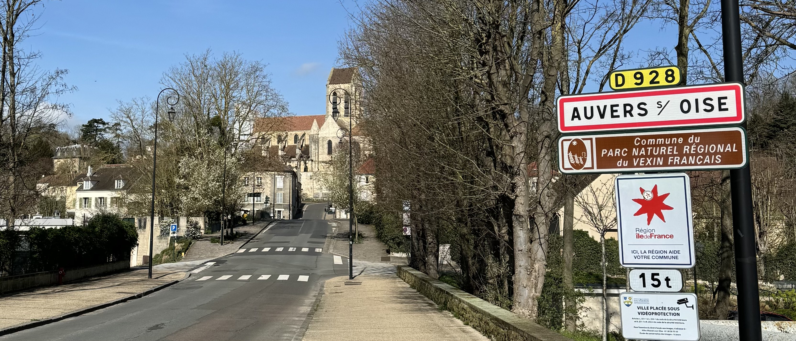
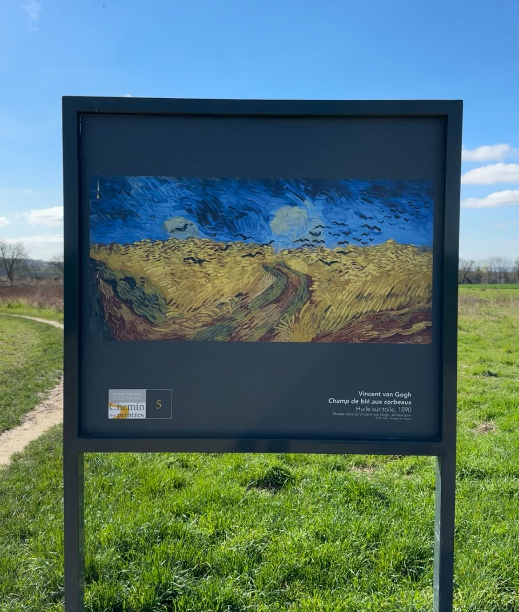
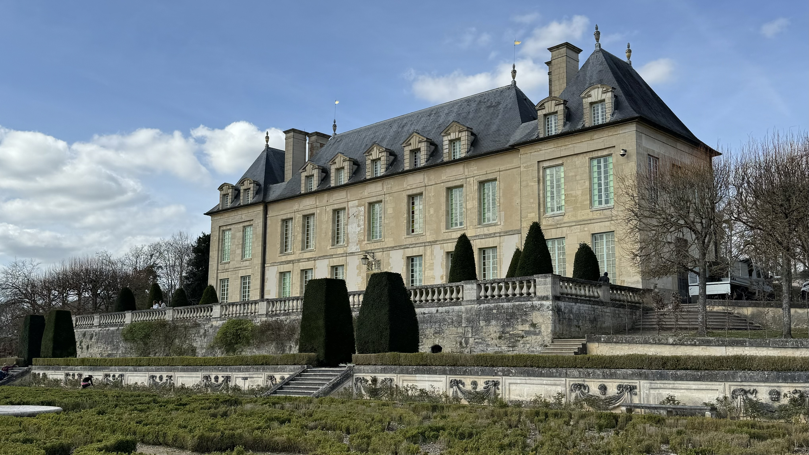

This week, I went to Auvers-sur-Oise as a solo day trip. This was my second time here, the first time was back in 2020.

Auvers is a town around 30km away from Paris in the north west. It is known because of the now famous impressionist painters who took inspiration & worked here in the 1800s, most notable Vincent van Gogh who is buried here.

### Getting there

There are a few different ways of getting there depending on the part of Paris that you're travelling from, and the funny thing is, each time I checked the directions a different route was proposed and the options were different between Google Maps and [Citymapper](https://citymapper.com).

Going there, I took the [H line](https://www.transilien.com/fr/page-lignes/ligne-h) to Méry-sur-Oise and then walked the 35 minutes to Auvers. The proposed option was to take the H train to Valmondois and then change trains to another H line with a 20 minute wait. Since the weather was good, I opted for taking a direct train and walking. If I planned the timing differently, I could have taken a bus from Méry-sur-Oise but the bus was super infrequent (between every hour and every two hours)

On weekends and public holidays during the summer season, there is a direct train between Auvers and Gare du Nord (from around the start of April until September). This can change depending on any works that they're doing on the train line.

I wasn't sure how I would come back, but I knew that there were different options depending on what time I decided to leave at. I did however check the planned works for the H line to know what time the last train was leaving at.

On my return to Paris, I took the 9517 bus to Cergy and then the [RER A](https://www.transilien.com/fr/page-lignes/ligne-a).

### The trip

The weather was great, especially for the time of year. I would definitely recommend going when the weather is nice (if you can plan it this way) because pretty much everything is outside.

On my walk from the train station, I went for a walk in the park of Château de Méry-sur-Oise. You can't get to this château, but the park was nice and they had an area for picnicking - I could imagine sitting there with friends and making daisy crowns.

Once I arrived in Auvers, I went to the tourist office and used the toilets there (bring your own toilet paper), before walking up to the tomb of Vincent and Theo van Gogh. Outside of the cemetery, there's some information (in English and French) about the life of van Gogh, his time here and his death.

Just across from the cemetery, there is a sign with one of van Gogh's paintings "Wheatfield with Crows" which is part of the van Gogh walk. Along this walk you will also see the church, the stairs that one of his paintings was based on, and the house that he lived at. The _Office de Tourisme_ says that the entire walk takes around 1h30.

There are also some other walks that you can follow that cover some of the main pre impressionists, impressionists and post impressionists painters of Auvers:

- impressionists path: (Pissarro, Cézanne, Corot, Daumier, Gachet, Goeuneutte, Vignon) which takes around 2h30.
- Daubigny path: (Botin, Musée Daubigny, Atelier Daubigny, Buste Daubigny, Léonide Bourges) which takes around 45 minutes
- illustres path: Daubigny, Boggio, Gachet which also takes around 45 minutes

After visiting the tomb of van Gogh and the inspiration for the wheatfield painting, I walked back towards the main town. It's really interesting to see the inspiration behind some of the paintings.

There is a beautiful church there that currently has a big sign for "un musée à ciel ouvert" (an open air museum)

I then stopped for lunch at Palais d'Auvers. The restaurant got pretty busy, so if you're going with a group it's probably worth making a reservation (some of the tables were reserved when I arrived). I had the menu midi (available on weekdays, excluding public holidays) which was 15,5 for a starter, main and dessert. I had nems, a selection of steamed dumplings with rice and two "beignet aux pommes" (apple doughnuts doesn't feel like the right translation). The food was pretty good, and the staff were friendly so I'd rate it 4/5 stars.

After lunch, I walked towards Château d'Auvers. I wanted to go to the exhibition "Van Gogh, les derniers voyages", but they didn't have any available slots for the next hour and a half. So I walked around the gardens, and then sat and journalled for a bit.

After enjoying the time in the sun, I took the bus to Cergy and then the RER back into Paris.

You can find additional information on the site of [Auvers](https://tourisme-auverssuroise.fr) which is also available in English

### Recommendations

- reserve a ticket in advance for any museums or exhibitions that you want to see. I didn't expect all the tickets to sell out for the exhibition in the château
- if you want to follow the painters walk, look at the route beforehand so you don't go back on yourself. Sometimes it's nice to see how I feel in the moment, but it's also good to have some of the details planned
- check the opening hours of everything you want to see because a lot of museums are only opened on certain days, for example the "House-Workshop of Daubigny" is only open on weekends, while the "Chambre de Van Gogh" (van gogh's bedroom) is open on wednesday to Sunday only during peak season (in 2024 it's from the 6th march to 24th november).

### What I spent

- transport is included in my monthly [Navigo](https://abisummers.com/articles/navigo) (the monthly ticket costs 86,40€)
- I had lunch at Palais d'Auvers which cost 15,50€ for the menu midi
- if I had planned better, I would have go to the exhibition at the château which costs 12€

### Now it's your turn

Are you planning on going to Auvers? If so, I'd love to hear your thoughts and experiences! You can reach me via email at **[contact@abisummers.com](mailto:contact@abisummers.com)** or via instagram at **[@abisummers](https://www.instagram.com/abisummers/)**
