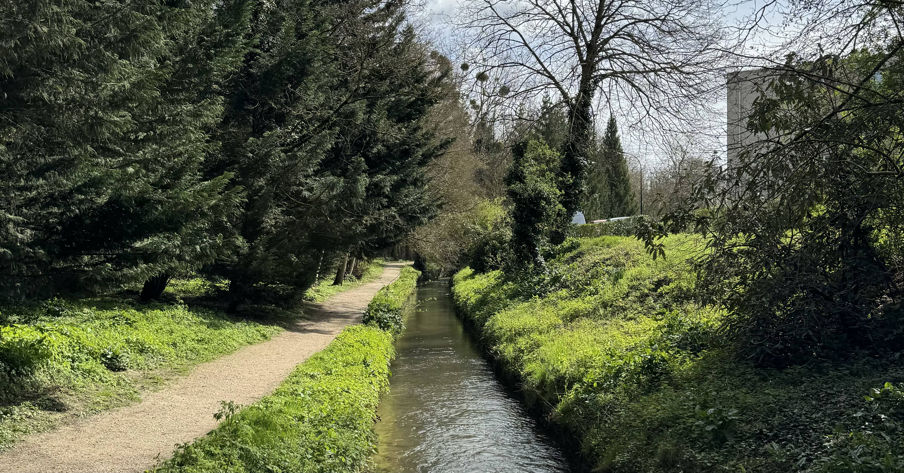
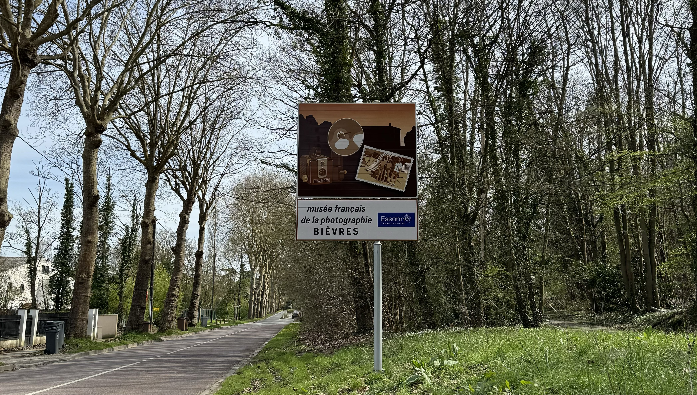

Bièvres is a town located around 24km from Paris at the confluence of two rivers, the Bièvre and the Sygrie. (there are two other towns in France with the same name). Nearly 60% of the area is considered rural, there are two big forests surrounding the city - Verrières forest and Versailles forest.

Historically, it was quite an important place. During the 19th century Château des Roches attracted a lot of distinguished figures in the world of politics and arts (Chateaubriand, Berlioz, Ingres, Liszt etc). Victor Hugo was the most renowned guest who spent time there whenever he could along with his wife and children. Some of his famous letters were even written while staying in Bièvres. 

Today, "Château des Roches, Maison Littéraire Victor Hugo" displays a lot of the work of Hugo, including the printing proof of "Les Misérables" which was hand corrected by Hugo himself. More info about "Château des Roches" can be found [on the website of the museum](https://www.maisonlitterairedevictorhugo.net/en/fondation/). 

Based on the position of the valley, Bièvres was on the route between Versailles to Fontainebleau (both are interesting places to visit on day trips!).

The coat of arms of Bièvres as has a beaver in the centre, two strawberries above and one below. "Bièvre" is the old celtic word for beaver, which also gives name to one of the rivers that runs through the town. The strawberries are important because of the strawberry cultivation that was done in the area.

### Getting there
There are a few different ways of getting to Bièvres from Paris. 

You can take the RER B to Massy-Palaiseau and then the V line (previously the RER C, not everything has been updated yet, including Google Maps). Or you can go via Versailles, taking the U line from La Défense or the N line from Montparnasse and then the V line. The V line runs between Massy and Versailles, every 15 to 30 minutes. 

For this trip, I took my bike so I cycled from Massy to Bièvres but I would have taken the V line if I didn't have my bike. The route between the two stations had bike lanes for a good chunk which were pretty well maintained and easy to follow. Not all bikes lanes are built equally, so this was a nice change. 

### The trip
When I arrived in Bièvres, I went to a bakery for lunch. I had a quiche lorraine and a "financier pistache" from "Le Fournil de Bièvres". It was pretty good, but the quiche could have been warmer. There are a lot of places around the city for locking up a bike.

Before planning this trip, I did some research on what to do. I wanted to cycle the 13km walking route ["l'abbaye au bois"](https://www.bievres.fr/medias/2021/09/rando-ABBAYE-AUX-BOIS.pdf)  but I realised pretty early on the route that I was following didn't allow bikes so I stopped following the GPS. (I'll be back at some point to do the hike).

For the short part that I followed on the route l'abbaye au bois all the paths were well maintained and the walk would have been pretty easy. However I think the part after has some inclines up forest paths, so make sure you wear some sturdy shoes. 

Before taking the V line back to Massy, I stopped for a drink at "Cafe Hotel de Paris". The waiter was friendly, he was asking me where I'm from because of my accent in French. While that is something I used to hate, now I've accepted that it's a part of learning another language and integrating in France. He was saying that a lot of tourists come here to see the nature and museums. One thing to note is that the minimum card payment is 10€ so if you're only stopping for a quick drink it's better to have some cash.

### Places to visit
I didn't get to visit any of the places because they were closed when I went. I knew that in advance, but I still wanted to see some nature.

 

- Château des Roches, Maison Littéraire Victor Hugo: only open on Saturday and Sunday afternoons.
- Château de Vauboyen: a private château which has guided visits at 2:30pm from the 1st July to 15th August. It says that it's possible to visit from September to June with an appointment but I'm not sure how that works (how far in advance you need to book, the cost, how flexible they are with dates etc)
- Musée de l’outil: only open on Saturdays. Throughout the town, they have different tools on display.
- Musée français de la photographie: this museum is temporarily closed and doesn't seem to have a date of when it will reopen

### Things I would do different next time
- go on a weekend, because a lot of the museums are closed during the week. 
- I wouldn't take my bike, but instead take a backpack with water and snacks to follow the route "l'abbaye au bois". From what I could see, it should be a nice hike

### What I spent
- transport is included in my monthly [Navigo](https://abisummers.com/articles/navigo) so I didn't need to buy a specific ticket (the full price monthly ticket for zone 1 to 5 is 86,40€ which covers the entire Île-de-France region)
- for lunch I spent 6,30€ at the bakery
- I spent 4€ on a soft drink at Cafe Hotel de Paris

### Now it's your turn
I will definitely be back sometimes, I want to do the hike that I had planned to cycle this time, and I also want to visit some of the cultural sites. I think it could be very interesting to visit the bakery of Poilâne which seems to only be possible on the journée de patrimoine so I'll be keeping an eye out for that. 

Are you planning on going to Bièvres? If so, I'd love to hear your thoughts and experiences! You can reach me via email at **contact@abisummers.com** or via instagram at **[@abisummers](https://www.instagram.com/abisummers/)**