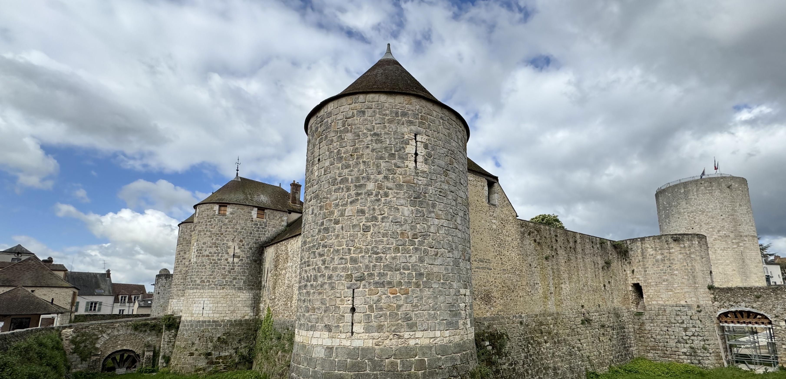
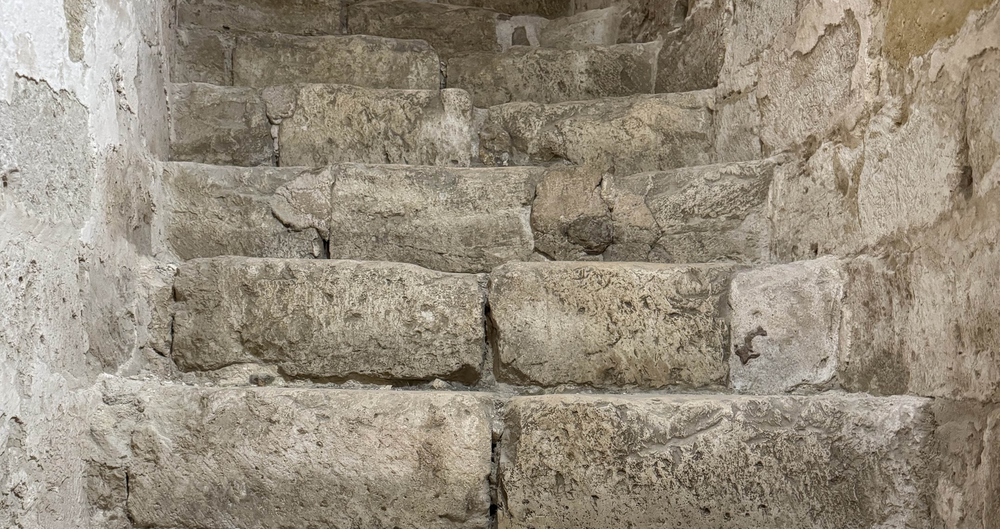
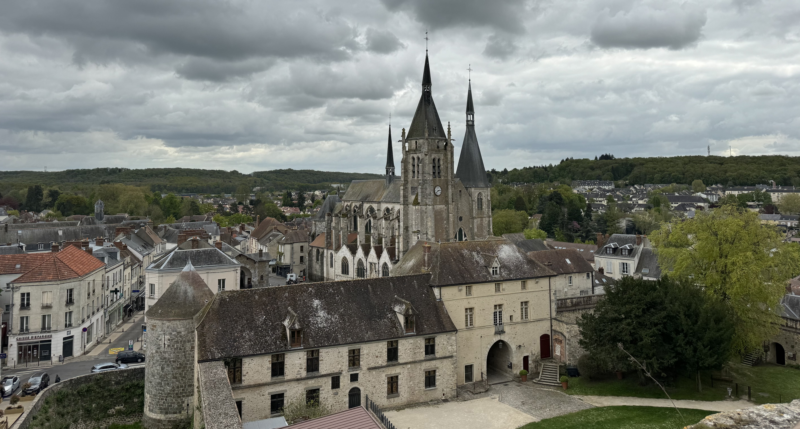

This week, I went to Dourdan, a town around 45km southwest of Paris. I wanted to visit the fortified château here which was built at the request of Philip II Augustus between 1220 and 1222. As with all châteaux, there's a complicated history with who owned it, how it was passed on and the use. You can find details of the history of the château on their [website](https://chateau.dourdan.fr/decouvrir/le-chateau-fort/) (only available in French).

### Getting there

Getting there you can either take the TER or the RER C from Paris. The RER C runs approximately every 30 minutes, and the TER runs less frequently. The TER takes just under 50 minutes whereas the RER C takes a little over an hour depending on where you are going to.

### The trip

I knew in advance that I wanted to take the TER in the morning because it's faster, so I checked the hours in advance on Citymapper. Since Dourdan is within Île-de-France this was included in my Navigo. I very rarely take the TER within Île-de-France because they don't stop often in this region. The TER was very quiet in the morning, and the seats were comfortable.

I spent the morning walking around the city on my own. They had a market (open on wednesday and saturday mornings) on the main square with places to buy things like cheese, meats and vegetables. I finished my book on the train in the morning so I went to the book store "Le Temps Retrouvé" to see if any books spoke to me but unfortunately I didn't really feel like any of the books they had. Some books that I liked the sound of were translated from English (so I would read it in English) or were not the first book in the series. I then walked back to the station to meet two friends who were joining me.

For lunch, we went to the bakery "Patisserie des Gourmets" and had our lunch there, I had a sausage roll (something you don't see often in France) with a cookie. They had an issue with their card machine because their WiFi was down but they kindly let us go to the ATM after we had our lunch, which was close. I usually carry a small about of cash because sometimes you can only pay by card if you have a minimum spend, but I didn't have any on me today.

After lunch, we went into the château. In France, I really like that they often ask if there are any of the conditions for the reduced ticket - under 26, a student, being unemployed etc. I don't fall into any of these categories anymore so I paid the full price of 5€ (reduced price is 3,5€).

The visit to the château is mostly outside. There are some stairs that you climb to get to the top - but they are quite steep, narrow and uneven. They have a rope to help you. (I really hate walking down spiral stairs).

You get a nice view of the city and church from the top. It really is impressive to see how thick the walls are - I'm sure I could lie down on the wall and not be close to touching the edge.

If the weather was nicer, then I would have like to have a picnic in the forest. While it didn't pour down with rain, it definitely felt like it could have changed at the drop of a hat.

### Recommendations

- Check the opening hours of the château if you want to visit - it's closed on mondays, tuesdays, thursday and friday mornings and closes for lunch every day. Last entry is 45 minutes before closure.
- Every year, they host a medieval festival on the first weekend of June. I haven't been to this one but I imagine the vibe is a lot of fun.

### What I spent

- transport is included in my monthly [Navigo](/articles/navigo/) (the monthly ticket costs 86,40€)
- I had lunch from a bakery which was 7,30€
- entry to the château cost 5€

### Now it's your turn

Are you planning on going to Dourdan? Have you already been? If so, I'd love to hear your thoughts and experiences! You can reach me via email at **[contact@abisummers.com](mailto:contact@abisummers.com)** or via instagram at **[@abisummers](https://www.instagram.com/abisummers/)**
