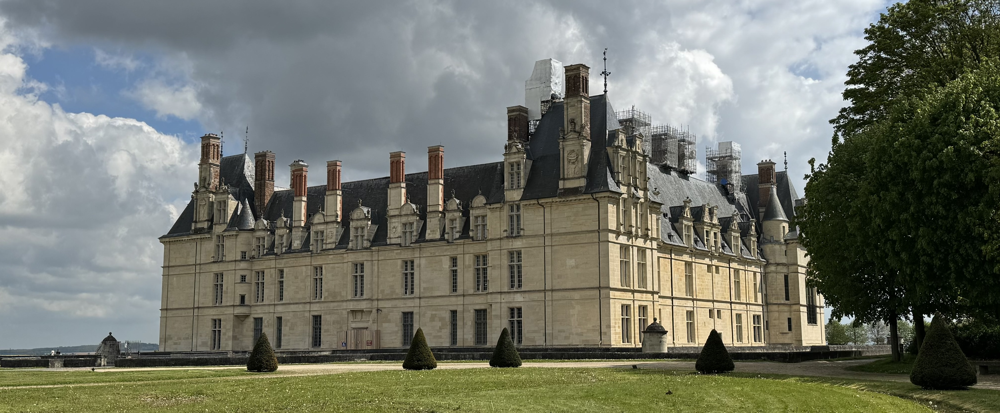
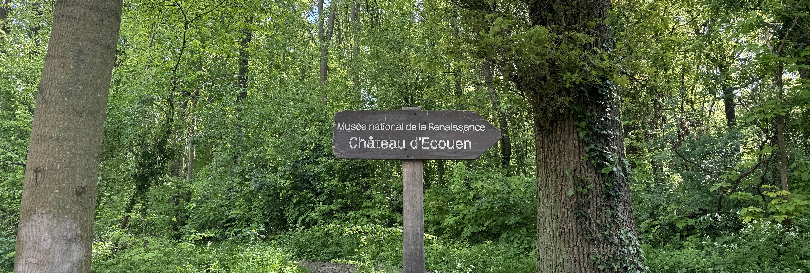
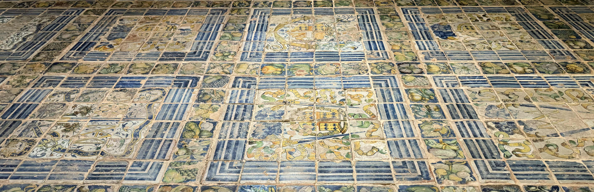

This week I went to Écouen, a town 20km north of Paris. This is a place I came across when researching this project, I had never heard of it before, so I was excited to visit. You can learn more about my research stage [here](https://abisummers.com/articles/planning).

The château was owned by Anne de Montmorency (1st Duc de Montmorency, Constable of France, Grand Maître of France). He owned multiple châteaux including Chantilly and had multiple _hôtels_ (grand residence) in Paris. The construction started in 1538 and ended in 1555 with the royal architect Jean Bullant participating in designing parts of the château.

Since 1975 the château hosts the National Museum of the Renaissance.

### Getting there

Getting to Écouen from Paris is easy and straightforward. You can take the H line directly from Gare du Nord to _Écouen - Ezanville_ which takes around 20 minutes. The train runs approximately every 30 minutes with a higher frequency during rush hour.

To get to the château from _Écouen - Ezanville_, you can take the bus 269 from the station which runs approximately every 30 minutes or walk which takes around 25 minutes.

### The trip

I opted to walk from the train station because the weather was nice and I enjoy walking through forests. I went to the bakery 'Boulangerie Pâtisserie' (yes, this is the name that appears on Google Maps) to get some food for breakfast and lunch. For breakfast I had a pain au chocolat which I ate straight away, and for lunch I had a 'swedish sandwich' which I took to the château.

The walk from the station is beautiful, I was surrounded by vibrant green trees. I find this time of year to be so inspiring with all of the different shades of green especially when the sun is out. There are signs to the château as soon as you enter the forest. This entire route doesn't show up on Google Maps, but I found the signs easy to follow. I imagine it doesn't show up because the château garden has opening hours so it isn't always going to be an available route.

I spent the morning strolling around the gardens. It was a nice walk, surrounded by more trees and I could hear a lot of birds. Some of the paths were a bit muddy, but overall it was an easy walk. You are not allowed to bring in bikes (even if you're not cycling), dogs (even if they're on leads) or have a picnic in the château gardens. However, in the forest just outside they did have picnic benches where you could sit and eat lunch. I ate my sandwich while sitting on a bench in the château gardens which was probably allowed (you're not allowed to sit on the grass).

The château closes between 12h45 and 14h for their lunch break. There are no toilets in the gardens unlike at [Champs-sur-Marne](/articles/alphabet-ile-de-france/c-champs-sur-marne/), but you can use the toilet in the château. I went a few minutes before they closed for lunch to use the toilet and the door was already locked - however the person who worked there kindly opened the door for me, so I would recommend going there a bit before if you would like to use the toilet.

After my lunch and seeing the gardens, I walked over to the nearby fort. There isn't really an idea place to see it from since it's surrounded by trees however some people have made a small path to get close to the fence.

After walking around the fort, I went back to the château to visit the inside. Because they are currently renovating the château, the entry price is 3,50€ (reduced tariff) instead of the usual 5€. The renovations are due to be finished by the end of 2026. I had to put my backpack in a locker before I could buy a ticket.

It took me almost 1h30 to visit the entire château. I loved getting to see all of the different decorations they had - the tapestries, mosaic floors and decorative plates were all impressive to see. I found the route quite complicated to follow - it wasn't a complete circuit like in most châteaux I've been to so you sometimes had to go back out via the same room you just visited. Part of this is probably due to the renovations.

After I had finished in the château, I walked back to the station following the route that google maps suggests - the first part is through the town before you join the forest.

At the château, they had a poster with places to eat for lunch. Two restaurants "L'Iscoam" and "O'Done" (kebab), both of them are close to the château, and two bakeries, "Le Moulin du Château" which is close to the château and "la boulangerie de la gare" (which is called Boulangerie pâtisserie on Google Maps) which they recommend driving to get there.

### Recommendations

- If you want to see the library, then you should visit on a weekday (it's closed on weekends and public holidays)
- The château is closed on Tuesdays
- The château gardens are quite hilly so I would wear some sturdy shoes

### What I spent

- transport is included in my [Navigo](https://abisummers.com/articles/navigo) (the monthly price is 86,40€ which covers the entire Île-de-France region)
- for lunch I spent 5,80€ at a bakery
- to get into the museum it cost 3,50€

### Now it's your turn

Are you planning on going to Écouen? Have you already been? If so, I'd love to hear your thoughts and experiences! You can reach me via email at **[contact@abisummers.com](mailto:contact@abisummers.com)** or via instagram at **[@abisummers](https://www.instagram.com/abisummers/)**
