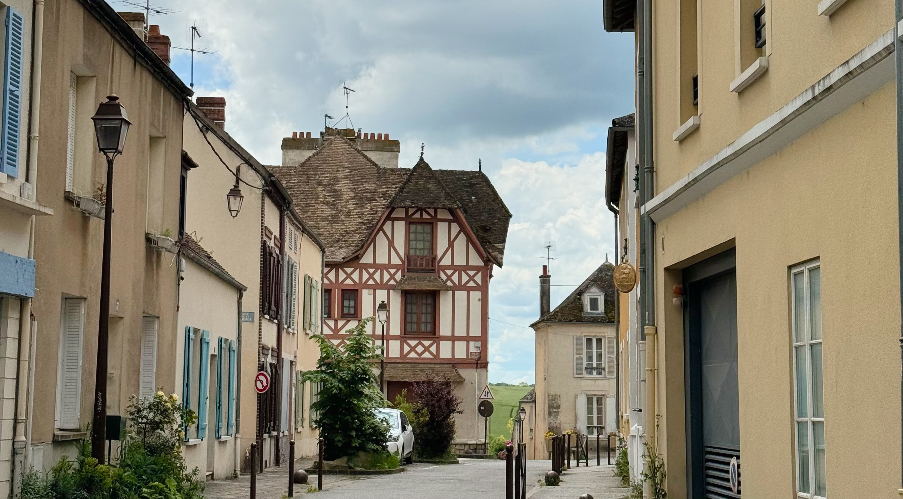
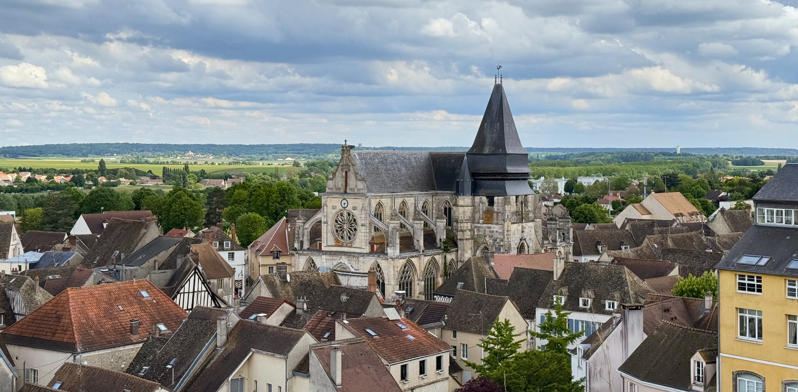

This week I went to Houdan with my partner, a town 63km west of Paris, right at the end of Île-de-France, bordering with Centre-Val de Loire. You can see on the maps at the end of this article where is it in relation to Paris, it's pretty far!

### Getting there

To get there from Paris you can take the Transilien N from gare Montparnasse which takes around 1 hour. Google maps sometimes shows the option to take a TER to Dreux and then the N line - I wouldn't recommend this option because it's longer and it's doesn't fall under the Navigo region.

### The trip

We arrived just before lunch time, so we started with walking around the town. It's crazy to me that towns just end and become countryside, something that I don't see often in Île-de-France. The town is small but cute with some beautiful buildings with their wood details. It has a lot of independent stores which I love to see as well as lots of places to eat. It really feels like it has a community vibe.

After a walk through the town, we had lunch at La Comédie. We had the suggestions of the day, desserts and a drink each. Almost everything was home made, and things that were not home made were specified. The restaurant was pretty busy which is always a good sign and everything looked good.

After lunch, we went to the Donjon de Houdan. We actually decided to visit Houdan on this specific day because we knew the Donjon would be open. It's marked as temporarily closed on google maps, because it doesn't have set opening hours. It's open once or twice a month, and also occasionally hosts concerts. The opening hours and events are shared on their website and instagram account (their website has more reliable information - they didn't post on instagram about the opening on Saturday 18th May).

The Donjon was restored starting in 2014 and was reopened to the public in 2016. Just opposite the Donjon there's a sign with information about it both in English and in French, unfortunately the state of it made it hard to read. The Donjon has few opening hours because it's ran by volunteers - the two women who were working where both really friendly. I think it's sad that all the time and money went into restoring it, but now it's rarely open because they don't have enough people to work there, I hope that that can change in the future.

The steps inside the Donjon between are narrow, steep and uneven in height so they were quite hard to walk on. In the recent restoration, they added a new set of stairs between the ground level and first floor which are much easier to use. On these stairs, you can get a view of the entire room. On the second floor, they have a 10 minute video which explains a bit about the history and restoration of the Donjon. You can walk to the top, and get a panoramic view of the city. On one side you have the old part of the town with the church, and on the other side the newer housing and the countryside. In total, we spent around 1 hour on the visit to the Donjon.

After visiting the Donjon, we went to look at the church, which is currently undergoing some renovations.

We stopped by a cafe to get a drink (mostly so I could go to the toilet before the hour long train) before heading back to the train station. We sat on the terrance, I had a glass of wine, and my partner had a beer. The guy who served us was really nice and was grateful when we took the glasses back inside when we paid.

### Recommendations

- check the opening hours of Donjon on their website if you want to visit (it's usually open once or twice per month)
- check train times in advance, on Saturdays they only run once per hour

### What I spent

- transport is included in my [Navigo](https://abisummers.com/articles/navigo) (the monthly price is 86,40€ which covers the entire Île-de-France region)
- lunch cost 54€ for two people
- a drink at the cafe cost 17€ for two people
- entry to the Donjon costs 5€ per person

### Now it's your turn

Are you planning on going to Houdan? Have you already been? If so, I'd love to hear your thoughts and experiences! You can reach me via email at **[contact@abisummers.com](mailto:contact@abisummers.com)** or via instagram at **[@abisummers](https://www.instagram.com/abisummers/)**
