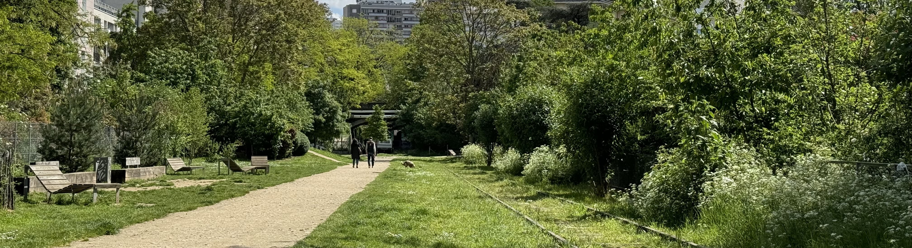

So K is going to be a little different to the other day trips because there's only one town in Île-de-France with the letter K, Le Kremlin-Bicêtre.

I did some research on Le Kremlin-Bicêtre and decided to not go here on a day trip because the places that would be interesting for me, like the fort, are not accessible to the public apart from on certain occasions the journées du patrimoine. There didn't seem to be any parks or cafes to sit in and read a book, so I wasn't sure what I would get out of this day.

This project is meant to be fun, and since I'm making the rules I decided to plan something else, still following the letter K so I went back to the drawing board.

Long story short, I had a nice day out to Parc Kellermann, but I preferred my other day trips because there was more to see.

### The research

I had already looked through the list of all towns in Île-de-France as part of the research on picking places so I knew there was only one. I started looking through other lists, famous people, metro stations and street names.

I had originally thought about exploring the area around Kléber metro because it's on the boulevard Kléber and he's a known military leader. But again, it didn't fill me with so much inspiration.

So I went and looked at all of the street names in Paris which is a short list (only 9) and most of them are pretty small. However, I did come across boulevard Kellermann, right in the south of Paris which looked promising.

Just off the boulevard there's a park, Parc Kellermann which I've never been to before and it's close to the "Petite Ceinture".

### Getting there

Since this is still within Paris, you can take the metro line 7 to get there. There are also options with buses and the tram 3 to get there depending on the direction you're coming from. For me, taking the metro is the easiest.

### The trip

I arrived with the metro and went to a bakery "madame Guymot" and got a cookie that I ate on the way to the park - everything in the bakery looked good and the cookie didn't disappoint.

My first impressions of the park was that it's very green, with a lot of different types of plants. I liked that they had a more wild area - something which is becoming more common in France which I love to see because it's great for the bees and other insects.

When I arrived at the park, I sat by the pond to journal and watched the different birds (they had some baby birds which were cute).

I then walked around the rest of the park - they had a place to do workouts, a small little 'farm' (Educational Farm Du Parc Kellermann) where I could see some rabbits and chickens - the farm does host some workshops but they're not ever weekend so you would need to check their schedule.

While I enjoyed my time here, it's not going to be the top of my list for parks to visit in Paris. You could still hear the traffic from the roads that surrounded the park which makes sense because it's so close to the ring road around the city.

I then walked over to the Petite Ceinture. This is a previous mainline train that ran all the way around Paris. Nowadays most of it is inaccessible, however some sections are parks, like this one. I sat on a bench there to journal some more. While there, there was a group of people who must have been having a dog meetup because the owners were all chatting away while the dogs played with each other

I think it's really cool to see part of history - this was part of a 32km railway that encircled Paris where parts of the line opening in 1852. Most of the line isn't officially open to the public, but parts have been transformed into places to visit including some places to eat and drink (I really like La REcyclerie in the north of Paris)

### Recommendations

While I'm pleased I went, I'm not sure if I would go again because there are other parks in Paris that I prefer. However I think this would be a nice place if you had kids because there's some animals that you can see (if they're not hiding), some play areas and it's easy to get there.

### What I spent

- transport is included in my monthly [Navigo](/articles/navigo/) (the monthly ticket costs 86,40€). Since this is within zone 1, you could also buy a single T+ ticket which costs 2,15€
- breakfast from the bakery cost 2,90€

### Now it's your turn

Have you ever been to Parc Kellerman? Got another favourite park in Paris or another idea of a place to visit for the letter K? I would love to hear from you! You can reach me via email at **[contact@abisummers.com](mailto:contact@abisummers.com)** or via instagram at **[@abisummers](https://www.instagram.com/abisummers/)**
