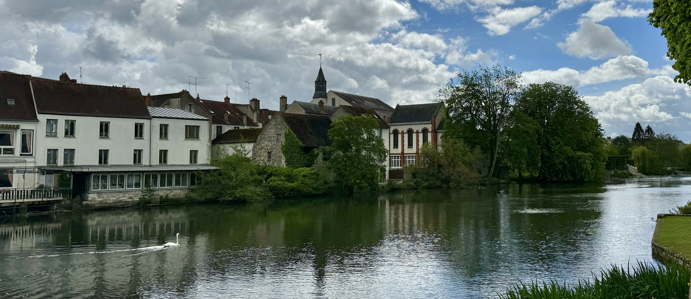
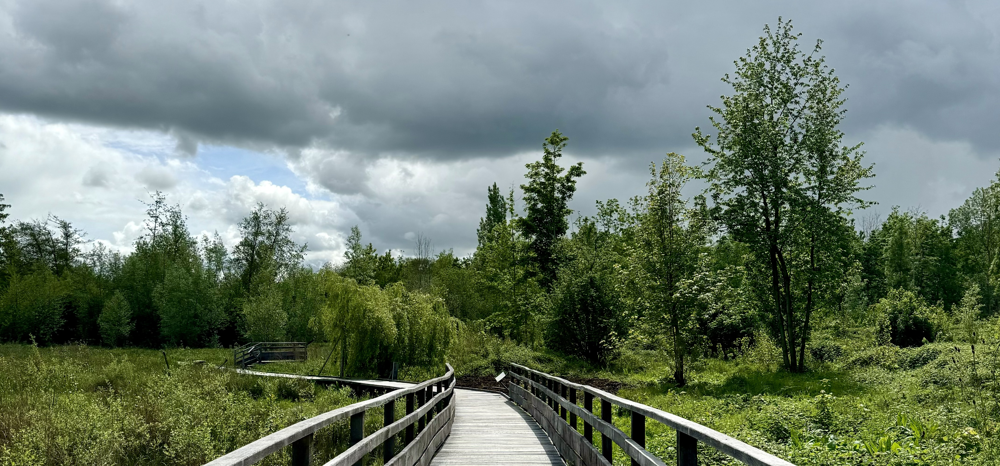
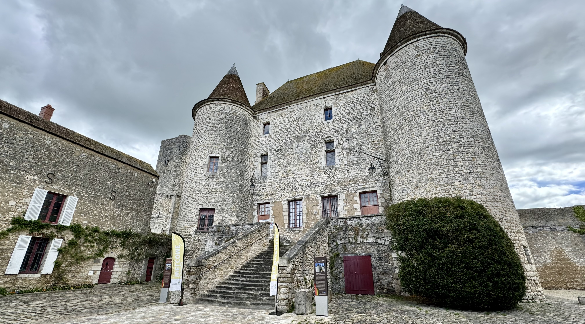

This week I went to Nemours, a town 80km south of Paris and 17km south of Fontainebleau (which is also worth visiting!). It is surrounded by the river Loing and is known for the 12th century château and the Île-de-France Museum of Prehistory.

### Getting there

To get to Nemours, you need to take the Transilien R from Gare de Lyon to Nemours - Saint-Pierre which takes just over an hour. This train only runs once per hour, so I would definitely advice looking up the train hours in advance. Do this for going there and also returning, just so you have a rough idea and you don't miss the train by just a few minutes.

### The trip

For this day trip I went with a friend, the hour on the train passed super fast as we exchanged stories as it was a while since we last saw each other. This trip was mostly around having a chilled day away from Paris.

When walking into the centre, we passed by a store selling old furniture so we had a look inside. They has some nice looking things, but nothing practical for me to buy considering I would have to take it back on public transport.

We walked around the city while chatting away. We had some questions about a small door in the courtyard of the château and why one of the towers didn't have a cone-shaped roof. We went into the tourism office to ask the questions. The person there was really friendly but didn't know the answer to the question about the small door. The tower without the cone roof was always built like that rather than it being destroyed or removed. When we left the tourism office, another person who was in there stopped to chat to us about the château and Nemours.

After out initial walk through the town, we went for lunch. We ended up picking a place called "Moulin de Nemours" which is right by the water. It's like a food court where they had a few different options for food - bagels, burgers, pizza and thai. We both went for the same option - a chicken burger and fries which cost 12€ each and a glass of wine which cost 4€ each. For the food, they give you a little beeper to take with you so you know when to return for your food, however ours didn't work so the guy brought the food directly to us. The place was pretty quiet which isn't that surprising for a Friday lunch when it could start raining at any moment. We were lucky with the weather, and when the sun came from behind the clouds it was really nice. I'm sure this place would have a great vibe on a warm summer afternoon

Just by the side of the restaurant there is a walk you can do over "Île du Perthuis" (which isn't yet shown on google maps but it is on apple maps). The Île du Perthuis is called a "poumon vert" (literal translation is green lung) in the leaflet from the tourism office. On the island, they have recently installed a walkway where you can observe the biodiversity in vegetation and animals. They have some information about some of the things you might see like birds. The walkway is open from April to October.

We then walked over to the other side of the water to sit in the sun for a bit longer. We had a nice view of the back of the church from here.

We then walked to the château to go inside. The château was originally built in the 12th century under Gauthier I. Over the centuries, the château has been used in many different ways - from a royal château, to a dungeon, a public school, a concert hall and a ballroom. Thanks to a big restoration project in 1901, the château is well preserved. Since 1903 it has been open as a museum and since 1977 has been classed as a historical monument.

It's a pretty small château which has the ground floor and the first floor. On the ground floor they had a small exhibition about different animals. Upstairs they had some paintings and statues. We spent around 30 minutes there. In a spat of luck, it started to rain quite heavily just after we arrived and stopped before we left.

During the journée de patrimoine, more of the château is open to the public.

We then went to sit in the library for a short while before heading to the train station. Libraries are usually really welcoming and I love the vibe of them. I also love reading, you'll almost always find me with a book in my bag. Then it was time to go back into Paris. Next time, I would like to visit the Île-de-France Museum of Prehistory.

### Recommendations

- check the train times in advance because the train only runs once per hour
- visit on a day when the weather is good so that you can sit by the water

### What I spent

- transport is included in my monthly [Navigo](/articles/navigo/) (the monthly ticket costs 86,40€)
- entry to the château costs 5€ (full price)
- for lunch, I spent 16€ on the burger, fries and a glass of wine

### Now it's your turn

Are you planning on going to Nemours? Have you already been? If so, I'd love to hear your thoughts and experiences! You can reach me via email at **[contact@abisummers.com](mailto:contact@abisummers.com)** or via instagram at **[@abisummers](https://www.instagram.com/abisummers/)**
