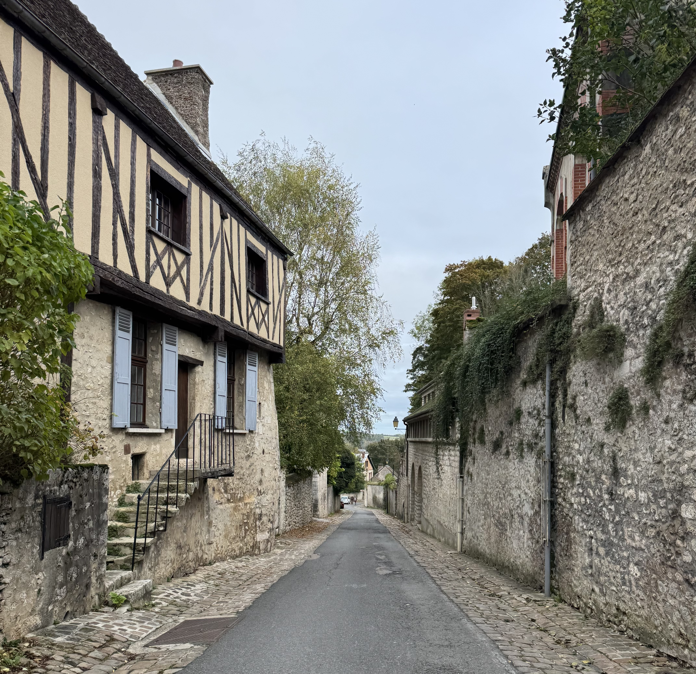
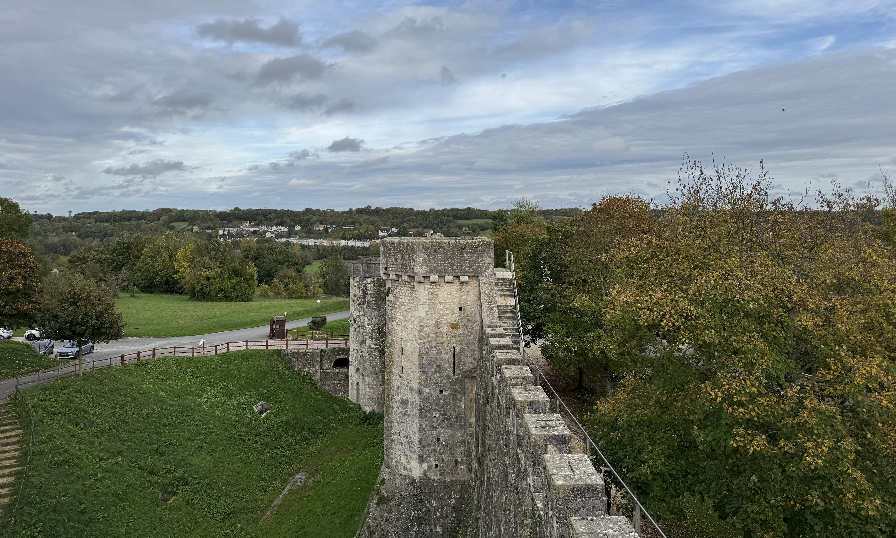
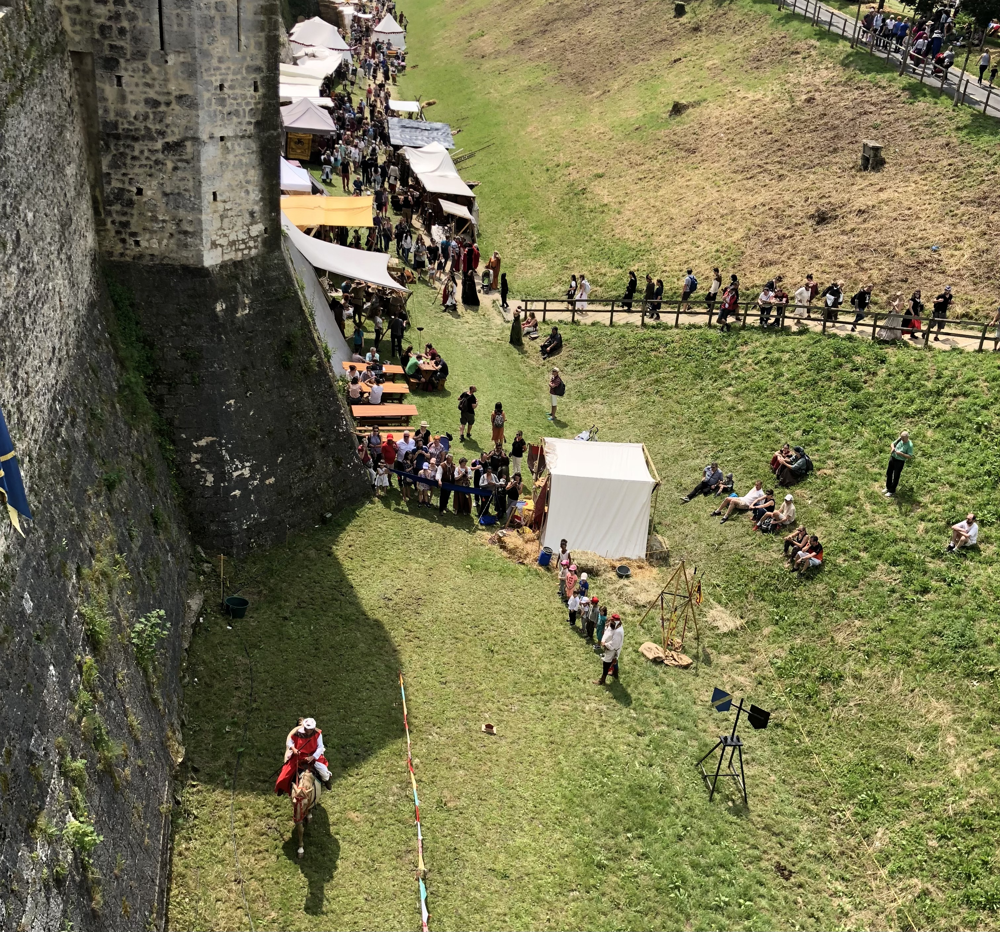

In October, I went back to Provins! It's been over a year since I was last here - the last time was for the medieval festival in June 2023. I went with a group of friends and their dogs(!!), and it was great for my soul. I think this was my 5th time visiting Provins over the 8 years I've been living in Île-de-France for.

Provins is known for its medieval architecture and importance throughout the Middle Ages. They host an annual medieval festival in June, which is the largest in France. Since 2001, Provins has been a UNESCO world heritage site. Provins is also known for roses and produces a lot of products based on roses, from jams to honey and even wine!

### Getting there

To get to Provins you can take the _Transilien P_ from Gare de l'Est which takes roughly 1h30. The train only runs once an hour so it's worth checking the times in advance to know when you need to be at the station with a bit of margin.

On the train going there, we played some card games - Uno and Dobble - which was great. I'm pleased my friend thought to bring some games, many years ago you'd always find a deck of cards in my bag for situations like this. We engineered a table with a scarf across two seats with bags on either side to keep the tension - it works really well! When we weren't playing games, we were chatting. The time went super fast!

### The trip

Once there, we walked into the centre which is around 25 minutes from the station. We didn't have a set plan, we just walked in the direction of the centre. There's a small train that runs through the city that can take you around the main points and explains the history of them but we had enough time to explore by foot. We could see a church on the top of a hill which is what we walked towards. We walked through the lower part of the town and then took the stairs on _Rue des Petits Lions_ and followed the road around. We passed the church _Collégiale Saint-Quiriace_ and continued walking. We passed the _Tour César_ and considered going in, but in the end we didn't.

You have to pay to get into Tour César (5€ for an adult ticket), but dogs are not allowed in. One of us would have had to wait outside with the two dogs, so we decided to not visit this time. I don't feel like I missed out because the weather was good and I know that I'll have the opportunity to visit again.

Once in the medieval centre we made a quick bathroom break and stopped to fill up our bottles - just off _Rue du Four Gaillard_ and _Pl. du Châtel_ there's public bathrooms that are free to use (however there's no toilet paper). There's a tap for drinking water on the outside, I remember this from the medieval festival last June because it was _so hot_ and I _hate_ having to buy bottled water when I'm out.

We walked towards the ramparts of the city which so cool to see. Along the way, we stopped in _Gourmandises Médiévales_ to see what they had. I always love to see what type of things they have especially in a place known for something. In this case, Provins is known for roses so there were a lot of rose related items (which personally is not my favourite smell or taste). We didn't buy anything on the first pass because carrying a bottle of wine around gets heavy but we did stop by here on our way back. The woman in the store was lovely, she explained that all of the baked goods were baked there following a medieval recipe, she let us try some rose syrup and joked about joining us on holiday. On the way back, I bought two beers to take home. They have medieval brunches which seems like it would be a fun experience (must be reserved in advance).

Just outside of the walls, we stopped for lunch - and also to wait for a friend who was one hour behind us since he missed the train. It was nice to sit outside for lunch, we played with the dogs and chatted. My partner passed by on his cycle to say hello and to meet some of my friends.

After lunch, we walked along part of the ramparts. To get to the top of the ramparts, the steeps are quite steep - my friend had to carry her dog down.

After walking along the ramparts, we walked around the side of them. Along the banks they had some sheep maintaining the grass levels on the side of the hills - I love seeing this. We walked back to the medieval centre, and went into a few more stores.

We went into _A La Croisée des Chemins_ to see what they had. They had a large varieties of salt, peper, sugars and different spices. They also had a lot of regional products, so again with lots of roses - rose jams, sweets, and drinks. They had some postcards that were designed by a local artist. After this, we went back to _Gourmandises Médiévales_ and then we went to _La Savonnerie De La Rose_. I loved _La Savonnerie De La Rose_, they had so many nice smelling soaps and fragrances, a lot of them made locally.

We then had almost an hour until out train so we stopped for a drink at _Au César Gourmand_. We sat on the terrace and got a bottle of cidre to share. Honestly the prices were a lot better than I expected them to be for being directly on the medieval square. The service was fast, but we ideally we would have had a little longer to enjoy the drinks before heading off for our train which was a 25 minute walk.

### Recommendations

- like usual, check the train times in advance because the train only runs once an hour. There are no toilets on the train, so it's worth going beforehand. In Gare de l'Est if you have a Navigo the toilets there are free.
- since it's mostly things outdoors, i'd recommend going on a day when it's not going to rain the entire day and to wear comfy shoes

This isn't going to be for everyone, because the festival is busy but to get a real feel of the medieval city, you can go during one of the two festivals they host. In June they host the largest medieval festival in France, and during December they host a christmas market (I haven't yet been to this, but I plan to go this year!). The summer festival is a lot of fun - there's a lot of great food and drinks, the atmosphere is great and there's various types of street performances. It's also a great place to visit outside of the festival!

> a photo from the 2018 medieval festival. I have been twice (2018 & 2023)

### What I spent

- transport is included in my [Navigo](/articles/navigo/) (the monthly price is 86,40€ which covers the entire Île-de-France region)
- I bought two bottles of beer to take home from _Gourmandises Médiévales_ which cost 7,90€ (the rose & raspberry one was nice but lasted a bit too much like beer for me, the other bottle we haven't tried yet!)
- I bought some soap and some perfumed stones (honestly not sure what they're called but they smell great) from _La Savonnerie De La Rose_ which cost 11,20€
- we took a picnic so didn't spend anything on lunch, but we did stop for a drink at _Au César Gourmand_. We had a bottle of cidre and a bowl of ice cream which came to 16€

Often when I go on day trips, I don't buy things to take home with me but here there are so many artisanal things, it's worth it!

### Now it's your turn

Are you planning on going to Provins? Have you already been? If so, I'd love to hear your thoughts and experiences! You can reach me via instagram at **[@abi.in.france](https://www.instagram.com/abi.in.france/)**
