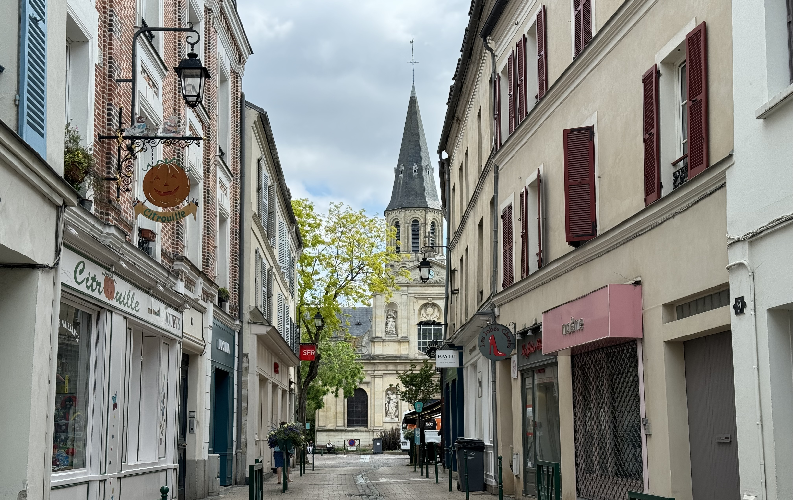
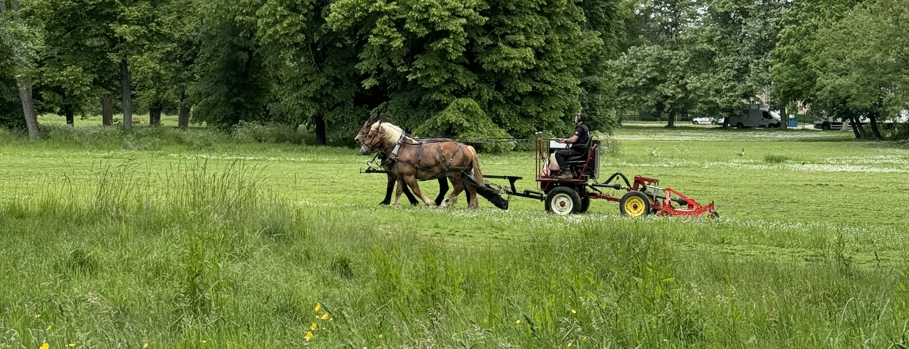

This week I went to Rueil-Malmaison, a town 13km to the west of Paris. I had a friend who lived here, so I've been a few times but never really to see the city. The city is known because of the château where Joséphine de Beauharnais (néé Marie Josèphe Rose Tascher de La Pagerie) lived.

### Getting there

To get there you can take the RER A from Paris to the station "Rueil-Malmaison" or you can take a bus from la défense. The train station isn't in the centre of the town, so you can walk (like I did) or take a bus into the centre.

### The trip

I took the train in the morning and walked from the station into the centre. I stopped by the bakery "Maison Leyrat" to get a pain au chocolat for breakfast (which was one of the better ones I've had for a while). For the first part of the walk, there isn't much to see but the weather was nice and I love getting to look at the different buildings along the way.

The city centre is really cute, throughout there are lots of references to Joséphine and Napoléon Bonaparte. There is a walk (Chemin Joséphine et Napoléon Bonaparte) that you can follow which is marked out by round circles on the ground that have a bee on them. The walk takes you through the town, which includes the church, parc et château de Bois-Préavu, and the château de Malmaision. There is a pdf that you can download that covers all of the key places which can be found [here](https://www.rueil-tourisme.com/fr/discover-rueil-malmaison/hobbies/randonnées-pédestres/chemin-joséphine-et-napoléon-bonaparte) (with English translations) with some information about each place.

I walked down the "passage Napoléon III" (a different Napoléon to the one who Joséphine was married to) which takes you to a cute little area with some shops (most of them were closed because it was a monday) on my way to the domaine national des châteaux de Malmaison et Bois-Préavu. I walked around the park, enjoying the sun. While I was there, they were using horses to pull a machine to cut the grass which I thought looked funny. I sat on a bench to journal before heading back into the centre for lunch (which was sushi because it's my go to meal when I'm alone so I don't have to think about what to have).

After lunch, I walked towards the Château de Malmaison, going through the Parc de Bois-Préavu again but walking further this time. They had two building (but I'm not sure what they were used for).

When at the château, I bought my entry ticket which cost 6,5€ and the audio guide is included in the price. For the audio guide, you have to leave a piece of ID so that you don't forget to return it at the end. You can also buy a double ticket for both the château de Malmaision and Bois-Préavu which costs 11€ (you can add on the second ticket after your visit if you're unsure). I decided to only visit the château because I was tired and knew I wouldn't be able to focus on both of them. If you only wanted to visit the gardens, then the ticket costs 1,5€. They are currently working on the château but that doesn't have an impact on the visit.

At the entrance to the château, you have an option to leave your bags and to pick up a guide. I really like the guide, it shows the layout of the château, but also has a timeline with the dates of key events which span from the Ancien Régime up to the Restauration. (I still get the dates of events mixed up, so I liked having the dates written down)

I started with the château, which has three floors, the ground floor and the first floor are how the château would have been used (with some small changes) by Joséphine and Napoléon and the second floor contains a collection about the exile of Napoléon to the island Saint Helene. A lot of the decorations in the rooms were inspired by Egypt.

The ground floor is mostly living spaces, such as the dining room, music room, library and board room. The first floor contains the bedrooms of Joséphine and Napoléon. The audio guide explains the different rooms, and some of the changes that have been made since the Bonapartes lived there. On the first floor they have the original painting of "Napoléon Crossing the Alps". I have seen reference to this painting many times, but I didn't know there are four other versions (with slight differences in the colours) of this painting all with the brief of Napoléon looking calm, on a mounted fiery steed. The second floor contains a collection of items from the time Napoléon spent in Saint Helene. It's crazy to me that it took almost 20 years for his body to be returned to France.

After seeing everything inside I walk around the rest of the domain. At the bottom of the gardens (by the entrance) there is a pavilion which contains some old vehicles including the one used for Napléon's funeral in Saint Helene. They have the old rose garden and the new rose garden. Joséphine had a strong interest in roses and wanted to have a large collection in her garden. Close to the old rose garden, there is the summer pavilion. (I'm sure the garden will look even nicer in a few weeks when the roses bloom, they were working on the gardens while I was there)

At the back of the château, there is a pond with black swans. In 1803 at Malmaision it was the first time black swans were acclimatised to europe (they're native to Australia). I honestly had no idea that black swans existed.

I found the visit to be interesting, and I learn a lot about the château but also about Joséphine and Napoléon. After the death of Josephine, the château has been owned by different people including her son Prince Eugène de Beauharnais and Emperor Napoleon III. Château de Malmaison was the last residence of Napoléon before he was exiled to Saint Helene after Waterloo. It has been a museum since 1905. More info on the château can be found on their [website](https://musees-nationaux-malmaison.fr/chateau-malmaison/en/now-museum) (available in English.)

I think the naming of Joséphine really interesting because she often referred to by the name Joséphine de Beauharnais despite not using that name herself. She was born with the name Marie Josèphe Rose Tascher de La Pagerie. Beauharnais is the last name of her first husband, and Joséphine is a name that Napoléon gave to her, prior to that she called herself Rose or Marie-Rose. The name "Joséphine de Beauharnais" seems to have emerged during the restoration of the Bourbons, who didn't want to refer to her by Napoleon's surname or her imperial title.

I will be back another time to visit château de Bois Préavu and the Musée d'Histoire Locale (local history museum) because I didn't have the mental energy to do it all on one day.

### Recommendations

- a lot of things are closed on mondays or tuesdays, so if there's something specific you want to see definitely check the opening hours in advance

### What I spent

- transport is included in my monthly [Navigo](https://abisummers.com/articles/navigo) (the monthly ticket costs 86,40€)
- the pain au chocolat from the bakery cost 1,45€
- I spent 14,5€ on lunch
- entry to the château cost 6.5€

### Now it's your turn

Are you planning to visit Rueil-Malmaison? Have you already been and see something I've missed? If so, I'd love to hear your thoughts and experiences! You can reach me via email at **[contact@abisummers.com](mailto:contact@abisummers.com)** or via instagram at **[@abisummers](https://www.instagram.com/abisummers/)**
