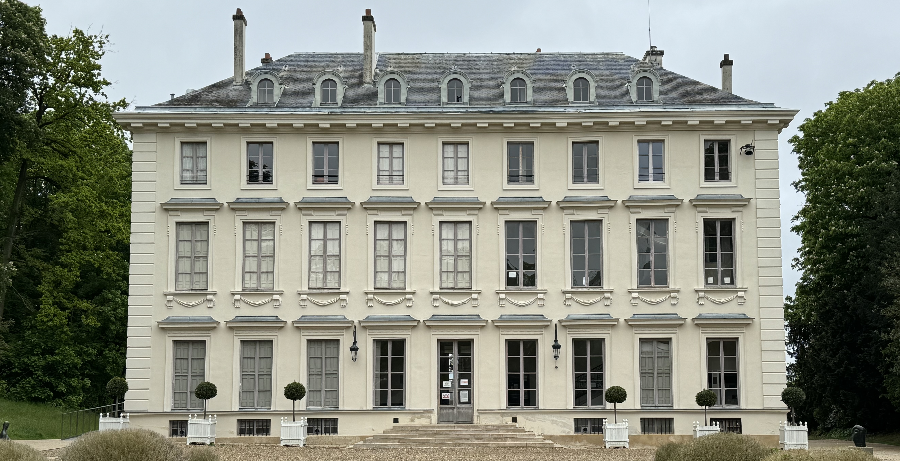

This week I went to Ville-d'Avray, a town ~12km to the west of Paris. When I was an au pair in 2016-2017, I lived close to here, had some friends who lived here. Despite that I never got to see the town, but I'm so pleased I found the time to visit. This is the town where Gambetta lived, and where some of Corot's paintings were based.

### Getting there

There are two train lines that go to the station "Sèvres - Ville-d'Avray" - the L line (from Saint Lazare) and the U line (from La Défense). From Saint Lazare it takes around 30 minutes on the train. Depending on where you're coming from in Paris, there is also an option to take the metro line 9 and then the bus.

### The trip

I arrived in the morning and went to see the "Étang Neuf" and "Vieil Étang" which are inside the "Forêt domaniale de Fausses-Reposes". There's a few reasons why I did this first, the first being the weather in the afternoon wasn't looking too great - rain was forecast and the second reason is because the house that I wanted to visit, "Maison des Jardies - Léon Gambetta" is only open in the afternoons (on certain days).

Corot based some of his paintings on the vieil étangs - this place was easily accessible for him because he had a country home nearby. These paintings are displayed around the world including at the National Gallery of Art, Washington and The National Museum of Fine Arts, Buenos Aires.

I enjoyed walking around the ponds and the forest that surrounded them. I love that there's so many options for green spaces just outside of Paris, I really forget that I've just came from a big city. I didn't see that many people apart from the occasional runner or dog walker which is to be expected a thursday mid morning.

After my walk through the first, I walked back towards the main town to get some lunch. I had sushi from Sayuri Sushi but there were lots of other options in the area. The sushi was pretty average - it's what you expect from a restaurant like this (which I actually enjoy). To pay by card, you usually need to spent 15€ however I was still able to pay by card.

I then walked to Château de Ville-d'Avray and sat there on the bench. The château is private but they do sometimes have concerts and events. While sat there, I drew the château in my journal - I'm not a natural artist, but I'm trying to lean more into creating in ways that feel right. I drew in my normal black pen which is freeing in a weird way, I know I can't erase my drawing once it's on the paper, but it didn't need to be perfect, it was just for fun.

I then walked towards Maison des Jardies - which technically is in Sèvres, rather than Ville-d'Avray but I'm counting it here. The street where the house is on, Avenue Gambetta is the border between the two towns. They opened at 2:30pm with a guided tour that lasted until 3:45pm. From 4pm you could visit unguided. There is no additional charge for the guided tour.

I am so so pleased that I followed the guided tour, there was one other person following it. It was super interesting to hear about the lives of Balzac and Gambetta. The tour started with a bit about Balzac who lived there in 1837, but the tour mostly focused on Gambetta who lived there from 1878 until his death in 1883 at the age of 44. If you live in France, you've probably seen some streets named after him, because he's in the top 10 of people that have streets named after them.

I won't spoil too much about the tour, but one of the things I love about guided tours is the stories and details that I might not have noticed otherwise. The house was build in three different phases, which is visible from the outside but I'm not sure if I would have noticed on first glance. There are stories about Gambetta escaping Paris in a hot air balloon with some great drawings to go with this event. And in photos, Gambetta is always facing away because he had a prosthetic eye and preferred his good side to be visible. What happened after his death is wild - from the staged photo to the autopsy which ended in parts of his body being taken as a relic (some parts were never traced after they were taken).

After visiting the house, I took the train back into Paris. Next time I would also like to visit Galerie de l'Entracte which displays some local artwork. They're open every day in the afternoon

### Recommendations

- if you can follow a tour in French, then I would definitely recommend following the tour at Maison des Jardies
- check the opening hours for Maison des Jardies on their website because they're not the same hours each week

### What I spent

- transport is included in my monthly [Navigo](/articles/navigo) (the monthly ticket costs 86,40€)
- for lunch, I spent 14,5€ on sushi
- entry to visit Maison des Jardies usually costs 7€ but entry was free because I have the Passion Monuments pass (70€ per year for the duo card)

### Now it's your turn

Are you planning on going to ville-d'Avray? Have you already been? If so, I'd love to hear your thoughts and experiences! You can reach me via email at **[contact@abisummers.com](mailto:contact@abisummers.com)** or via instagram at **[@abisummers](https://www.instagram.com/abisummers/)**
