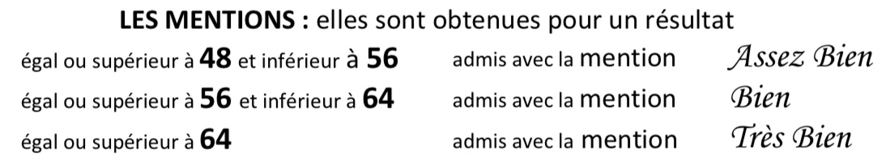

In France, they _love_ a certificate. Without the right qualification and paperwork, everything is so much harder, sometimes impossible.

Before becoming a tour guide, I was a backend developer. I had spent three years working at French company, and decided it was time to change companies. While I faced a lot of rejection, I did get through to quite a few interviews. One of these interviews really stands out - during the first interview the tech lead basically said to me that because I did not have a degree, there was no point in continuing, and that if I wanted to do the tech interview I could, but essentially it would be a waste of my time. I had three years of professional experience, with good references, but that did not matter.

### Why I got the DAEU

In France there are two types of tour guides, licenced guides and unlicensed guides. There's an entire process to getting the license, with a few different ways to achieve it. The first step for me was getting the baccalauréat, also known as the BAC. This is the qualification that you get when you pass _lycée_ (high school). Note, I'm using the word high school because most people are familiar with this term, but in the UK (where I'm from), we call it college or sixth form.

While I did go to college aged 16-18 (high school) in the UK, the subjects I picked were not enough to convert it to the BAC. I didn't study any languages or humanities. I studied, maths, psychology, biology and chemistry.

### What is the DAEU?

The DAEU is the _diplôme d’accès aux études universitaires_, or the diploma that gives you access to superior studies. This qualification gives you the same rights as the BAC. This means, you can use this diploma to get into university, or follow various courses. It's an important piece of paperwork.

### Why I picked the DAEU

When researching my options, I came across a few different options:

- BAC with lessons at a school
- BAC as an independent candidate (no classes, just the exams)
- DAEU (option pre-DAEU, A (littéraire), B (scientifique), CNED (Centre national d'enseignement à distance) or _remote_)

While I liked the idea of being an independent candidate for the BAC, so that I could study around work, I knew that wasn't the best option for me. Partially because I wasn't sure if my French was good enough, and partially because I know the structure of a class helps me a lot. It was also a good opportunity to meet people which helps keep me motivated. It's the same reason why I did not do the DAEU with the option CNED. I looked at the option of going to school to get the BAC, but the hours would have made it complicated for me to continue working.

So, I applied for the DAEU at Université Paris-Est Créteil (UPEC). The hours were less intense than the hours for the BAC, classes were in the afternoons (and I mostly work mornings) and I hadn't missed the deadline for applying. The littéraire option was the best option for me, because it gets me closer to getting my guiding licence.

### The entrance exam

In order to get onto the course, you have to sit an exam. There are two parts to this, the French exam and the foreign language exam (in my case English). I was not worried about the English exam with it being my native language, but I was nervous for the French exam. A french exam, for native french speakers! The exams are entirely written, and my written french was _not good_. For both the English and French exams, there are two parts. The first part is reading comprehension, the second part is writing.

A few days after the exam, you get to pick a time to go into the uni to talk with them about your options. Based on my French exam, they wanted me to do the _pre-DAEU_ (see, I told you my French writing was not good). This is a year dedicated to getting your reading and writing level up to a level that gives you the highest chance of passing the DAEU the following year. I did not want this course to take two years. I was motivated, I knew I could find the time to work on my French outside of school, with the exams being that extra bit of motivation needed. Because my reading comprehension and oral french were good enough, I was able to convince them that I could do the DAEU A in one year. We came up with an agreement that after the mid-year exams, if I was struggling, I'd drop history and geography to focus on the french.

I had passed the B1 DELF exam in December 2022, but I did not need to provide this, or any other language certificate outside of French entrance exam.

spoiler: I did the DAEU in one year!

After the exams january exams, I got a lovely email, saying that I was progressing well so could continue with all four subjects.

> translation: When we met earlier this year, we agreed to touch base again if necessary. I haven't forgotten you, but I ultimately didn't schedule a follow-up appointment because you are doing well. However, please don't hesitate to get in touch if you run into any difficulties. Congratulations, and all the best.

### Pricing

I was a student for the 2025-2026 year. The pricing depends on a few factors - who's paying for it (you as an individual, a company or through CPF). In my case, the inscription fee was 178€ and the price of 4 modules was 344€. Because I live in Ile-de-France, the region covered the cost of the modules. Thank you Ile-de-France! (seriously, I [love this region](/articles/alphabet-ile-de-france/).)

so in total, I paid only 178€ for the year. This is by far the cheapest form of French classes I've ever done. French classes can get pricey!

### My experience

I had a great time. I'm so happy I did the DAEU. It was definitely intimidating. Everyone else in my classes spoke French as a native language. I did not. Everyone was super kind to me as I fumbled for words and made basic grammar mistakes!

In my classes, there were people who were in their early 20s, people my age (late 20s) but also people who are in their 50s. There were people who worked full time, people who has done entire careers, people with kids. It was great getting to meet people with all sorts of backgrounds and lifestyles. Some of these people became friends.

In the first French class, everyone had to stand up at the front of the class, to talk about a book, movie or piece of art that they enjoyed recently. I picked the first French book I enjoyed reading _La vie secrète d'un cimetière_ (and I still tell everyone about this book, I loved it). Yeah, I was nervous, but getting outside of my comfort zone really helped improve my French.

During the registration, I got to pick the courses and the timetable. I had classes two days a week. 4 hours of French on a Wednesday afternoon, and 2.5 hours of history, followed by 2.5 hours of geography on a Thursday afternoon. I could have done history and geography on different days, but I preferred to have classes back to back. I didn't attend English class - I was not the target audience for these lessons, but I did still have to sit the English exam.

There were a few things that really helped my French over the year.

- French classes with native speakers. It was interesting to see the type of mistakes they were making, and it made me feel better about the errors I was making.
- Learning a topic, without French being the main focus. My history and geography classes, were taught entirely in French. This helped me learn a lot of new vocab without it feeling like a French lesson.

### The exams & grading

There are two rounds of exams, the mid year exams in January/February and the final exams in May/June. The entire grade comes from these exams - no work you do in class counts towards them. They're entirely written exams. If you're going to do the DAEU, you should absolutely go to the exams in January/February. In order to pass, you need 40/80 points. Each subject is graded out of 20.

The way the exam results were calculated is as follows:

- if your end of year exam is higher than your mid year exam, you keep your end of year grade
- if your mid year exam is higher than your end of year exam, you get an average of the two.

Your mid year exam can only help pull up your grade! You should 100% sit these exams, there's nothing to lose. It also helps you mentally prepare for what it is like to be in the exam hall.

### Results

A 40/80 is what you need to pass. You can get 7 points in one subject and still pass as long as your total is above 40. Within the passing grade, you can also get a _mention_.

> grades between 40 and 47 (included) give no mention. Grades between 48 and 55 (included) give the mention assez bien. Grades between 56 and 63 (included) give the mention bien, and grades of 64 and higher give you très bien.

I scrapped by with the mention bien by getting 56 points! I'm super proud of this achievement - my exams were graded as if French was my native language. I did not get any sympathy points. I worked hard, I attended almost every class and spent time outside of class working on my french.

### Get in contact

Before signing up for this course, I heard no one talking about this option. I personally think it's super cool that options like this exist, and are affordable. If you have any questions about the DAEU, you can get in contact via Instagram at **[@abi.in.france](https://www.instagram.com/abi.in.france/)**!

---
