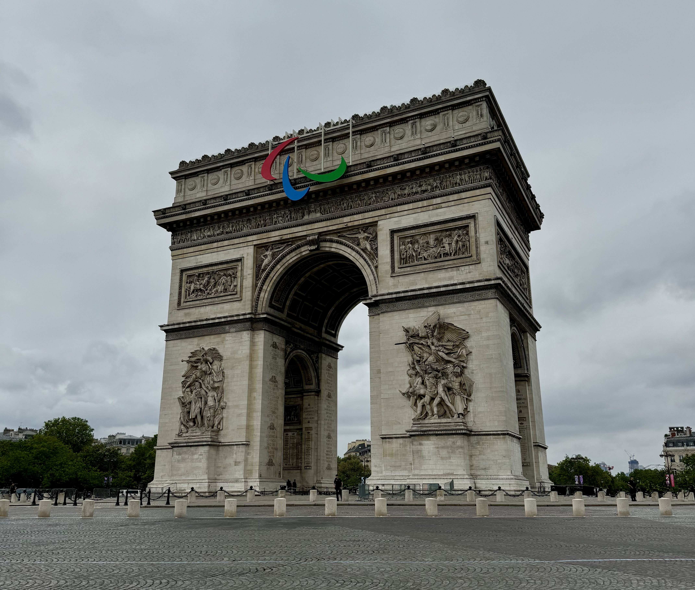
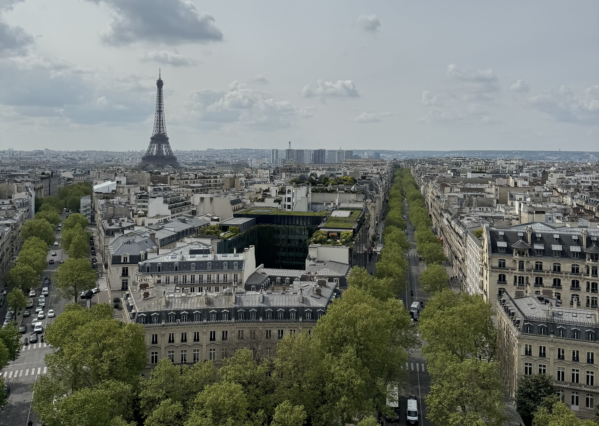

The Arc de Triomphe is one of the most famous monuments in Paris. It's located at the western side of the Champs-Élysées, one of the most iconic shopping streets in Paris, on Place Charles de Gaulle. It was commissioned by Napoleon in 1806 after the victory at Austerlitz. On the inner and outer surfaces, there are the names of French victories and the generals. Underneath the Arc, lies the Tombe du Soldat inconnu or the _Tomb of the Unknown Soldier_ from World War I.

There is a metro station under the Arc de Triomphe called _Charles de Gaulle – Étoile_. Etoile is the French word for star, and that's because the view from above looks like a star, there are 12 streets that arrive at the roundabout. From the top, you can really see the shape.

To reach the Arc de Triomphe, you need to walk _under_ the roundabout, please don't try to cross the road. Almost every time I'm here, there's someone trying to cross the many lanes of traffic which is dangerous. There are two sets of stairs that go under the roundabout, one from _Avenue des Champs-Élysées_ and the other is from _Avenue de la Grande Armée_.

### Construction

Construction started in 1806 but it was only inaugurated in 1836. But why did it take so long to finish the Arc de Triomphe?

It took 30 years to finish the Arc de Triomphe because it was handled under multiple different political regimes. Construction started in 1806 during the First French Empire (also known as Napoleonic France). The first First French Empire started in 1804 and ended in 1814. It was briefly back between March and July 1815 before Napoleon was exiled to Saint Helena, a very remote island in the South Atlantic Ocean. Napoleon never got to see the finished Arc because he died in exile in 1821, 15 years before it was finished.

in 1810, due to the Arc de Triomphe not yet being complete, Napoleon had a wooden mock-up of the completed Arc so that he could walk under it with his new bride Archduchess Marie-Louise of Austria.

1815 marks the beginning of the Bourbon Restoration which lasted until 1830. During this period, the construction was halted, which accounts for half of the time between starting the works and it being inaugurated.

The July Revolution of 26 July 1830 (also known as Second French Revolution or the Trois Glorieuses) marks the end of the Bourbon Restoration. There's a famous painting _La Liberté guidant le peuple_ (Liberty Leading the People) by Eugène Delacroix that represents the Second French Revolution which is on display in the Louvre. It is during the period of the The July Monarchy (1830–1848) that the Arc de Triomphe is finished.

Louis Philippe, King of the French during the July Monarchy, turned to the glories of Napoleon to prop up his own regime. Louis Philippe supported the return of Napoleon's remains from Saint Helena (where he died in 1821) and finished the Arc de Triomphe between 1833 and 1836 as a monument to Napoleon's victories.

In December 1840 Napoleon's remains passed under it on their way to Les Invalides where Napoleon is still today. When Victor Hugo died in 1885, his body was displayed under the Arc before going to the Panthéon.

The final cost was reported at about 10,000,000 francs (~€65 million in 2020)

### Visiting

It is open daily with some exceptions for public holidays and other events.

You're able to get close to the Arc de Triomphe without needing a ticket. You only need a ticket if you're wanting to climb up the 284 steps to get to the top. Full price tickets cost 16€. It is free to enter on the 1st sunday of the month outside of peak season (free access on the 1st of the month between November and March).

If you're going during peak season, I would recommend reserving tickets in advance so you can skip the queue, which can sometimes be quite long. Alternatively, if you have the [Passion Monument](https://www.monuments-nationaux.fr/en/passion-monuments-subscription) card, then you can also skip the queues - this card (valid for one year) costs 45€ for one person or 70€ for the duo card which grants free access to more than 80 monuments in France (including the Conciergerie and Sainte-Chapelle). See how much I have saved [here](/articles/subscriptions/) with my subscription.

Visiting the Tomb of the Unknown Solider is free to access. In 1920, the the remains of an unknown solder were placed under the Arc de Triomphe in tribute to all the soldiers who went missing in the during the First World War. The tomb has an eternal flame which burns all day and all night in memory of the lost soldiers, which was first lit in 1923. Every evening at 6:30pm, there is a service where the flame is rekindled.

I would recommend visiting the top because you get a great view of Paris, especially if the sun is shining. You'll get to see a lot of the recognisable Paris landmarks, such as the Eiffel Tower and the [Sacre-Cœur](/articles/guide/sacre-coeur/) in [Montmartre](/articles/guide/montmartre/).

You'll be able to see the two other arches that are part of the 'Axe historique de Paris', or the _historical axis of Paris_. The historical axis is made up of different monuments that are all in a straight line. Looking east down the Champs-Élysées, you'll see the obelisk at Place de la Concorde, and if you keep looking straight you'll see The Arc de Triomphe du Carrousel. If you look west, you'll see the Grande Arche of La Défense.

### Annual closures

the Arc de Triomphe is closed for certain holidays and events throughout the year.

- New Years celebrations happen on the Champs-Élysées so the Arc de Triomphe closes early on the 31st December. For the New Years celebration, thousands of people gather on the avenue to listen to music and to watch the fireworks with the Arc de Triomphe being a central element. People start arriving during the afternoon to ensure they get the space they want. It is closed on the 1st January.
- 8th May which is the commemorations of the victory of May 8 1945 (closed in the morning).
- 14th July is the national holiday in France. There is a parade that happens on the Champs-Élysées (in 2024 due to the olympics, the parade happened on Avenue Foch, one of the other streets leading off the Arc de Triomphe). If you are wanting to see the parade, it is advised to go very early. (closed in the morning)
- At the end of July, the Tour de France ends in Paris with multiple laps including on the Champs-Élysées. The exact date changes each year. Watching the Tour de France is a fun experience, but arrive early if you'd like to get a good space.
- 11th November (Armistice Day or Remembrance Day) marks the end of World War I.
