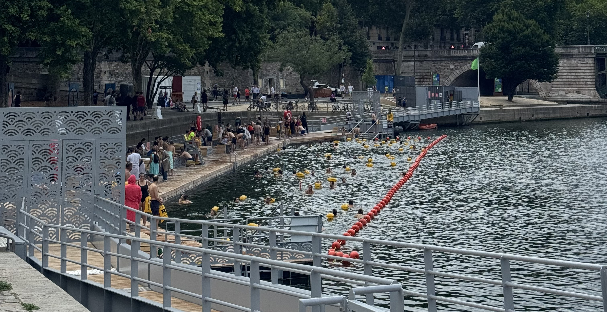
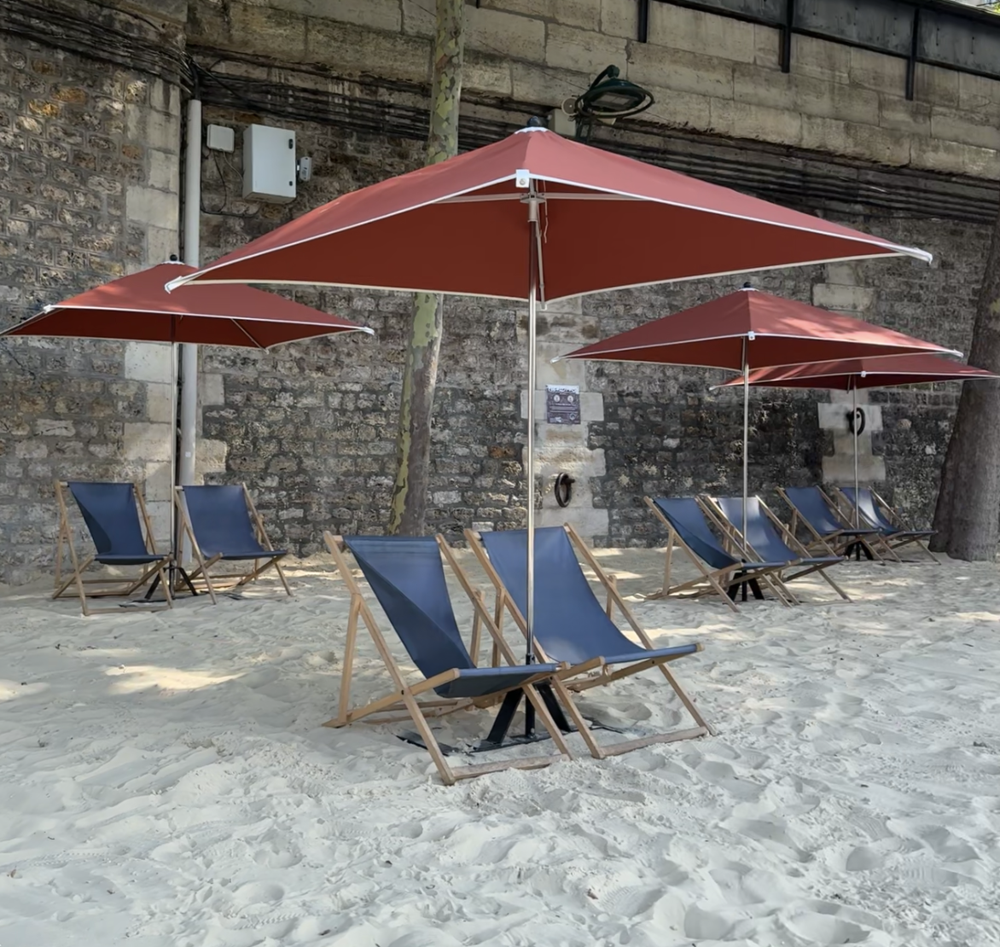

It's the start of September and I'm sat in my office reflecting on August. Summer is a busy period for me as a tour guide, so unlike a lot of 'normal' jobs September is actually calmer for me (it's been a while since I found the time to just sit and write!). That being said, I love Paris in August!

### Is August a good time to visit Paris?

Paris is a great city regardless of the time of year, but every period has something different to offer. Personally, I like Paris over the summer months. It has a slower pace to it (yes, even with it being my _busiest_ period) and I enjoy the sunshine. A lot of the Parisians are on holiday or are working remotely so the metro is much quieter, and overall everyone is in the holiday vibe even if they're still in the city.

Some of my favourite things about the summer are the free activities that Paris hosts, the Paris plage (Paris beach) and open air cinemas to name a few. Along the _quai de la seine_, it turns into a beach - I'm talking sand, deckchairs and this year they even a few areas to swim in - for the first time in 100 years, all thanks to the Olympics! Along the river banks, there are misting stations to cool down at, places to get sun cream (which is very important!!) and places to borrow games. It's such a vibe and you'll see people of all ages enjoying this space.

Paris has had a lot of great exhibitions on over summer! At the end of August/beginning of September a lot of exhibitions close and get ready for the next season. There's definitely some I missed out on because I didn't make the time for them.

Another great advantage to summer is the hours of sunlight! in winter, it can be dark by 5pm which personally makes me want to wrap with inside with a hot chocolate. I love being able to explore into the evening with the sun still lighting the city. It also makes people feel a lot more comfortable while walking around an unfamiliar city.

### Cons of visiting in August

While there are pros to visiting in August, there are definitely some cons. Summer can get hot (but this year we had a crazy warm June, August was ok). When it's hot it's so important to drink enough water - and there are plenty of places across the city to fill up water bottles. Mother nature is in control here, so you just have to go with whatever is thrown at you.

The French love a good holiday, and in August you'll see traces of that across the entire city - bakeries, pharmacies, restaurants, independent boutiques, hair dressers etc, you name it, they'll be taking holiday. It's not uncommon for these places to take _at least_ two weeks off, sometimes they'll take an entire month off. Yes this is the famous Berthillon ice cream store that is closed in August.

This makes finding places to eat a little more complicated - you can't always trust the opening hours on google maps. It happens to me every year, where there's a place I want to go and find out it's closed when I get there. On the bright side, it does help you make a decision when there's only two bakeries to pick between rather than five. Good news is, there are a lot of bakeries around the city so there's always something that's open.

A lot of the popular tourist attractions get busy in summer - I'm taking the Louvre, Versailles, the Eiffel Tower. I HIGHLY recommend getting tickets in advance and even with tickets in advance there will be queues. When it's hot, the summit of the Eiffel Tower sometimes closes, so that's also something to consider.

While the metro is quieter, it means that they take the time to do important maintenance work so it doesn't interrupt most commuters. A lot of lines end up with closures for a few weeks. The metro system in Paris is great so there's almost always another route or you can use the replacement bus service. Apps like google maps and city mappers are almost always aware of these closures, so they'll show you the adjusted itinerary.

### Let me know what you think

Like with all things in life, there are pros and cons. If August is the only time you can visit Paris - take the opportunity! Yes, it's busier, but the vibes are much slower, there are lots of activities, and overall everyone is in a great mood!

Anything you'd add to this? Let me know over on Instagram at **[@abiguides](https://www.instagram.com/abiguides/)**!
