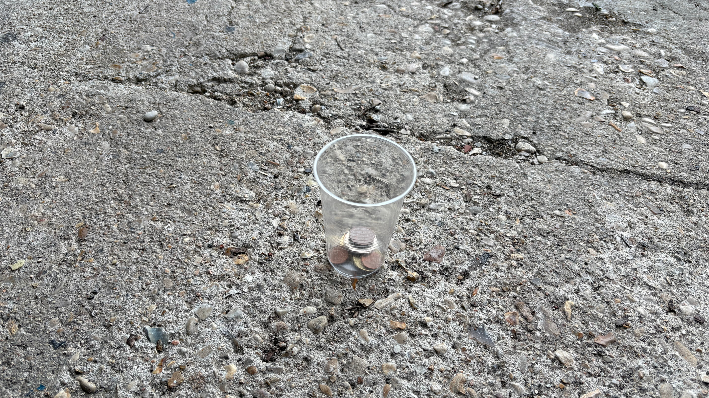

As with all big cities and tourist locations there are certain things to watch out for. The scams are used in other cities around the world, but sometimes a reminder is helpful

The french word for scam is _arnaque_.

Paris, overall is a fairly safe city and is comparable to other big cities in Europe. This list isn't meant to put anyone off Paris, but more about the things to pay attention to so that you can fully enjoy your time in the city. A great day can easily be flipped if you notice your wallet is stolen.

### Pickpockets

This is an obvious one, but there are pickpockets all around the city. Metros are one of the prime locations where they're active, along without around any major tourist location like the Eiffel tower.

Here's some good practices:

- don't leave phones, wallets, passports or anything else valuable in a loose pocket, or where the item is visible
- don't leave your bags unattended, which includes on the back of a chair in restaurants
- pay attention if you're using your phone by the metro doors, pickpockets are known to snatch phones and get off the metro just as the doors are closing

If you see a sign, or hear an announcement that says "beware of pickpockets", the natural instinct is to check to see if you still have your phone and wallet. Be cautious around this, because if you tap your pockets that contains your valuables, pickpockets will know exactly where to target.

### The cup game

You will often see people playing this game by the Sacré-Cœur and the Eiffel Tower. The game is essentially guessing which of the three cups has the ball in it - you watch the person place the ball and then they move the cup around. I'm sure you've seen this before, another classic scam.

There's a team of people working together, you have the main person who is moving the cups around, and another person who is adding to the cash prize _if_ you're able to win and observing everyone that's watching.

It's wild to watch these people play, often you'll see them playing with 50€ notes, so the stakes are high. There's a lot of cheering that goes on around these games which draws in new people.

I'd recommend staying clear of these games - the odds are not in your favour.

### The clear cup

> a clear plastic cup on the ground with some coins inside, recreated

This scam involves someone sitting on the side of the street, with a clear plastic cup in front of them, directly where people will be walking. Inside the cup, they have a few coins. Sometimes, they'll even put it down just as you're approaching so it's sure that you'll knock it over.

I have seen this often near the Opera and on Rue Rivoli because both of these areas are busy, but it can happen anywhere in Paris.

The idea behind this is that you'll knock over the cup, feel bad about it and then will stop to help put the coins back _and_ will give them some more money.

The only way to avoid this is to pay attention where you're walking and if you do knock over the cup you don't need to give them additional money.

### Sacré-Cœur bracelets

At the Sacré-Cœur you'll often have people (usually men) making bracelets. There's usually 3 of 4 of them, standing in a line, and will try and grab your wrist as you walk by.

Do not engage with them, pretend that they're not even there. Often, you need to assertively say no. Once the bracelet is on you, they'll ask for money.

### The clipboard

In the touristy areas, like around the Louvre or Eiffel Tower, you'll often see a group of people (usually young women) who have a clipboard. They say that they're collecting donations and often act as if they're deaf.

The money that they collect is in fact not going towards and charity they say it is.

Sometimes, you'll see people outside metro stations asking for donations for charity or different associations - it's always very clear what they're doing when. They wear lanyards and branded clothing (t-shirts, vests etc), they're not at all pushy. It's easy to tell that they're legit volunteers.

### Metro tickets

Sometimes, around metro stations (usually the ones that have the long queues) there will be people selling metro tickets. Never buy these tickets, because the tickets will not work. By time you go back to ask them about the ticket, they will have moved on to their next location.

If you need to buy a metro ticket, go to the machine, which all have an English option, or buy directly on the _bonjour RATP_ app.

The Paris transport system does not accept contactless payments when validating a ticket, so you do need to buy a ticket in advance.

### How can I avoid scams in Paris?

- know where your personal belongings are at all times, never leave them unattended. I always have a bum bag that has all my valuables in it, and a tote bag that had everything, like a bottle of water and a book.
- do not leave your phone, wallet or other valuables in an easy to access place such as a back pocket
- if someone approaches you in the street, it's usually not for a good reason _especially_ if they start with 'do you speak English?'.
- if your gut is telling you something is off, you're probably onto something
- don't be afraid to say no

### Got any questions?

If you have any questions about Paris, or see a scam that I've missed, feel free to reach me via Instagram at **[@abiguides](https://www.instagram.com/abiguides/)**!

If you are visiting Paris and would like a private tour, you can book a tour using the button below.
