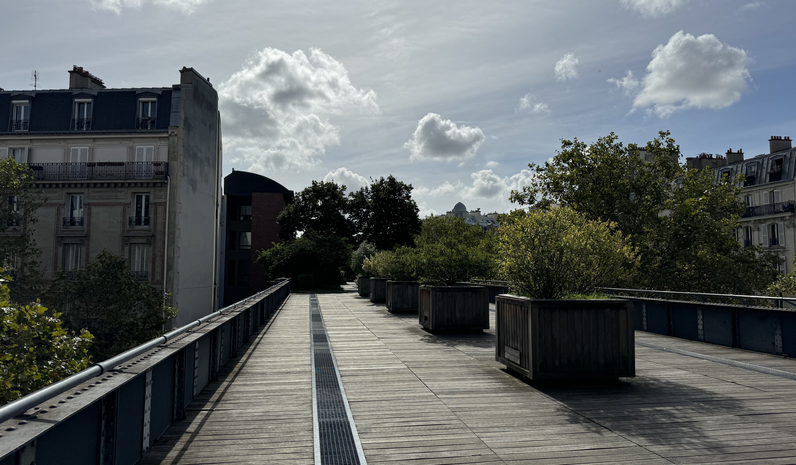
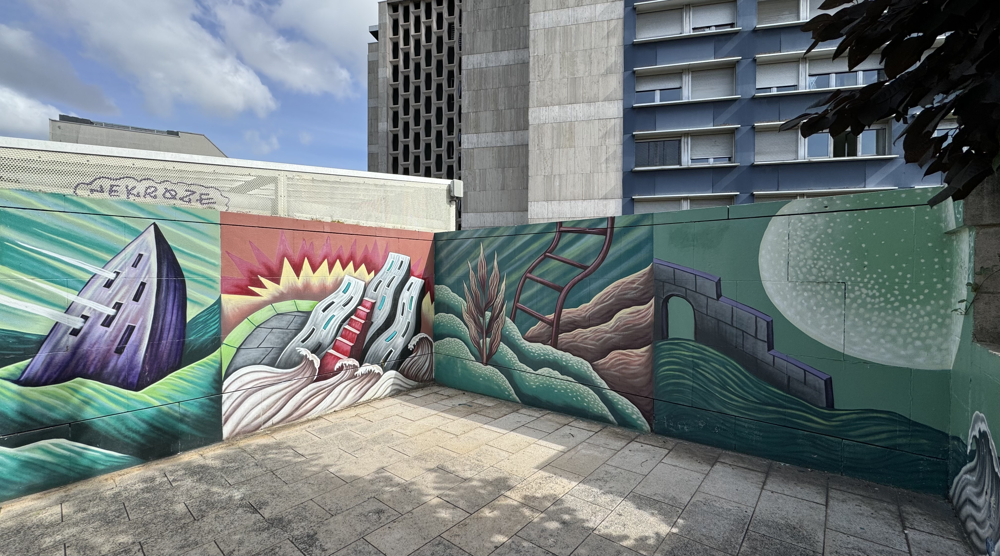

Coulée verte René-Dumont, or otherwise known as _Promenade Plantée_ (planted promenade) is an almost 5km walk from Bastille to Vincennes that follow an old train line. You'll go from walking along the beautiful _Viaduc des Arts_, across bridges, and through tunnels while getting to enjoy Paris at a slower pace (and hopefully also the sunshine).

I love this walk, especially in summer because you get to see all of the different flowers and shades of green. There is something so inspiring about spending time outside when the sun is shining. I love seeing everyone go at their own pace, enjoying either their time alone or the company of their friends.

### The walk

The first part of the route from Bastille to Jardin de Reuilly is easy to follow - between Basttile and jardin de Reuilly you follow the _Viaduc des Arts_. I love this viaduct, it's such a contrast to the buildings that surround it. It's crazy to me, that a train once ran along here - it's so cool to see parts of history in everyday Paris. I also really enjoy getting to see things from a different angle.

After jardin de Reuilly, it becomes a little harder to follow. There are signs, and it's essentially a straight line, but you're no longer on the viaduct. While it is pedestrianised the entire way, you're now passed by cars on the same level and there are a few roads to cross for a short while. Once you get to this level, there is a bike lane which is easy to follow.

The crossing from Paris into Vincennes could be better (and maybe this will change in the future!). You have to go under the ring road of Paris but unfortunately the straightest tunnel is closed to the public so you have to go round to the right. A short walk through Saint-Mandé and then you're in Vincennes!

From here, you have a few different option! You could spend the remainder of the day exploring the Bois de Vincennes or you could even end the day with a visit to the Château de Vincennes. Or, if you're tired from a day in the sun, you can take the metro 1 back into Paris.

I really like that along the walk, there are different pieces of street art that have been commissioned. I think it's great that art is accessible - I didn't grow up exposed to art so I'm still finding my style and words to describe it. I also really appreciate spaces that are designed for people living here - this is a great place to see friends, to read a book or to escape the business of Paris life. I love that there are so many green areas in Paris.

### Ideal for

I would recommend this to anyone that enjoys a casual stroll. It would be a great activity with kids because they are able to explore without the danger of cars. It would also be great as a date because it's usually not so busy, and because you can focus on the conversation without looking at directions, or having other distractions.

Just off of the walk, there are different places you can stop like parks, cafes and restaurants (it's worth noting where the access points are, especially for the first part). I really like the park _Jardin de Reuilly - Paul Pernin_ because of how big it is - it has an open field which has shade and there's also a play area for kids. I feel like this is one of the more hidden parks

### History

As I mentioned, this follows the old train line from Bastille to Vincennes (opened in 1859), but the train line actually ran further - to Varenne-Saint-Maur. In 1969, the line was closed due to the opening of the RER A line - some of which follows the same track now. The part Paris-Vicennes part was almost completely abandoned - along parts, nature really took over.

The _coulée verte René-Dumont_, created in 1988 by Philippe Mathieux (architect) and Jacques Vergely (landscape architect) is what we can follow today. It was at around this time, that the viaduct was also repurposed and turned into an area for workshops with a strong focus on craftsmanship.

### Practical info

And here we get onto the practical info - you can verify that all of this information is still up to date on the [Paris website](https://www.paris.fr/pages/de-bastille-a-vincennes-par-la-coulee-verte-4932). On the website there is a map with the route.

- parts of the walk have opening hours, these hours vary between summer and winter.
- there are lifts to access the Viaduc des Arts however it's possible that they are sometimes out of service (really, not enough is done to ensure things remain accessible)
- there are plenty of places to fill up water bottle, staying hydrated is important!

### Now it's your turn

If you walk along the Coulée verte René-Dumont I'd love to hear what you think! Please share your thoughts over on instagram at [@abisummers](https://www.instagram.com/abisummers/)!
