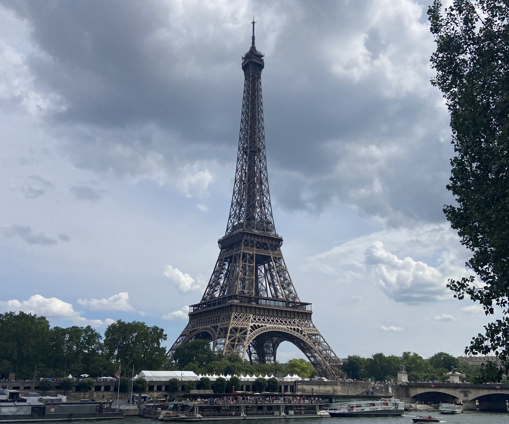

The Eiffel Tower, is one of the most visited attractions in the world! Here you'll find my tips and tricks for having the best experience - with or without a guide.

The article is broken down into themes based on my experience on giving tours of the Eiffel Tower. You can skip to the part that's most relevant for you!

- [Scams](#scams)
- [Security checks](#security)
- [Tickets](#tickets)
- [Summit tickets](#summit-tickets)
- [The best view](#best-view)
- [Weather conditions](#weather)
- [Landmarks](#landmarks)
- [Book a tour with me](#guided-tour)

### Scams

I have a whole [article on scam](https://abisummers.com/articles/guide/common-scams/) in Paris, but I think it's worth mentioning here, because this is one of the locations where you'll see almost all of the scams.

All across Paris, and other big cities, you get pickpockets. You'll often see signs or hear announcements to remind you of your personal belonging - that means no phones in back pockets, no bags hanging on the back of a chair and never leaving your valuables unattended. I'm sure this advice is nothing new.

For me, the most annoying scam you'll see by the Eiffel Tower is the people, usually women, with clipboards. They'll either ask if you speak English (almost always a red flag) or will just tap the clipboard pretending to be deaf. They'll claim it's for a charity or some other good will act, but in fact you're just giving them your money. They can be persistent and it's very hard to get out of it. My advice would be to not engage with them at all.

Recently, I was waiting for some guests on a guided tour of the Eiffel Tower. While waiting for the people on my tour, two tourists approached me asking for help to find their tour - no worries there, I'm happy to help, they wanted to know where their meeting point was. They were standing a few meters away from me while trying to get in contact with their tour company (they missed the start and were trying to get rescheduled). I noticed that two people approached them with the _do you speak English?_ question and clipboards. I went over to see how they were getting on with rescheduling their tour, and the women were angry with me asking what I was doing - one of them even grabbed my arm. I simply said that they were with me - a small lie but I could tell they were uncomfortable _and_ I know it's hard to get out of this situation. They accused me of being a pickpocket, but they left without saying anything further.

### Security checks

There are two security checks. The first check is to get access to the pavilion, this is free of charge to access. For the first check, they will ask you to empty your pockets and open your bags for them to inspect. If you have mobilities issues, such as using a walking stick or wheelchair, you are often able to skip the queue - there's usually someone from the security that will assist you.

For the second security check, your items are all scanned. So you'll close your bags and it will be scanned like at an airport. This is done after purchasing the tickets/showing your pre-booked tickets.

Here are some important things to remember for the security checks:

- there is a limit on the size of bag you can take in. So no suitcases, most backpacks are ok, but do check on their website if you have any doubts
- glass bottles are not allowed
- no alcohol is allowed
- no knives, or other sharp objects are allowed

A full list of item that are prohibited can be found on the Eiffel Tower website. If you have any of the prohibited items, they will be confiscated and you are not able to get them back at the end.

You are allowed to bring in water bottles. There are places on the ground floor to fill them up - I love that all across Paris you can find places to fill up water bottles.

### tickets

The cheapest way to visit the Eiffel Tower is by taking the stairs - this will only take you to the second floor. They estimate that it takes ~15 minutes to get from the ground floor to the first floor, and an additional ~15 minutes between the first and second floor. This will of course depend person to person and the speed that you would like to go at.

Alternatively, you can take the lift. There are two lift options - to the second floor or to the summit. Second floor tickets are always available whereas the summit tickets tend to sell out (more on that in the next section). After visiting the second floor, you are able to take the lift or the stairs to the first floor (which is worth visiting!).

You do not need a ticket to access the area underneath the Eiffel Tower.

#### Summit tickets

There are three ways to get tickets to the summit. You can reserve tickets on the Eiffel Tower website for the day and timeslot you'd like to visit, you can book through a company, or you can queue up on the day. All of this depends on your schedule and what works best for you. You will often find out that the cheaper summit tickets (eg without the option of a glass of champagne) sell out far in advance, and it's not possible to add the summit option to an existing ticket.

If you are booking through a company, you're going to want to look for an option that has skip the line tickets to the summit. If a company does not offer skip the line tickets, there is a chance you will only get to the second floor, this is because the Eiffel Tower management close the summit when they reach max capacity (~300 people). It will also mean that you have to wait in the line to buy tickets with your guide which can sometimes take more than an hour.

There will always be summit tickets available to buy on the day _however_ this does change throughout the day. If the summit is at max capacity, they will pause the sale in summit tickets. If the summit is closed, it is clearly stated both at the security lines and for the ticket purchasing lines. This is where you have to make the decision - you can wait until they reopen the summit, which is _usually_ within an hour. There is no guarantee, so it somewhat of a risk. No one at the Eiffel Tower will be able to tell you when the summit tickets will be available to purchase.

Once you are at the summit, you can spend as much time as you'd like there - enjoying the views and maybe even a glass of champagne!

There are also rare occasions when the summit is closed unrelated to the capacity, like if there's a lot of wind. This is something that is out of everyone's control.

The summit is not accessible for people in wheelchairs or people who use walking aids, so this is worth noting when deciding what option you want to take. If you have a walking aid, such as a walking stick, even if you can walk without it, you may still be refused access to the summit.

### The best view

Everyone is going to have their own opinion on this, but personally I find that the view is best from the second floor, and here's why. On the second floor, there is a viewing platform where you have an unobstructed view of Paris - no barriers or glass screens. This is also the best place for taking photos. I like that I can see the depth of the buildings from this angle.

The summit is nice, but I find that it can be quite overwhelming due to the number of people _and_ because you are so much higher than surrounding buildings you lose the element of 3D, everything looks _flatter_.

### Weather conditions

The weather can really influence your experience of the Eiffel Tower, so it's something to plan for (when possible). The Eiffel Tower is a mostly open structure meaning you're going to feel the weather. This can be great on a day where the sun is shining (don't forget sun cream!), but it does also mean that if it's raining or windy, you're going to feel it!

It's also worth remembering that while under the Eiffel Tower, you have _some_ protection from the wind and rain. On the 1st floor, you're more than 57 meters from the ground with nothing to protect you from the wind. I would recommend bringing an extra layer of clothing if you have any doubts - you want to fully enjoy your experience and not rush it because it's cold.

There are areas on the Eiffel Tower that are protected from the wind and rain - but these are not the places with the best views!

### Landmarks

One of the cool things about the Eiffel Tower is getting to see all of the landmarks. Some of the things to look out for:

- l'arc de triomphe
- sacre coeur
- le louvre
- centre pompidiou
- notre dame
- invalides
- tour montparnasse
- trocadero
- la defense
- le grand palais

### Book a tour with me

If you are interested in learning more about the history of the Eiffel Tower and what makes it so remarkable, you can get in contact with me via email **[contact@abisummers.com](mailto:contact@abisummers.com)** to organise a tour!

<!-- For a guided tour of the ground floor where I tell you some of the stories behind the Eiffel Tower, and what makes it so remarkable (because, it really is!), pricing starts at 40€. A tour of the ground floor will take ~1 hour.

If you would like for me to join you to the 2nd floor or summit, an additional fee will be charged. I am able to show you they key landmarks that are scattered across Paris and explain a bit about each of them.

Note: the Eiffel Tower tickets are not included in this price. This is something you will have to pay for (including my ticket if you would like me to join you to the second floor or summit). -->

 
