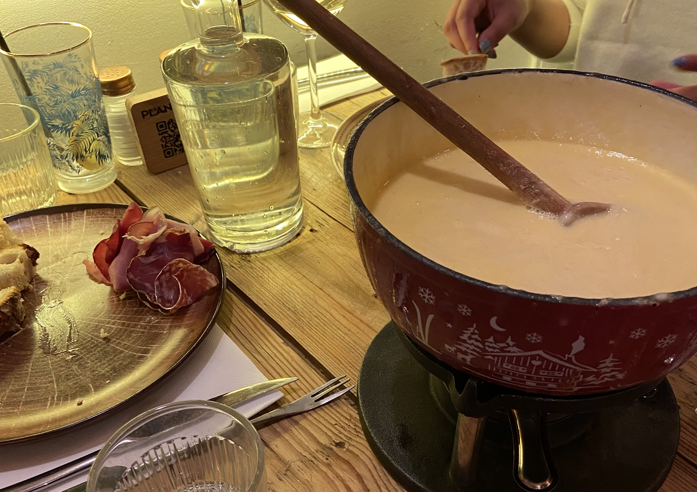

France is known for their food, and French people generally eat foods that are in season - they taste better, they're usually cheaper and it's also nice to have variety in your diet. You won't find strawberries at your local market in winter!

But there are certain foods that you'll only find at specific times of the year. Sometimes, they're only available for a few weeks. If you're in France during one of these periods, it's definitely worth trying!

### Galette des Rois (6th January)

This translates to _kings cake_, this is eaten for the occasion of _epiphany_. You will find this in most bakeries around this time as well as supermarkets. Ones from bakeries are more expensive, but worth it in my opinion. A lot of bakeries will allow you to pre-order one, so you can be sure to have one on the day! It's a heartbreaking experience going to buy one and finding out they're sold out.

This is a really fun tradition in France - especially for those with children. The youngest person goes under the table, someone cuts the galette into slices so that everyone gets a piece. The person under the table will assign a piece to each person, once everyone has a piece they can eat! The reason why someone goes under the table is to prevent cheating. Inside each galette there is a little ceramic item and whoever gets this, becomes king for the day!

This isn't just celebrated at home, you'll find this in office. One year, I went to the bank at around this time, they were offering pieces of the galette and if you won, your monthly card fee would not apply for the next year!

The little ceramic items are fun to collect, you'll often find them at flea markets.

### Chandeleur (2nd February)

This is celebrated on the 2nd February - 40 days after christmas. On this day, the tradition is to eat crêpes. _La chandeleur_ is _la fête des chandelles_, so the candlelight festival.

There are a few theories on why we eat crêpes, although who's to say which is the _original_. The first theory, is because they're round and yellow(ish) so they resemble the sun (which provides light).

Another theory is a parade that was started by Pope Gelasian I, where believers were invited to walk and sing with holding candles - at the end of the walk they needed something to eat. It's likely they would have had a cake that was made of flour and eggs, and over the years the recipe transformed into that of crêpes.

The final theory is related to the superstitious peasants - they thought that their wheat fields would be destroyed if they did not make pancakes on Chandeleur so they made pancakes and hoped for the arrival of spring.

### Huîtres

Huîtres or _oysters_ are in season from September to April (the saying goes any month with the letter _r_ is a good month for oysters). There are many ways of eating oysters, but the most common way is raw. When in season, you'll be able to find different varieties at markets, even in Paris.

While you can find oysters from September, a lot of people will only eat them between Christmas and New Years.

### Raclette

One thing to know about me, is I love cheese and potato based dishes. It's one of the things about winter that I look forward too. I start eating the cheese and potato based dishes earlier than the average french person, and I continue eating them after they've stopped.

While this is a dish that originated in Switzerland, it is common in France. There are a few variations on how to eat it (but all of them are great!).

The most common way to eat raclette is with potatoes, with a side of charcuterie and cornichons. At home, you can use a raclette machine where every person gets one or two dishes to put their cheese in, and melts it under the grill. This is one of my favourite meals in winter with friends and family because of how social it is, everyone takes their time and gets to eat at their own pace.

At every Christmas market in France, you'll see raclette. This is a little different to doing this at home, because they have half of a wheel of raclette cheese that is melted under a grill. When someone orders raclette they'll scrap the top layer of the cheese off directly onto your bread (or sometimes potatoes).

### Fondue

We have another cheese based dish! Again, this is a dish the originates from Switzerland, but is common in France. The word fondue comes from the French word verb fondre 'to melt', and that's exactly what it is. A pot of melted cheese! It's usually served along with bread. You'll get a small piece of bread on a skewer and put it into a communal pot of cheese.

<!-- Fondue can also be used for meat fondues, which you cook meat in hot broth (research, origin of the word in relation to _fondre_) -->

### Tartiflette

And yes, _another_ cheese dish but this time it's actually French and not something Swiss! It's made with potatoes, reblochon cheese, lardons and onions. You'll find this in most christmas markets in France.

This is harder than the other two cheese dishes, but it's still easy to make at home! You will need potatoes, lardons, onions and of course the reblochon cheese. A summarised version: brown your onions and lardons in a pan. When they're golden brown, add in your peeled and cut potatoes and cook for ~20 minutes. You can deglaze your pan with white wine. You can add pepper and nutmeg to taste, salt usually isn't needed because of the salt from the lardons.

Next you'll need to cut your reblochon. You'll cut this in half across the centre so you'll have two complete circles. In your oven dish, add your potatoes, onions and lardons. Cover this with your reblochon with the crust facing upwards (you might need to cut this further so that it fits your oven dish). Place in the oven for ~15-20 minutes on 200°c, until the cheese starts to brown!

There's a regional version called _croziflette_ in which potatoes are replaced with _Crozets de Savoie_ (small, square shaped pasta usually made from buckwheat).

### Foie gras

So here's a controversial food. Some French people are very in favour for keeping the tradition while others say that it's inhumane and should be banned. Foie gras literally means _fat liver_. Foie gras is the liver of a duck or goose which has been fattened by force feeding.

This is a conversation that comes up year after year.There has been a lot of discussions around banning the practice of force feeding ducks and geese, but as it stands it's protected by French law - it is part of the protected cultural and gastronomic heritage. The practice has been banned in many places, including within the EU - it's only legal in 5 of the 27 EU states.

### Bûche de Noël

Bûche de Noël or a _yule log_ is a dessert that is commonly served around the christmas period. You'll be able to find fresh ones on most bakeries throughout December.

There are some variations to this dessert. The traditional version is made of a sponge cake that has been rolled up into the shape of a log and then covered with a thin layer of buttercream. However now in bakeries you'll often find the 'fantasy' version which is more refined and has many more elements to it. They will often include things like fruit mousses and biscuits.

<!-- You'll be able to find these in pretty much every bakery in France during December! You can often buy mini version too. If you are wanting one for a specific day, I'd recommend ordering one in advance from your local bakery. -->

<!-- ### Vin chaud

Vin chaud or _mulled wine_ -->
