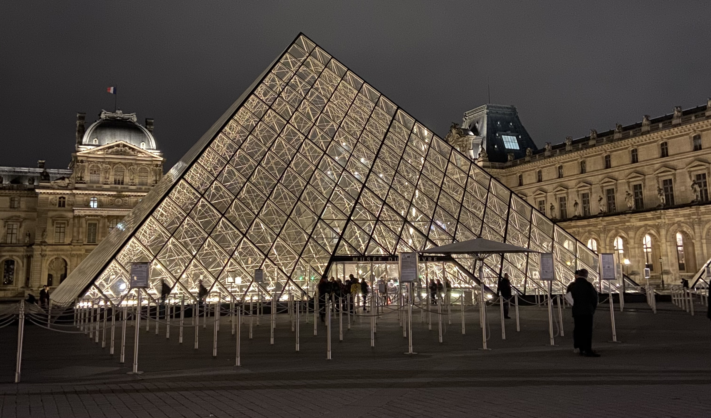
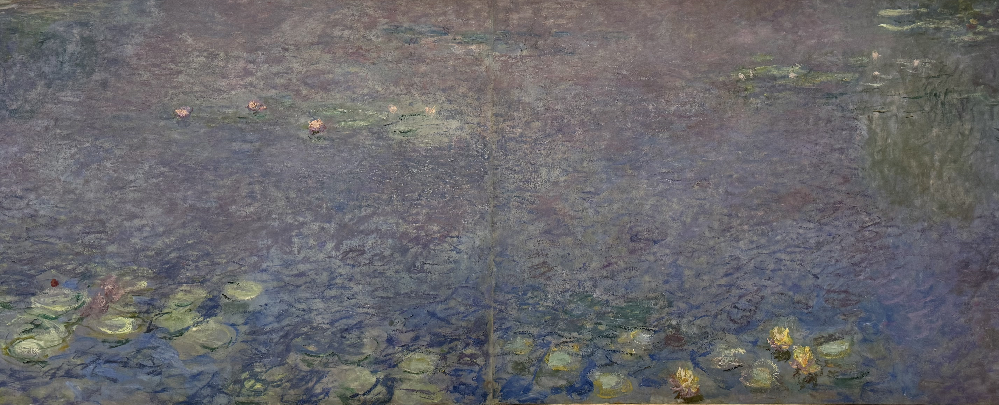

The first arrondissement is at the very centre of Paris. The name of this arrondissement is _Louvre_, and you can probably guess why.

While the Louvre is one of the most famous museums in the world, there are also other museums in the area that I really enjoy. If you're only in Paris for a few days, you're not going to see everything, so pick what speaks to you the most.

If you're looking for other things to do in the first arrondissement of Paris including places to eat, you can check out my article [here](/articles/guide/first-arrondissement/).

### Louvre

The first museum I'm going to mention is the Louvre, partially because it's the name of the arrondissement, but also because it's on the list of must-dos for a lot of tourists who are visiting Paris. It is one of the most famous museums in the world after all. Even if you're not planning on visiting inside, I still think it's worth admiring the building from the outside. You'll get to experience the size of the museum because it's _massive_ and you'll get to see the glass pyramids.

One of the most famous pieces is no doubt the Mona Lisa, or _La Joconde_ in French. There's a new project underway to create a new room for the Mona Lisa that will be independently accessible and have it's own access path, which should open in 2031.

Another famous painting is _La Liberté guidant le peuple_ or Liberty Leading the People. It's an iconic French painting, so much so that the figure of Liberty is viewed as a symbol of France. This painting has been referenced outside of The French revolutions including in the May 68 protests.

I would highly recommend reserving tickets in advance because the queue can get really long especially during peak season. If you have the Paris Museum card, you will still need to reserve a timeslot. At the end of most guided tours here, you're allowed to wander through the rest of the exhibition on your own.

### Musée de l'Orangerie

At the west side of the Tuileries Garden, you have anther museum _Musée de l'Orangerie_. This museum is known because it has 8 of Monet's water lilies murals. They're beautiful. At the centre of the rooms where the water lilies are displayed, there are some seats where you can pause to admire the art. I would recommend reserving tickets for this museum too, because the queues can get long.

note at the time of writing this (January 2025) the museum is currently closed for renovations and is due to reopen in early March 2025.

### Bourse de Commerce

I also really like _Bourse de Commerce - Pinault Collection_. The building was originally used as a place to negotiate the trade of grain and other commodities in the 18th century. I think the architecture of this building really adds to the exhibitions, it reopened in 2021 after a large renovation project.

### Conciergerie

The _Conciergerie_ is also worth visiting if you're interested in the French Revolution. It was originally part of the former royal palace, the Palais de la Cité which also included Sainte-Chapelle. It's most notable as the prison where Marie Antoinette was held before she was executed during the French Revolution.

### Sainte-Chapelle

While not a museum, I feel like _Sainte-Chapelle_ deserves a spot on this list because it's a place people often want to visit. If you're walking along Boulevard du Palais, you'll often see people queueing to get in. From the outside it doesn't look like much, but once you're inside it's beautiful especially on a sunny day. Sainte-Chapelle is known for the stained-glass windows.

Sainte-Chapelle also have classical music concerts. I've not yet been, but it's on my list of things to do in Paris!

If this is on your list of places to visit, I would recommend buying a ticket in advance so you can skip the queue. Alternatively you can first visit the Conciergerie and buy a twin ticket that gives access to both the Conciergerie and to here which allows you to skip the queue.

### 59 Rivoli

To the east of the Louvre you have 59 Rivoli, one of my favourite art galleries and well worth a visit. It's made up of 30 different studios, with many artists having short term residences (3-6 months) so each time you go, there's something different to see. One of the things I love about 59 Rivoli is getting to watch the artists work. Each artist has a different style and it's wonderful. It's a great place to buy souvenirs and gifts from small paintings, postcards, and bookmarks. Did you know that the word souvenir comes from French? It comes from the French work _souvenir_ which means to remember.

### And so much more

Even though the area is small, there's so much to see and do. While I've listed some of the museums in the first arrondissement, there's more! Personally I find that Paris is more enjoyable when you dedicate the time to experiencing something rather than rushing between places.

I'd love to know your thoughts on museums in the 1st arrondissement of Paris, you can reach me via instagram at **[@abi.in.france](https://www.instagram.com/abi.in.france/)**!
