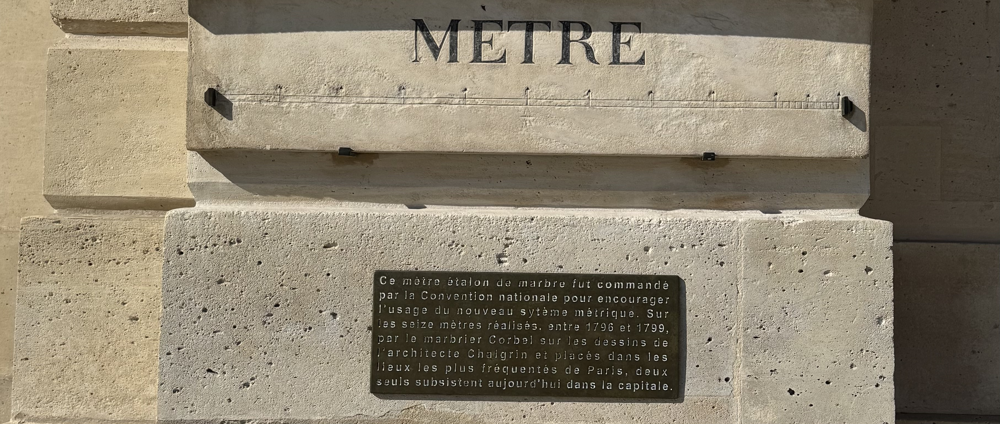

The first arrondissement is at the very centre of Paris. The name of this arrondissement is _Louvre_ and you can probably guess why. This is one of the areas that most tourists will visit. It's well connected to most of Paris through it's various metro and RER lines.

Depending on what you like to do while on a city holiday, you could spend a few hours here, or you could a full day here.

### Museums

This area hosts one of the most famous museums in the world, the _Louvre_. It's on the to-do list of most people who visit Paris, sometimes people want to take their time to see an entire section (because you're not going to have the time to see _everything_), others are here to see some of the more famous works like the Mona Lisa (in French it's called _La Joconde_). I would highly recommend reserving tickets in advance because the queue can get really long. At the end of most guided tours here, you're allowed to wander through the rest of the exhibition on your own.

The _Tuileries Garden_, at the west side of the Louvre is well worth a visit. I personally like to spend a bit of time outside after a museum, so the gardens are a perfect place for a stroll. They also have seats throughout where you can sit and pause. In winter, it hosts one of the biggest Christmas markets in Paris.

At the west side of the Tuileries Garden, you have anther museum _Musée de l'Orangerie_. This museum is known because it has 8 of Monet's water lilies murals. They're beautiful. Again, if this is something you really want to see I would recommend reserving tickets.

To the east of the Louvre you have 59 Rivoli, one of my favourite art galleries and well worth a visit. It's made up of 30 different studios, with many artists having short term residences (3-6 months) so each time you go, there's something different to see. One of the things I love about 59 Rivoli is getting to watch the artists work. Each artist has a different style and it's wonderful. It's a great place to buy souvenirs and gifts. Did you know that the word souvenir comes from French? It comes from the French work _souvenir_ which means to remember.

### Landmarks

While it's a small area, there's a lot to see. Here are some of the other notable places.

At the centre of _Place Vendôme_ there is the _Colonne Vendôme_, a bronze column topped by a statue of Napoleon. While this is the first thing you're likely to see, it's not the only thing worth looking at.

The French revolution had a massive impact on France (stick with me), but also globally. It was during this period that France standardised certain measurements, including the metre, litre and kilo. Throughout Paris, they had placed 16 meters standards in busy areas to help with the transition into the new system. Only two of them remain today, and one of them is here at 13 Place Vendôme.

Another thing that is not obvious is at that the former Texas Embassy in Paris was here. It's marked by a small plaque that's easy to miss if you're not looking for it.

_Domaine National du Palais-Royal_ is well worth a stop. It's a great place to take photos from and to admire the beautiful buildings. There's also _Jardin du Palais Royal_ which is nice to walk through. If you've seen the series Emily in Paris, you might recognise this place.

### Best restaurants in the first arrondissement

There are so many restaurants in this part of Paris, here are some of my favourite.

**Bistrot Victoires** is a restaurant where you'll find the classic French dishes at a reasonable price. If you've been to Paris before, you'll know that a lot of restaurants are only open for a lunch service and a dinner service. However this is one of the bistros that serves food all day _and_ that I would recommend.

If you're looking for Italian food, I'd recommend **Presto Fresco**. It's possible to reserve a table online which I would suggest to do. I've been here a few times and tried something different each time and I've never been disappointed. This was the restaurant that I went to with my family after I got married and it was a massive success with everyone!

I've heard from a friend that **Maslow** is a good vegetarian restaurant. I haven't been (yet), but I trust the judgement of friends so it's going on the list. I know that finding good vegetarian food in Paris isn't always easy. They're also serve food all day.

**Hakata Choten** is one of my favourite ramen places in Paris. There are two in the 1st arrondissement of Paris, the one on 53 Rue des Petits Champs is my favourite but they're both good. I really like their gyoza with spicy miso sauce. Delicious.

**Kodawari tsujuki** is ramen with a fish based broth. The decor mimics that of the old Tokyo fish market. This is a restaurant that I haven't personally tried because I'm not big fish fan, but I've heard from friends that it's worth it. There is often a queue to get in, and they don't accept reservations.

**Bistro Ramen Ryukishin** is technically not the first arrondissement, but it's just across the road so I'm adding it here. It's more expensive than some of the other ramen restaurants in Paris but wow is it good. The vegetarian ramen is WOW (and the meat ones are also great, but finding good vegetarian ramen is _hard_).

### Bars

Depending on what you're wanting to drink, you can go into most French bistros and get a beer or glass of wine. You'll often see a lot of French people sitting on the terrace regardless of the weather.

**Le Dernier Bar avant la Fin du Monde** (The Last Bar Before the End of the World) is something a bit different. I love coming here, they have creative cocktails and selection of board games to play. The staff are all really friendly. They have multiple floors, which have different themes.

**Le Garde Robe** is a small wine bar, that has a lot of natural wines. It's small, so it's worth reserving if this is something you want to do.

### Transport

This area is very well connected to the rest of Paris. There are multiple metro lines (1, 4, 7, 11 and 14), and multiple RER lines (A, B and D) that run through the station Châtelet - Les Halles (it's really two stations that merged into one). Because of this, it can be a _nightmare_ to get out of the station. You can be walking for 15 minutes to get from one line to the other line. Google Maps will often tell you there's a walk, but it often underestimates it especially if you're not familiar with the station. A lot of locals joke about the 'Châtelet - Les Halles escape game'. There's ~26 exits.

Account for extra time when passing through here, and if possible _avoid_ (seriously, a lot of locals avoid this station).

### Shopping

There's a lot of options for shopping in the area, the firs thing I'm going to suggest is somewhat niche.

A lot of people want to stock up on French skincare products while here. _Pharmacie du Forum Des Halles_ is a giant pharmacy located in the Westfield Forum des Halles shopping centre. It has everything you could think about, and more. A lot of the staff here speak English and are happy to help out. The prices here are reasonable - not all pharmacies are equal. I will say, that it can get busy, so it's not for everyone.

If you're wanting to buy an English book while here, I'd recommend _Smith & Son_. They have a large selection of books to choose from and a tea room upstairs. They also have a small selection of British snacks like Terry's chocolate orange.It's located just opposite the Tuileries gardens.

Along Rue Saint-Honoré you'll find the luxury and designer stores.

_Samaritaine_ is a department store, located between the Louvre and 59 Rivoli. There's a large selection of stores here, but I think the most notable thing is the building. It was recently renovated and it's beautiful.

### Your experience

What do you think of the first arrondissement of Paris? Got anything you'd like to share? You can reach me on instagram at **[@abiguides](https://www.instagram.com/abiguides/)**
