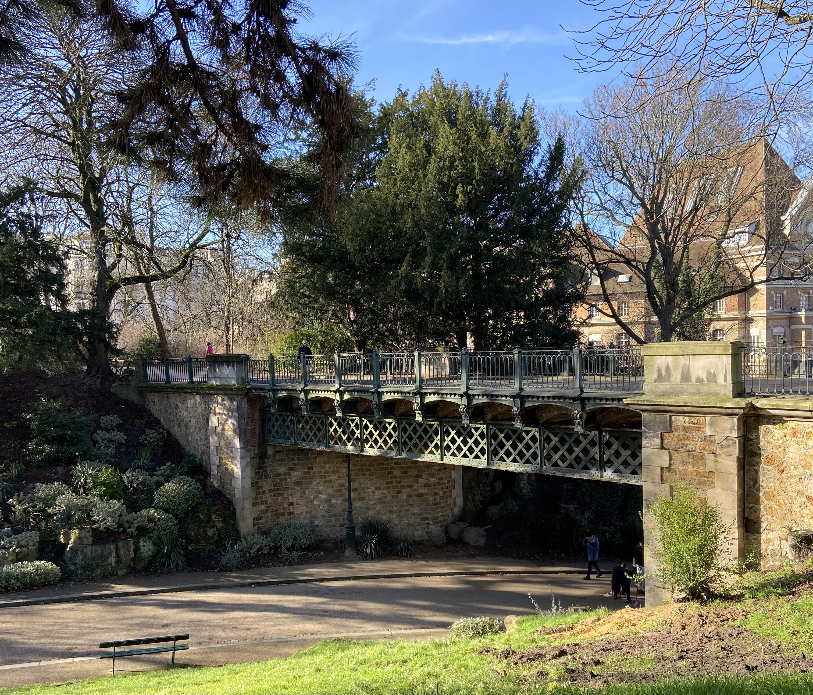
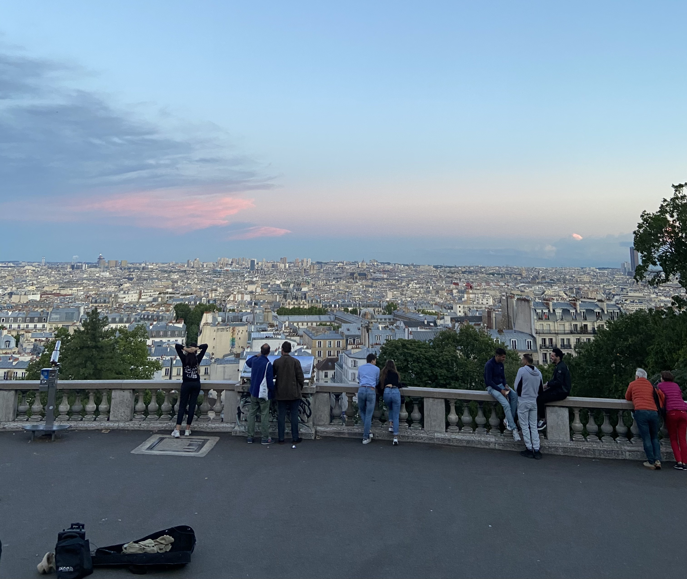
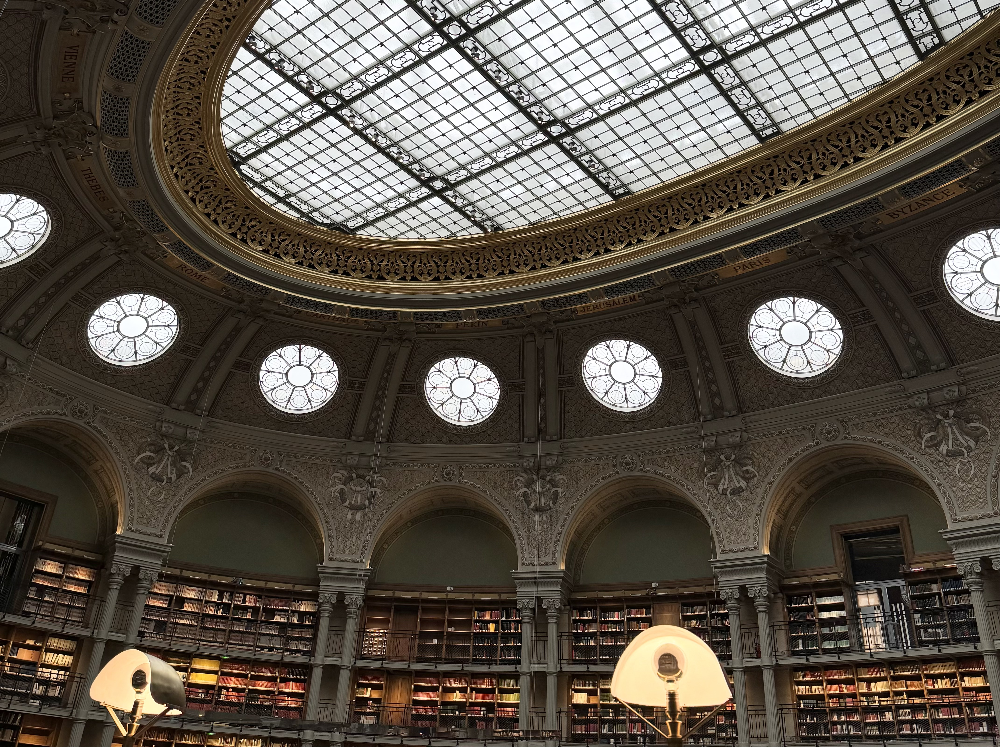

There's this idea that Paris is an expensive city, and in ways that is true. Accommodation is one of the big expenses that's hard to avoid, and there are certainly a lot of ways to spend money while here - tickets to museums, eating out, transport etc. However there are a whole bunch of things that are free that I think can still add a lot to any trip here.

All of the things in this article are free for everyone - there's a lot of additional things that are free if you're under 26 and living in an EU country. For some of these activities I like to carry some cash, so that I can leave a tip.

### Parks and other green areas

Paris, has quite a lot of green spaces which I really love especially when the weather is nice. I have an article about a walk that you can do between Bastille and Vincennes called _[coulée verte](http://abisummers.com/articles/guide/coulee-verte/)_ - a 5km walk along an old train line. I also have an article about some _[parks in Le Marais](https://abisummers.com/articles/guide/marais-parks/)_

Some of my other favourite green areas are:

- **Parc des Buttes-Chaumont**: a park in a former quarry filled with lots of charm. I love it here because it really doesn't feel like you're in Paris.
- **Jardin du Luxembourg**: a beautiful park with lots of places to sit. There is almost always one area of grass that you're allowed to sit on towards the south of the park (sitting on the grass is something I appreciate in a park).
- **Parc Monceau**: another park where you're allowed to sit on the grass (you'll often get to see cats playing here)! There's a small pond with Roman columns partially surrounding it, which makes for some pretty photos. Good for kids with the the places to run, carousel and the pony rides (if that's your thing)
- **Jardin du Musée du Quai Branly**: a garden surrounding the museum with lots of hidden benches and quiet places to sit
- **La Petite Ceinture**: translates to _the little belt_, is a abandoned train that goes around Paris. Only parts of it remain accessible, you can find more information [here](https://petiteceinture.org/acceder-a-la-petite-ceinture/)

Almost every park will have some history behind it, sometimes that's explained at the entrance of the park, other times it's not. One of the things I love about Paris is the history that's directly in front of us - who is this park named after? what was here before? why does this building stand out?

### Watching the sunset

One of my favourite activities is to watch the sun set from the Sacré-Cœur with a glass of wine or a beer. Often you'll find street performers which are always impressive to see and really add to the vibe.

There are two performers that always come to mind when I think of street performers here. The first being _the football guy_ - you might have seen some of his videos on youtube. He does some very impressive tricks with a football, including climbing to the top of a lamppost - all while having a great view of Paris. The second being two fire performers which is really cool to see as the sun is setting.

There are often musicians around the area. Sometimes they'll get the crowd involved with selecting songs or singing along. It's all a lot of fun - and a great way to end a morning or afternoon in Montmartre. As far as I'm aware, there's no way of knowing if and who will be performing on a given day.

### visiting _the islands_

Île Saint-Louis and Île de la Cité and two _river islands_ caused by the flow of the river seine. Along these islands, there are places to sit by the water. I love the vibe in summer when people are sitting with their friends, a glass of wine and a picnic. I love getting to explore the little side streets. The bridge _Pont Saint-Louis_ connects these two islands often has street performers - sometimes someone is playing the accordion, other times people are roller skating.

L'île aux Cygnes, translated as _swan island_ is an artificial island with three bridges crossing it. On this island you can find a quarter size replica of the Statue of Liberty (did you know that _the_ Statue of Liberty has ties to France?). Along the entire island, there's a public promenade. Unlike the two other islands in Paris, there are no houses built here.

### Movies

If you are big into movies, then you might find some steps to trace! Here are some films that have some scenes filmed in Paris:

- Inception: Pont de Bir-Hakeim (it's also a great place to have a photos with the Eiffel Tower in the background)
- Amelie: filmed in many locations across the city, but the two most known places are probably _Café des Deux Moulins_ and _Au Marché de la Butte_ in Montmartre

### Museums

There are so many museums to choice from in Paris, depending on the type of art you want to see. _Most_ are paid, but some are free! Ideal for a rainy day.

#### Paris Musées

Almost all of the [Paris museums](https://www.parismusees.paris.fr/en/les-musees-de-la-ville-de-paris),the 14 museums ran by the city, have a free permanent collection.

One of my favourite museums in this network is the Carnavalet, a museum in the heart of Le Marais. It's a museum that focuses on the history of the city of Paris. It is broken down into different sections starting with prehistory all the way up to the 19th century. Even if you're not so interested in French history, it's still worth checking out because the building is beautiful.

#### 59 Rivoli

59 Rivoli is an art gallery on rue rivoli, close to the Louvre. There are in total 30 different artist's studios - 15 are permanent while the other 15 are dedicated to residencies of between 3 and 6 months.

There are a few things that I love about this place. The art is always changing, each time there is a new surprise. All of the artists have their own specialities so if one studio is not for you, then there surely will be something else that you like. I love getting to see the artists work on their art. I love that the entire building is art - the outside is always decorated as well as the stairs.

While this is free to enter, I always like to bring some cash - I like to buy small pieces of art such as postcards, and to give a small tip on my way out.

They also host events which they share on their instagram page.

#### 1st Sunday of the month

A lot of museums are free on the first sunday of the month, including musée d'orsay! You can reserve ticket directly on the website of the museum that you want to go to. It's worth noting that the museum will usually be busier than normal _and_ not all museums do this monthly, for example _l'arc de triomphe_ only does this during low season.

### Libraries

Libraries are a great place to find inspiration - and also a great place for a toilet stop. Paris has over 50 city libraries that all all free to enter without needing a library card. I like looking through the different books they have, sometimes I'll flick through a book about architecture or others time about green areas in Paris.

One of them most beautiful libraries in the city - _Bibliothèque Nationale de France (BNF) - Richelieu_. Here you will find _The Oval Room_ which just has such an incredible vibe. There are places to sit and read, or desks to work from, _however_ the space fills up fast. It is still worth visiting just to see this room.

There's is also another BNF library, _BNF Mitterrand_ which sometimes hosts free exhibitions such as the the _[Â nous les stades](https://abisummers.com/articles/museums/bnf-a-nous-les-stades/)_ - an exhibition hosts related to women's sports and how it's evolved over time. Most of the exhibitions are in French, but I still think it's an interesting building to see.

You've probably seen or heard about the Centre Pomipdou. It's a noteworthy building - some people love it, some people hate it, but everyone has an opinion on it (personally I really like it). You are able to access the library here free of charge. Personally, I think it's worth having a quick look inside, because it really is a unique building. It's going to be closing soon for some big renovations so it's worth checking out if it's open (it's closed every tuesday). The museum is also nice to visit but that's paid.

<!-- ### Events

There are events throughout the city, with different themes. Some events are more regular than others.

If you're into books, Shakespeare and Co host events a few times a month with different authors. I've been to two different events there and really enjoyed both (the book shop is also cool to visit, I have an article on my [favourite English speaking book store](http://abisummers.com/articles/book-stores/) in Paris). When the weather is good, they host events outside, otherwise it's either on the lower floor of the book store or upstairs. -->
