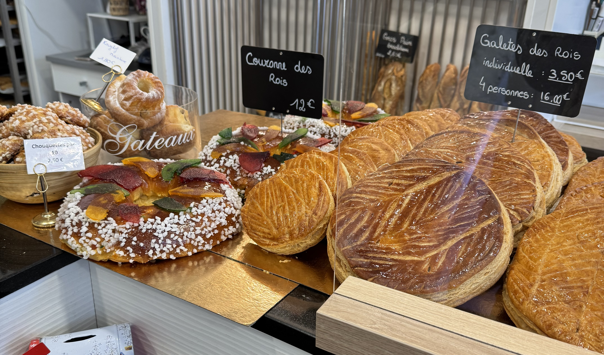

Just before Christmas and at the start of January, you'll see this beautiful looking _galette des rois_ is every bakery along with a crown. You can only find it for a few weeks a year, so if you're in France during this period, it's definitely worth trying!

You can also find them in most supermarkets which are significantly cheaper but are not as good as the fresh ones. Most bakeries will do preorders so you can pick it up on the 6th January.

### What is a galette de rois and why do we eat them at on the 6th of January?

Galette de rois translates to _kings cake_, which is eaten for the occasion of _epiphany_ (the celebration of the Twelfth Night after Christmas). It's a cake made of puff pastry and almonds in a frangipane preparation.

There are many variations of the galette de rois. In the south of France you are likely to see a _gâteau des rois_ (or sometimes called a _couronne des rois_) instead. This is made of a brioche cake flavoured with orange blossom water, and is covered with sugar and sometimes candied fruit. This is very different to the type you'll see in most Paris bakeries, but some bakeries will also have other variations (like in the photo above taken from a local bakery).

One thing is the same between them, they'll both have a _fève_ (a small figurine, often made from porcelain) inside. If you get find the fève, you win!

### The origin of galette de rois

The origins of the galette des rois can be traced back to the ancient Roman Saturnalia festival. These festivals were dedicated to the god Saturn so that the Roman people could celebrate the longer days that began after the winter solstice (I love noticing the days are getting longer!).

This tradition was later adopted by Christianity to mark epiphany. Epiphany marks the arrival of the Three Wise Men (or the Three Kings) who came to visit Jesus. 'Epiphany' comes from the Greek word meaning 'to reveal', as it is when the baby Jesus was 'revealed' to the world.

### The modern day tradition

So while for some people there is a religious element, for a lot of people it's just a fun tradition - it's more than just eating a slice of cake.

When it comes to eating the cake, you don't just slice it and eat it like with a normal cake. With a galette de rois, the youngest person goes under the table. Someone then cuts the cake so there is a slice for everyone. Once the cake is cut, the person who cut the cake asks the person under the table who gets this piece. Once everyone has their slice, you can start eating, but pay attention there's something hidden in one of the pieces!

If you get the fève, you win and become the king (or queen) for the day!

Different families have different rules for when you're the winner, it often depends on the age of people participating. Either way, it should be fun and festive!

### More than just a cake

This is more than just a cake, it's part of an annual tradition for many people across France. Fèves are often collected, some people have a really impressive collections. At flea markets, you'll often see people selling them.

This is a tradition that I have been a part of every year since I moved to France. My first experience of it was when I was an au pair, and the youngest child went under the table to assign everyone a piece of the cake. I had never heard of this tradition, but it's something I now look forward to every each.

Whether this is your first time trying a galette de rois, or if it's something you do annually, I'd love to hear your thoughts over on Instagram at **[@abi.in.france](https://www.instagram.com/abi.in.france/)**!
