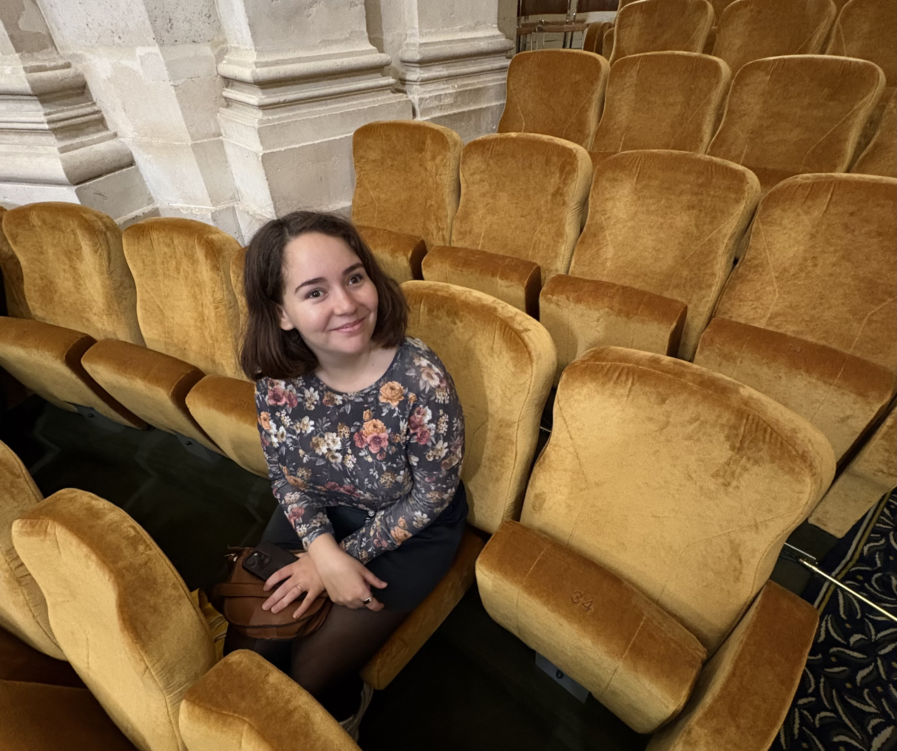
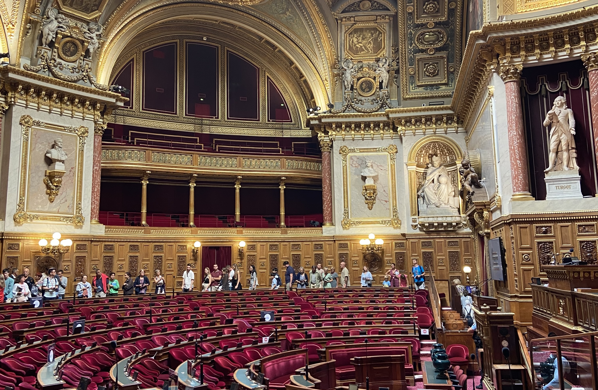
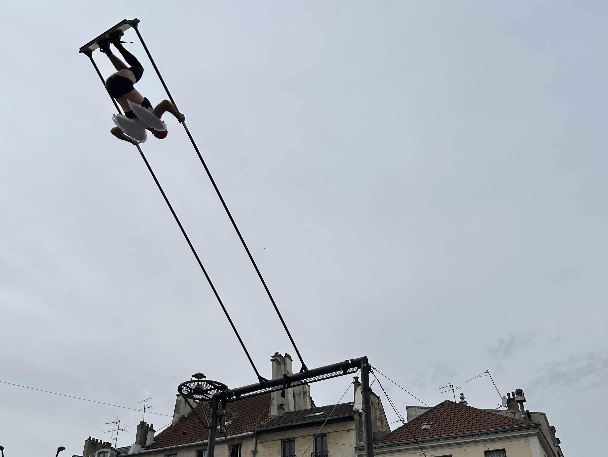

_Les Journées européennes du patrimoine_, or heritage days, is one of the weekends I look forward to every year. Seriously it's amazing! There are a bunch of cool places that are usually not open to the public that you get to visit and the majority of the events are free! In 2026, it falls on the 19th and 20th September, with close to 25,000 places open to the public across France.

You can find the entire programme for France [here](https://journeesdupatrimoine.culture.gouv.fr/programme) (in French).

### What is heritage days?

2026 is the 43rd edition of heritage days. While this event started in France under Jack Lang, the minister of culture, it is now an event that is celebrated all across europe. This year there are two themes _Patrimoine de la photographie_ (photographic heritage) and _Patrimoine en péril : raviver, résister, réimaginer_ (heritage at risk: revive, resist and reimagine). This event allows the public to get involved with their heritage by discovering places that are usually inaccessible and a place to learn about them in more details from experts. It encourages people to step outside and see what is around them. 10/10, I love this event!

Over this weekend you can visit places like official residences (like that of the French Prime Minister), embassies, industrial sites, old train lines, along side museums and monuments. There's a wide range of activities!

In France, people are incredibly proud of their culture which is something we discuss often on my tours!

<a  class="cta" href="/book/" >
      Book a tour</a>

### Getting reservations

Getting reservations for certain events is _hard_! They usually start opening the slots at the start of September, but some even go live earlier. My advice is to have a look at what you'd like to see and make a note of when the slots open up. For any of the popular ones (like Hôtel Matignon, the official residence of the Prime Minister), you really have to be there at the opening time. If you're unable to secure tickets, do not fear! There are so many fun places that do not require reservations, so you can just show up on the day. I've had a great time in previous years without reservations.

A lot of the time slots are fully reserved within minutes, so you really have to be on your game to get them. 2026 is the first year I've been able to secure any tickets - and even then it's not the one that I _really_ wanted - the clock tower at Gare de Lyon. I'm going to try again next week in the second round of reservations. The events I did get reservations for are outside of Paris so slightly less in demand.

Pro tip (learn from my mistake): you need to try and identify the website that the reservations are made from before the reservations open. In my case I REALLY wanted to get tickets to see the clock tower at Gare de Lyon. I knew when they were opening up the reservation, it was in my calendar, with the link to the event page, I was on my laptop ready to go go go when it opened. HOWEVER the reservation button on the information page, does in fact **not** link you to the correct page (booooo!!). It should be linking to _affluence_ but instead it just links to the SNCF heritage page. Frustrating.

### Showing up with no reservations

If you're planning on checking out a place that doesn't do reservations, you're best going earlier in the day - bonus, if you energy you can fit a second one in in the afternoon! The queues tend to get longer as the day goes on. I'd also advise on bringing a bottle of water and some snack (I always need snacks when standing in queues). If rain is forecast, then an umbrella is also a good idea. Depending on what you want to see, there might not even be a queue!

### Places I have visited

I've been luck enough to attend for a few different editions! Here are some of the places I have been (with no reservations!):

In 2023, I went to events on both days. On the Saturday I visited _le wagon_, and old dining wagon from a train. (I really love trains and infrastructure). Trains are my favourite way to travel. I also visited the basilica de Saint Denis (usually paid, but is free for the heritage days). In the town of Saint Denis, they has a street performer and it was WILD. There was a man, who was wearing wing, who was swinging on a _giant_ swing - he went upside down!! Heritage days isn't just about visiting places, it's about engaging in culture and engaging in the arts which is something that I love.

on the Sunday, I visited _le Sénat_, inside the jardin de luxembourg. Incredible building! The art, the details! And this is where people go to work! It's inspiring to be in a room where so many important decisions are made.

In 2025 I was able to visit the _Institut de France_ / _Académie française_. Again, incredible building! There were lots of people throughout there to ask questions to. They had various workshops and presentations going on throughout the day. I arrived in the morning, and there was no queue to get in. I just love walking through grand buildings. They had an amazing library and I love books! 

I also visited the _Cour administrative d'appel de Paris_ (administrative court of appeal of Paris) which was very cool. This is a build I walk by often on my way to work. I spend a lot of time imagining what is going on behind the doors of Paris, peaking through whenever I see people going in and out. And then I also got to see the basement of the _Association pour la Sauvegarde et la Mise en valeur du Paris historique_ (Association for the Preservation and Enhancement of Historic Paris).

Paris Historique do loads of great guided tours throughout the year, and everyone there is lovely. They have a small shop where you can buy books and posters with the theme of Paris. I have a giant map of Paris hanging in my dining room that was purchased there.

So if you're in Paris over this weekend, I'd highlight recommend wandering around and trying to catch an event! I think September is such a fun time to visit the city - the summer crowds are gone because schools (around the world) have started again, and the weather is pleasant (_especially_ after the insane heat we've had this year).
