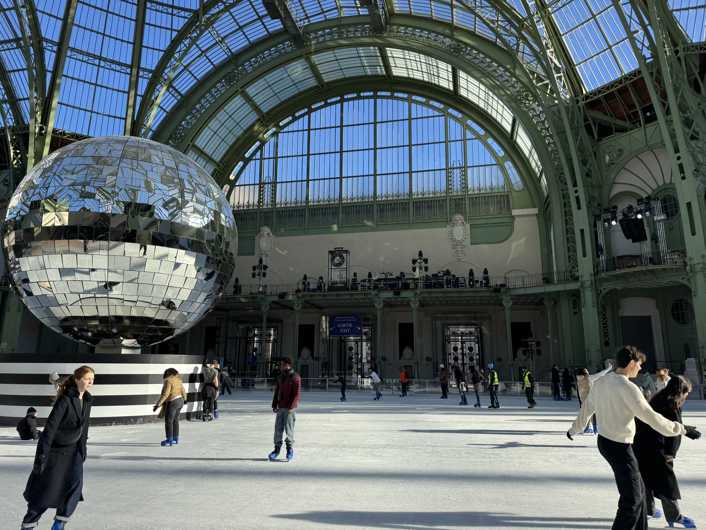
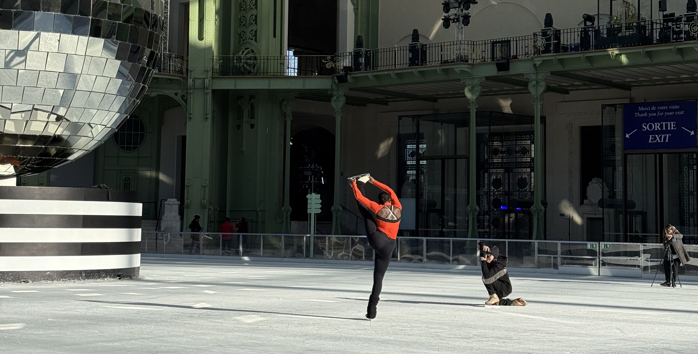

The Grand Palais is both a museum and exhibition hall in Paris, known for it's beautiful glass vaults. Each December it turns into an indoor ice skating rink, and the 2024/2025 had the largest temporary indoor rink in the world. The Grand Palais was closed for a few years for renovation - it reopened for the olympics (some events were hosted here!).

I had seen so many photos and videos on Instagram prior to going. I'm sure the reopening has added to the hype. But the question remains, is it worth it?

### The price

There is different pricing depending on the time of day. The morning session is the cheapest which is the one I attended at 25€ per adult.

The afternoon sessions cost 30€ per adult and the evening session costs 36€ (for both adults and children). In the evening there is a DJ and disco.

The rental of ice skates is included in the price, however if you're wanting to leave your bag in the cloakroom that's an additional 2€ charge (which honestly feels like it should have been included in the ticket price given how expensive they were).

### My experience

let's start by saying, I had fun! I am happy that I got to experience this. I went with a friend on the 7th January (the second to last day) for the 11am session. We decided to go after the school holidays were over so that _hopefully_ there was less people. Thankfully it wasn't busy when we were there! A lot of the photos had me worried that it would be _too_ busy.

There was essentially no queue when we arrived which was nice. Security were there checking all bags - food and drinks (including water) were not allowed in. You were allowed to keep your bottle. After security, the tickets were scanned and you were inside! As you walk in, you see the giant disco ball!

We dropped out bags off at the cloakroom (some people just left their bags by the edge of the rink), picked up our skates and got on the ice! While I _can_ just about skate, I'm not a confident ice skater. The first few laps I remained very close to the edge which was mostly fine. However groups of people did sometimes gather there and didn't always check before starting to skate again.

At one edge of the rink there was an area for kids, which had some cars that they could either sit on or push. At the other end of the rink there was a camera that was connected to two large screens. A lot of people stopped here to take their group photos.

We spent ~1h40 skating in total. Just before 1pm they closed the rink so they could smooth over the ice in preparation for the afternoon session.

After giving back our skates, we saw a professional ice skater (or at least someone who clearly knows what they're doing) do some figure skating on the rink which was cool! It's so impressive to see how gracefully skaters can move.

### Was it worth it?

I think this depends on the type of person you are. Is ice skating in the Grand Palais a cool experience? Absolutely!

So while I am happy that I went, and I did have fun I don't think I will be going again next year.

I feel like I didn't full appreciate the building because I was so focused on the skating (and trying to not fall over) - I feel like a lot of people go to be inside the Grand Palais. I loved the feeling on the sun coming through the roof but it did somewhat blind me when I passed by the area. I do however want to visit the museum!

The ice quality was _ok_. At the start of the session is was much better compared to when we got off the rink. Over on my [instagram](http://instagram.com/abiguides/) I shared a story asking people to place their bets on how many times I fell (the answered ranged from 0 to 14 times - correct answer: once). I got a respond saying "that ice is so chopping, idk how you could not have fallen". So if you're looking for good quality ice, maybe give it a miss.

For the morning session, there was no music playing. I think it would have been a nice addition especially knowing the evening session had a disco.

And I do think 25€ for a few hours of ice skating is expensive. There are other places in Paris where you can go ice skating for a fraction of the price. Obviously you're not just paying for the ice skating - it's the ice skating inside the Grand Palais, but I do think it's worth considering other places if it's the ice skating you're actually interested in.

### Would I go again?

While I do enjoy ice skating occasionally, and I do love the building of the Grand Palais, I'm not in a hurry to go again. Yes, I had fun, but I think it was expensive for what it was. From what I have heard, I got lucky with the slot I went at considering how busy it can get. I don't think I would have enjoyed the disco session because of the number of people there. If you're an experienced skater, then you'd probably fun!

Let me know over on Instagram at **[@abiguides](https://www.instagram.com/p/DEh-9g2t2m_/?img_index=1)** if you've been and if this is something you would like to do!
