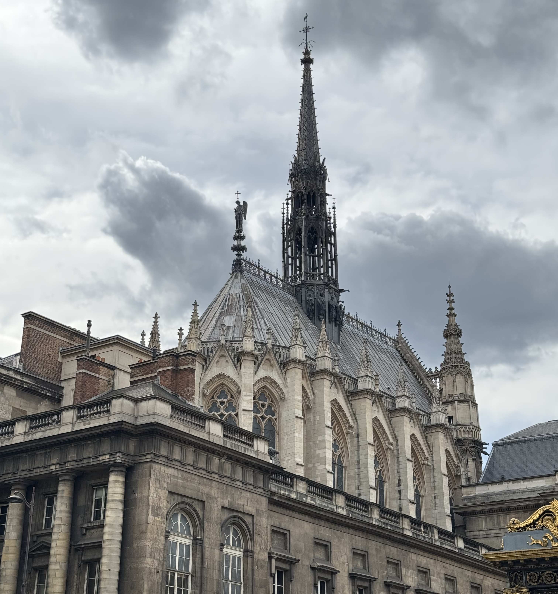
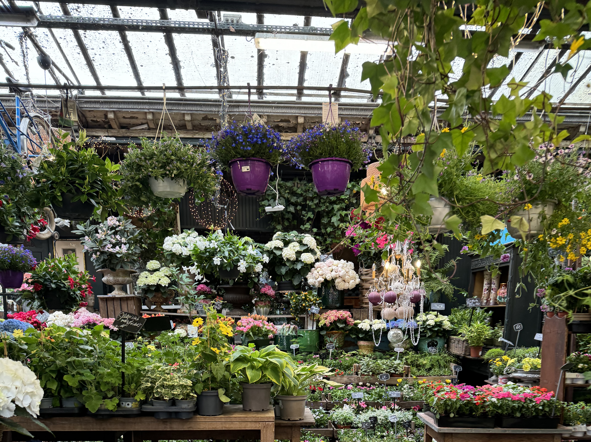

Île de la Cité, is the island at the heart of Paris. It is one of three islands the city has, with Île Saint Louis just next to it, and Île aux Cygnes which is close to the Eiffel Tower.

This free walking tour will take around 45 minutes, depending on how much time you stop for admiring the city and taking photos. If you'd like to know more details, you can book a tour!

### A (very) brief overview

If you have seen any old maps of Paris, you'll probably have seen that Paris started out here on the island. Strategically, islands were a great place to be because the river offers protection. The first group of people to live here were a a Gallic tribe called Parisii (ever wondered where Paris got it's name from?).

The Romans arrived later which brought a change in name of the city to Lutetia. They continued expanding the city, mostly on to the left bank. On the left bank, we have the Cluny museum, which contains ruins of Gallo-Roman thermal baths and the _Arènes de Lutèce_ which is the remains of a roman amphitheatre. Some of the artifacts from this period are on display in the Carnavalet Museum (one of my favourite museums in Paris!).

As the Roman influence came to an end, the Franks, a germanic-speaking tribe were there to take the spot as next leader. Clovis I, who was the leader of this tribe who became the first king of France. Clovis lived in the _Palais de la Cité_ which was built on this island until his death in 511. Over the years, the role of this palace changed as the kings moved to other locations in France.

<a class="cta" href="/book/ile-de-la-cite/">Book a tour</a>

### Pont Neuf

The self guided tour starts on the bridge _pont neuf_, or the _new bridge_, which is in fact the oldest bridge in Paris. The nearest metro station is called _pont neuf_.

Historically in Paris bridges were made out of wood which didn't always end well - you have to deal with both fire and rot. Goodbye to the bridge, goodbye to the homes that were standing on it.

If you look west (away from the island), you'll be able to see a few notable landmarks. On the right hand side, you'll see the Louvre. You might recognise the next bridge down the river Seine because it's the love lock bridge or _pont des arts_. The love locks were removed in 2015 because of their weight. You will still find love locks around the city, including on the bridge you're standing on.

The building with the dome on the left banks is the _Académie française_, which is the principal location for making changes to the French language, something that is very important to French culture. Just to the left of this, you'll see the _Monnaie de Paris_ which is a museum and a mint (a place where they make coins).

After admiring the view from the bridge, we're going to walk further east onto the island. Because there are no traffic lights here, pedestrians have right of way at the crossing _however_ you need to be careful, especially with bikes because they won't stop unless they know you're going to walk.

### Place Dauphine

Place Dauphine is the next stop on our walk. This park, really encapsulates the vibe that people come to Paris for especially in summer. In summer, the restaurants expand out onto the square with temporary seating, the locals are playing pétanque (a game that originates in the south of France), and people are sat on the benches drinking wine.

This park was designed by Henri IV (the guy on the horse on Pont Neuf). It was named after his son, the daupin of France (future Louis XIII). Daupin, daupine - you might be wondering why there is an _e_ at the end of Daupin - and that is because of the French language. While the square is named after his son, because it's a _place_ it becomes feminine.

If you place Invaders, keep your eyes open because you might just happen to find one on this square.

After walking through this park, you're going to turn left and then right when you get to the seine. The next building is on the right is out destination.

### La Conciergerie

You may recognise this building if you watched the opening ceremony of the Paris 2024 olympics because [Gojira and Marina Viotti](https://youtu.be/5hTMYk7orHw?) (YouTube link) performed here! Or you might recognise this for the role this building played in the French Revolution - it was the prison where Maire Antoinette was kept before she was executed.

It in now a museum, that focuses on the role of the prison during the French Revolution.

After admiring this building from the outside, keep walking along the river towards the crossing. Turn right when you get to the traffic lights and stop on the corner of the Conciergerie.

### Tour de l'Horloge du Palais de la Cité (the clock towner)

There are so many things to see in Paris, and it's hard to know what to focus on. But here, if you look up, you're going to see a beautiful clock. This clock was first displayed in the 14th century, and had undergone a few restorations since then. This was a gift given to the people of Paris, but some would also consider this a threat - on the left, you have a woman representing law, and on the right, you have a woman representing justice.

One of my favourite details on the clock is the roman numerals. You have have noticed that one of the numbers isn't how we'd normally write the number. The number 4, is written as IIII instead of the usual way of IV. Have you noticed this anywhere else? This is how it's usually written on clocks, but don't worry we still use IX for 9 - as if numbers were not complicated enough.

When facing the clock, we're going to turn left, walking past the Conciergerie - you can look through the windows to see what the inside of the building looks like. Don't be deceived, while this looks _incredible_ grand, the prison cells were in fact actual prison cells and not a place you'd like to stay.

Keep walking, until a square, _Place Louis Lépine_ appears on your left. Cross the road and pause here, we're going to look at the building with the spire.

### Sainte Chapelle

Sainte Chapelle is a building known for it's beautiful stained glass windows - they're truly spectacular. From the outside, you can see the large windows, but they don't compare to what you see inside. It was created for Saint Louis (or Louis IX as he was known at the time) in the 13th century, because he had a very important object he wanted to house including the crown of thorns.

You can read more about visiting Sainte Chapelle [here](/articles/guide/sainte-chapelle/), including on how to get tickets.

After admiring Sainte Chapelle from the exterior, we're going to walk across the square. On the left you have a flower market that is worth the detour. Stepping inside, everything feels quieter, and the scent from the flowers transports you away from the city. The next stop, is the heart of the show - the Notre Dame. When you reach the road _Rue de la cité_, you're going to run right - you're not going to miss the final destination.

### Notre Dame

You can't talk about this island without mentioning the Notre Dame. I have an entire article on the [must knows before visiting](/articles/guide/visit-notre-dame/) the Notre Dame.

The Notre Dame, one of the most iconic buildings in Paris is high up on most peoples to-visit list especially since the opening after the fire. Take a moment to pause, and appreciate the beauty. There are _so many_ details to admire.

The construction started in 1163 and is an example of gothic architecture. Some of the elements of this architecture style are: the details, the gargoyles and flying buttresses.

Details were incredible important at the time, because the majority of the population didn't know how to read. Books were incredible expensive to buy. So building, especially churches, would use the detail on the outside to tell a story. The door on the left, is dedicated to the Virgin Mary, the door in the middle is dedicated to the Last Judgement and the door on the right is dedicated to Saint Anne.

### Ending your visit

There are other things that could be mentioned about this island, from the oldest hospital in Paris, to legend of the [two doves](/articles/guide/rue-de-la-colombe/), the location where Sweeney Todd was supposedly based and the memorial for those deported during World War II.

Interested in learning more? You can book a tour!
