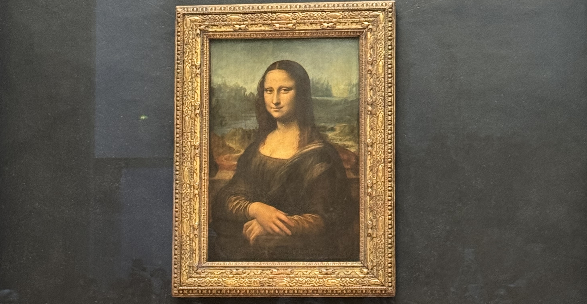

On tours, I often get asked what I think about the Louvre and if it's worth it. Do I _have_ to visit the Louvre? Is the Mona Lisa a must see?

Every person and travel group has a different idea of what will make their trip enjoyable and memorable. It's up to you to decide what is worth it for you. For some people, the Louvre is 100% worth it, but sometimes people are left feeling overwhelmed.

### Should I visit the Louvre?

The short answer is: it depends.

I personally _love_ the Louvre, there are some _incredible_ pieces of art on display. But I have the luxury of being able to dip in and out because I live in Paris and have the annual card. I'm also interested in history and art so it very much speaks to me.

If you're not interested in museums, or this type of art (because we're all interested in _some_ art), then it's a **skip**. Do not force yourself to visit the Louvre. It's giant. It's overwhelming. It's busy. Think about _why_ you want to visit. Is it just because someone told you that you had to? Just to tick off another must-see monument? Paris is more enjoyable when you're not chasing down items on a list.

If you're only in Paris for three days and you'd like to fit multiple attractions in on one day, they you should prioritise what you'd like to see. I'd recommend against doing the Louvre and another museum on the same day. You can spend hours here. Seriously. Hours.

Paris has so many wonderful museums. Most of them are a lot less overwhelming.

### How to get the most out of your time

Unless you live here, or visit Paris regularly, you're going to be somewhat limited on time. Here are some tips for getting the most out of your experience at the Louvre.

- Booking a guided tour is a great way to explore the highlights (group tour) or something more specific (private tours). I don't give tours inside museums yet because I'm not a guide conférencière (but I am working towards this). If you would like a guided tour, I can recommend some independent tour guides, or some group tours. Yes, they can be pricey, but they help get the most out of the experience by providing information, context and navigation around the museum.

- if you're not doing a guided tour, you should be booking your tickets in advance. This doesn't just apply to the Louvre, it's the case for a lot of museums. I've missed out on exhibitions in the past because I didn't book tickets.

- If a guided tour is not an option for you, I'd recommend looking at the plan of the museum beforehand. Decide what you'd like to see and plan your route. Getting between sections can take time, and you want to avoid walking in circle to get to where you're going next. I've had people on my walking tours that have said it took them 45 minutes to find the exit. That does not surprise me. It is much bigger than most people think (take a look from Pont Neuf or from a river cruise!).

- While the Louvre highlights are incredible, there are entire sections that feel like you're in another museum. A lot of people will only come for the famous pieces (like the Mona Lisa and Liberty Leading the People) but there's so much more to see if you have the time (and energy). Identify if any of these sections are interesting to you, and if you see something that catches your eye, head there!

### Practical tips

- Download your tickets before arriving at the Louvre. The internet is often really bad around the museum and inside. Inside they do have wifi but it is sometimes slow.

- Be prepared for security. You'll be asked to take off your bags and empty your pockets. All of your items will then be scanned. They sometimes as you to take off your jacket.

- Make sure you're not hungry because you're going to be walking a lot. Have some snacks and a bottle of water in your bag for when you've finished at the Louvre or head to a nearby cafe. Personally, I know that when I'm hungry, I struggle to focus and get overwhelmed more easily.

### Got any questions?

Got any questions about how best to enjoy the Louvre, get in contact via Instagram at **[@abi.in.france](https://www.instagram.com/abi.in.france/)**!

If you'd like to [book a walking tour](/book/) click the book a tour button below! Note: I do not do tours inside museums. You can reach out to me via instagram to book a call to discuss your itinerary and Paris trip.
