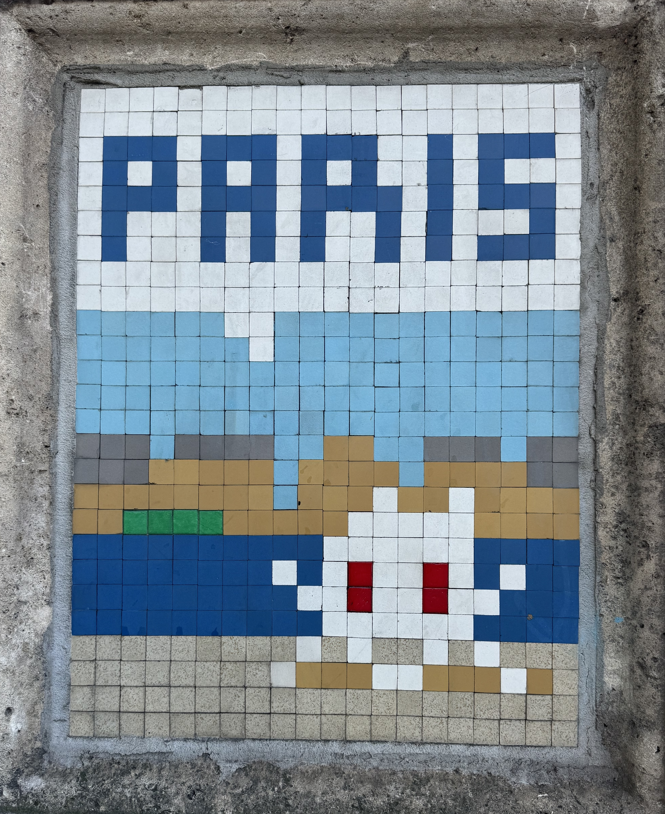
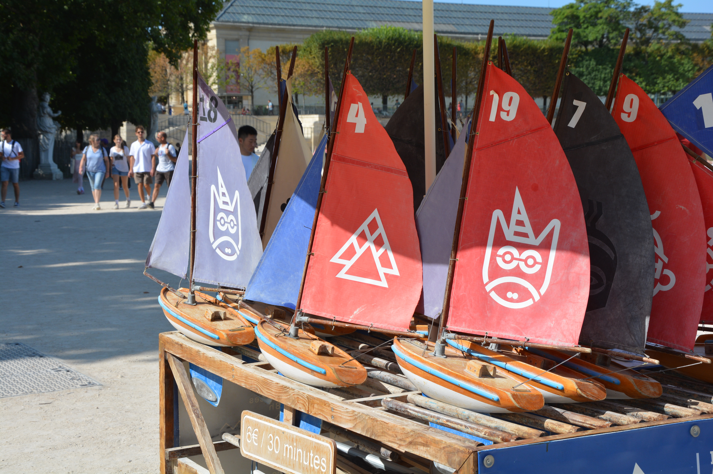

There are lots of things about Paris that make it great for families! And in the last 5 years I've noticed a positive change too - there's less cars and more green spaces. And it's likely to get better in the coming years too!

All my tours are kid friendly and I love having kids on my tours. While I'm not a parent, I do have lots of experience working with kids - from looking after my brother while growing up to three years of au pairing. I think kids ask the best questions, and I love how curious they are to know more. All my stories can be adapted to their age and interests.

<a class="cta" href="/book/">Book a tour</a>

All of these activities depend on the kids and the family, but here are some things that I like to do to make it more interactive! As my tours are private, they're fully adapted to you and your needs!

### Encourage questions

This is the case for all of my tours - I like to ask lots of questions and encourage kids (and adults!) to ask questions to me. There's no such thing as a daft question! Even if it's not related to the rest of the tour, I'm happy to answer! Asking and answering questions is one of the best ways to keep kids engaged.

### Flash Invaders

You may have seen that around the city there is lots of art on the walls. Some of these pieces belongs to a treasure hunt style game - there's an app that allows you to scan the Invaders. For each Invader you get points - there's over 1500 Invaders across Paris! If the parents are ok with this game (because I know different parents have different rules related to screen time), I'm happy to let the kids use my phone to scan the Invaders.

I love this game, because it encourages you to look around. Paris has so much history sitting in front of us, and a lot of that requires us to look at buildings. On buildings you can often see names of the architects, the district you're in, and plaques of the famous people that previously lived there. Plus, who doesn't love a treasure hunt?!

### Water fountains

It's important to stay hydrated while walking around the city, so I always know where to find a place to refill water bottles! This is another great thing to get kids to look out for, because there are various different styles across the city. Some water fountains have mist machines which is a great way to stay cool when it gets hot in summer.

I also know how important it is to have access to bathrooms so if we're passing by a place with bathrooms, I'll always mention it.

### Playgrounds and parks

Sometimes kids just want to run around, so if that's the case I'll make sure we pass by a playground. Sometimes they just want to sit down so if that's the case we'll find a bench to stop on. Some parks in Paris have places where you can rent boats, a great activity for kids who want to run! The boat comes with a stick, that you use to push the boat around.

### Got any questions?

Have any questions about my private tours, you can get in contact via email at **[contact@abisummers.com](mailto:contact@abisummers.com)** or via instagram at **[@abiguides](https://www.instagram.com/abiguides/)**
