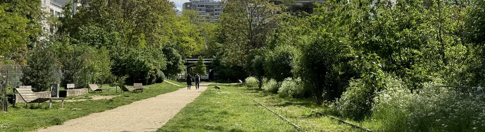
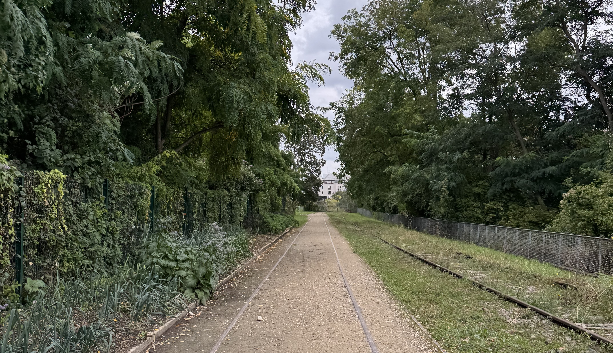
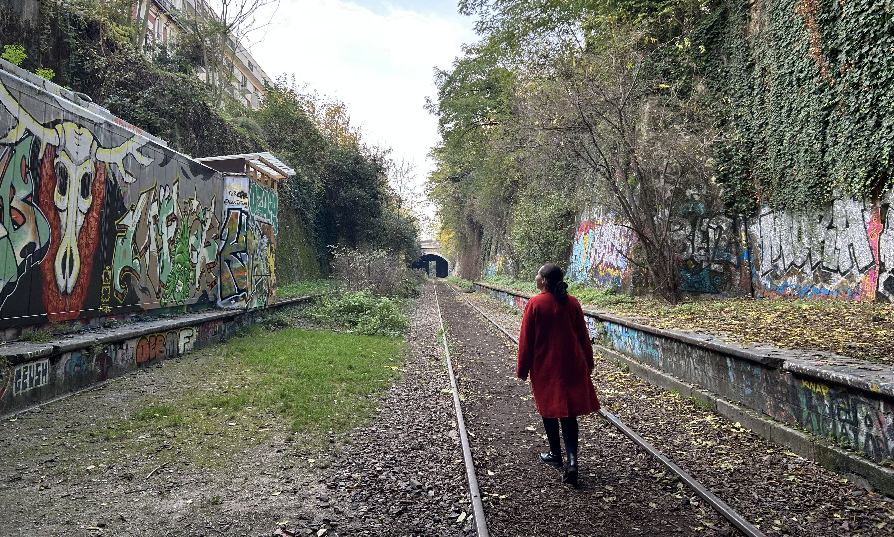

La Petite Ceinture translates to _the small railway belt_, is an old 32.5km train line that went around Paris. It was created in 1852, during the second empire, to connect different parts of Paris together. It was initially designed for freight trains. It's hard to imagine that actual, full size steam trains used to run _in_ Paris!

> La Petite Ceinture, 13eme (May 2024)

Since 2006, the City of Paris have been working with SNCF to reopen parts to the public. It's an ongoing project, with another 4km expected to open before the end of 2026. There's a few reasons why the entire railway is not accessible for pedestrians. La Petite Ceinture remains owned by SNCF (_Société nationale des chemins de fer français_, the national French railway company), and some parts of the lines are still used. Other parts are closed for public safety, like the long tunnels with no lights. Some of the old stations of the La Petite Ceinture have been transformed into place bars, restaurants and other cultural places which I'm a big fan of. I also love that there's a focus on biodiversity _and_ green areas for the people who live in Paris.

All of the places that are accessible are displayed [here](https://petiteceinture.org/acceder-a-la-petite-ceinture/).

This isn't the only old train line that's a sign of the past, there's also [Coulee verte René Dumont](/articles/guide/coulee-verte/) - where you can take the scenic 5km walk from Bastille to Vincennes!

Here are some of my favourite places along La Petite Ceinture! Jump to [map](#map).

### Le passage à niveau (19eme)

_Le passage à niveau_ is a restaurant that is accessible directly from La Petite Ceinture. The food here was really good, but the highlight was the dessert. The mi-cuit pistachio was so so good - this is something I have never seen before and it exceeded my expectations! Their cheesecake was also good, and they had a bunch of other classic foods.

I really liked the vibe of this place! I think it's great for parents because it's just next to La Petite Ceinture, so you're able to enjoy your meal while letting your kids play. There are not many restaurants like this in Paris where you can let your kids burn through their energy over dinner time.

They have _The Sunday Show_ where they invite different musicians to play which is really cool.

This part of La Petite Ceinture that's accessible to the public here is not so long (~0.25km), but it's still nice to walk along and enjoy the nature.

### la REcyclerie (18eme)

La REcyclerie is located in one of the stations that was served on La Petite Ceinture and I love what they've created! The building still keeps a lot of the charm of an old train station. The main focus of la REcyclerie is on sustainability. They host workshops and event throughout the month all with a focus on sustainability, aimed at different groups of people. In November 2024 they have pop up markets, guided visits of the site, workshops like _atelier 2 tonnes_ and mini parties!

Atelier 2 tonnes is a known workshop in France, companies will often run them as part of their eco-responsibility (I took part in the company I previous worked at!). It's based on the global goal of everyone producing less than 2 tonnes of CO2 per year to reduce the impact of the climate crisis. You start out with a questionnaire about your lifestyle, and by the end of the workshop you have a personalised list of how you can reduce your impact, from reducing your meat consumption, to taking a train instead of flying, and buying second-hand. It also talks a lot about collective change which is super important!

They also have a restaurant, cafe and garden, again with the them of sustainability. The restaurant does their part by having home made food that's sourced from local, in season ingredients, 50% of their options are vegetarian including one vegan option per day, and they recycle their biowaste. I love it when a restaurant has a real focus on the environmental impact! After you're finished with your food and drinks, make sure you check out the garden that they have!

### Poinçon Paris (14eme)

Poinçon is a restaurant, opened in 2019, in one of the train station along La Petite Ceinture. It takes the name from the _poinçon_, the tool that was used to punch travel tickets indicating the class of ticket. This original train station opened to travellers in 1867 and closed in 1934.

I really like the vibe of this place and the food is good! I like the mix match of tables and chairs, each table has their own set, but are different to all of the others. Some feel like they belong in a workshop, others feel like they belong in a family dining room yet it all matches the place. The tables were well spaced which isn't always the case for restaurants in Paris.

On top of being a restaurant, they also host live music (DJ events & live music every sunday for brunch), stand up events and workshops!

Just behind the restaurant, you can access part of La Petite Ceinture (not part of the restaurant so you can freely access it). This part has the grungy feeling that I often associate with the old train line (back from when it wasn't open to the public). There's a lot of graffiti on walls of the old platform. Officially, you can access ~0.75km of track here.

### Further reading

If you're interested in learning more about the history of La Petite Ceinture, you can find information (in French) on the association [page](https://petiteceinture.org). On their [archive](https://archives.petiteceinture.org/Brief-history-of-the-Petite-Ceinture-circular-railway-of-Paris.html), there is some information in English.

The City of Paris also have some [additional information](https://www.paris.fr/pages/la-petite-ceinture-et-ses-promenades-ecologiques-7855) (in French) about each section that's open to the public.

### Map
