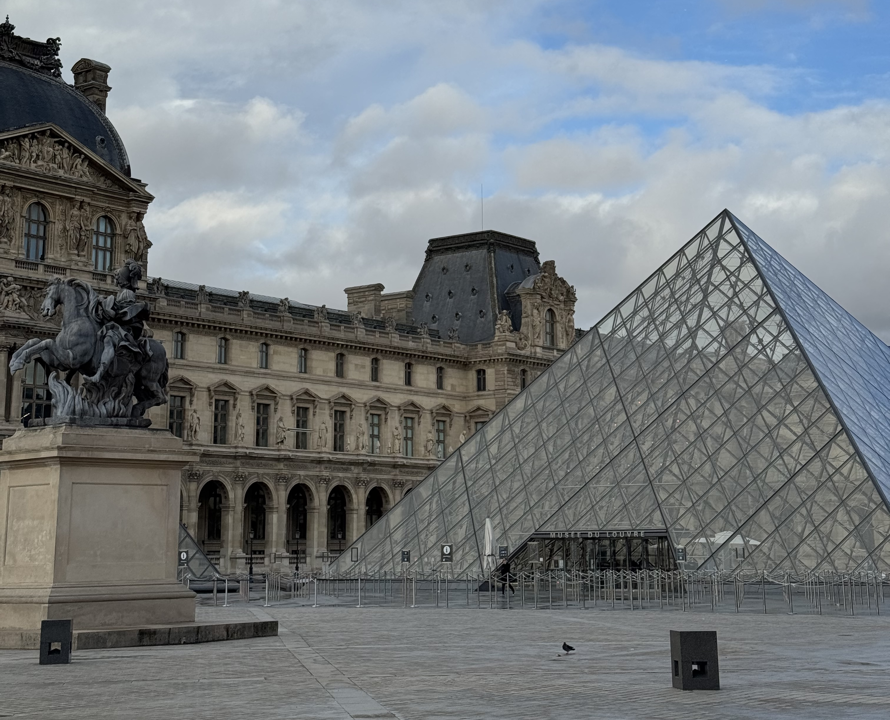
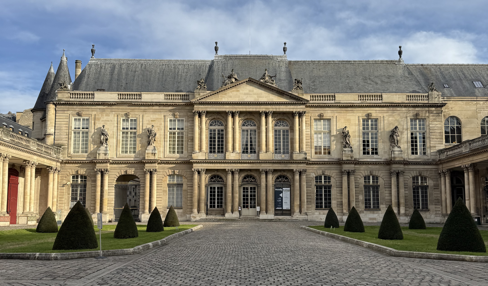

On of the things I like to do in my free time is visit museums - I think this year I may have gone a bit over the annual passes, oops. The good news is Paris has so many museums (including many that I haven't been to!), the bad news is that a lot are closed on a Monday.

Some of the museums listed here are open daily, others are closed on a different day of the week. Theses are the general hours, but of course there are exceptions such as certain national holidays or other unexpected events (like the recent Louvre heist!).

Here are some museums to visit on a Monday.

### The Louvre

Starting off with the museum that is high on the list of many people visiting the city, the Louvre! I always recommend booking timed entries _especially_ in high season. You can truly spend _hours_ and not even scratch the surface. This is one of the museums I have an annual pass for so I can dip in and out.

If you're visiting the Louvre, I highly recommend either doing a guided tour _or_ coming with a plan on what you want to see - either specific pieces (hello Mona Lisa) or what themes you'd like to see. The museum is massive (and can definitely be an overwhelming experience).

### The Pantheon

This is one of my favourite places in the city. The building is _beautiful_, and it's a great place to sit and reflect. In the crypt, you'll find some French people who have had a big impact on French history, from resistance fighters to scientists to politicians. I'm sure you're going to recognise some names but you'll also come across some names you're unfamiliar with.

It's walking distance to the Jardin du Luxembourg, one of my favourite parks in Paris.

Free, skip the line access with the National Monument card (70€ a year for the duo card, but it's 100% worth it).

### l’Arc de Triomphe

This is a part of Paris I don't find myself in often, but I will go out of my way to visit here. Unfortunately there are no good bakeries in this area so come prepared - I've learnt the hard way. You get a great view of the city. Note - there's is a tunnel that takes you _under_ the roundabout, don't try and walk across!! From the top, I almost always see someone crossing the roundabout, so don't be that person (it's dangerous!).

Free, skip the line access with the National Monument card.

### L’Orangerie

I'd recommend buying tickets in advance. I love sitting and looking at the Monet paintings but there's a lower level that also has some interesting pieces. This museums is in the perfect location for a stroll around the Jardin des Tuileries before or after - hopefully with the sun shining.

### National Archives

This is a free museums in Le Marais and I'd consider this a hidden gem. The building is beautiful, and they have a small little garden to the side that I love to stroll through. The museum and exhibitions are usually free, and are related to the archives. Lots of the text has been translated into English.

### Sainte Chapelle

Sainte Chapelle is open daily and I _always_ recommend buying ticket in advance. Good news is, there's a few different ways of getting tickets so you can read [my guide here](/articles/guide/sainte-chapelle/). I'd recommend giving yourself at least one hour here - while the building is small in comparison to other museums on this list there is a lot of details to look out for and sometimes the security line can take a while. The security here reminds me of being at an airport - it's stricter than most museums.

The stained glass windows are beautiful, and the (paid) audio guide is great - it takes you through the history of the building and the story of the stained glass windows. There is an elevator if needed - you can speak to the staff and they will bring you up.

Free, skip the line access with the National Monument card.

### Conciergerie

If you're interested in the French Revolution, this is one of the places I'd recommend. The French Revolution has had a big impact France as we know it today. This is a great museum for kids because it's never busy, there's lot of space and you can have some interesting discussions. Most of the text has been translated into English.

Free, skip the line access with the National Monument card.

<!-- ### National History

This is another museum that is great for kids. -->

### La Poste

I haven't been here _yet_ but I'm adding this to the list because I want to visit and because it's indeed open on a monday.

<!-- ### Architecture museum

There's something about this museum that I find breathtaking. The scale, the sizes and inside a museum?! Incredible. Through the widows, you get a great view of the Eiffel Tower.

### Musée de l'Homme

And just next door you'll find Musée de l'Homme. Another museum that I think is great for kids. -->

### And I'm sure there's more....

Let me know [here](https://www.instagram.com/p/DQmplsIjb-Z/) if you've visited any of these museums on a Monday, or if you have another favourite place to visit! I'm always happy to have new suggestions!
