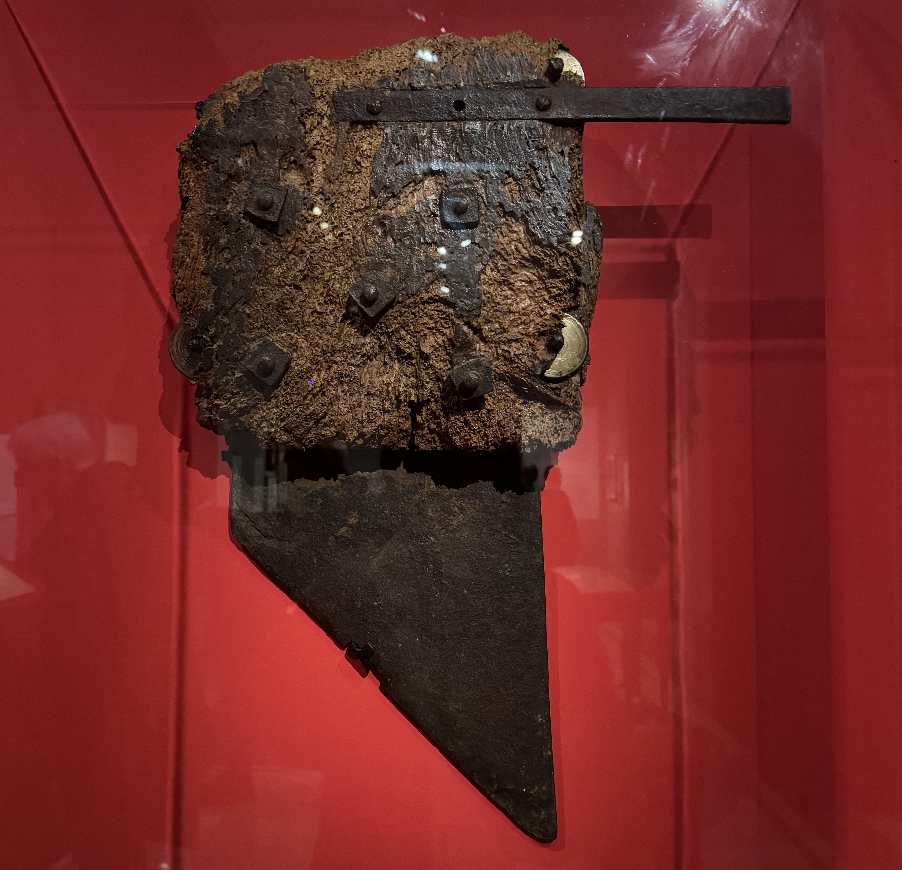

So if there's one thing to know about French history (which you probably already know), it that it's very, very bloody.

One of the main ways of execution during the French Revolution was with the _guillotine_. It's essentially a machine that can very easily can decapitate someone with a very high success rate.

Death by guillotine isn't as far back in history as you'd like to think - in France the last time it was used was in 1977 (think of all the people you know that were alive then!). The death penalty in France was only abolished in 1981.

> the blade of a guillotine on display from an [exhibition](/articles/museums/carnavalet-paris-1793-1794/), _Paris 1793-1794 Une année révolutionnaire_, at the Carnavalet museum (no longer on)

I've heard tour guides talk about certain myths related to the guillotine, and here are some of the main ones.

### The origin of the name

Any guesses where the name guillotine comes from? You'd be thinking along the right lines if you said it's named after someone. But it's not named after the person who invented it which is a common misconception. It's name after Joseph-Ignace Guillotin who was the person who proposed the guillotine during the French Revolution. Prior to this, decapitation was usually done with an axe, and well the success rate on the first swing was not always 100%. If you were of the upper class, sometimes a sword was used.

The guillotine hasn't always gone by this name, some of the other names include _le Rasoir national, (the national razor) or \_la Monte-à-regret_ (the regretful climb).

### Guillotin

Joseph-Ignace Guillotin (1738 – 1814) was a French physician, politician, and freemason who proposed the guillotine as a more humane method of execution. Believe it or not, he was actually against capital punishment and the death penalty.

There's this common myth that Guillotin was beheaded, but (un)fortunately that's not true. He died of natural causes at the age of 75. He is buried in Pere lachaise cemetery.

### The lasting legacy

I think it's somewhat unfortunate that Guillotin has the lasting legacy of the guillotine considering he was against the death penalty. At least for me, I have always associated the guillotine with the French Revolution, but it's not the only time and place that it has been used (remember, the last time it was used in France was in the 20th century!).

### Book a tour

I'm currently finalising a tour talking about different myths and legends and how much of their story is based on true events. If you want to find out when the tour is launching, you can find details on Instagram at **[@abiguides](https://www.instagram.com/abiguides/)**, or check out the [other tours](/book/) that I have already launched! Or if you have any questions you can reach me via Instagram.
