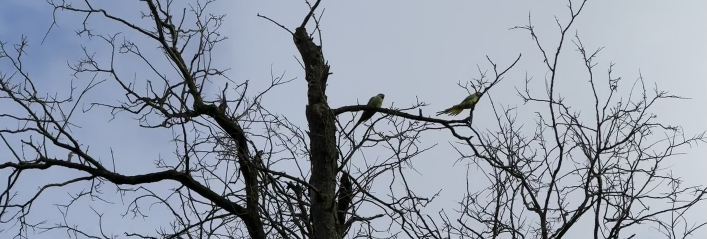

When walking through parks and green areas, you'll often see or hear vibrant green birds flying overhead. At first glace, you might not trust what you're seeing, "did you just see that green bird?". They really do standout by their colour and their singing. They're not local to the Paris region, so why are they here?

### Why are there parakeets in Paris?

The parakeets, also known as rose-ringed parakeets, have been in France for many years, but originate from Africa and the Indian subcontinent. Despite the different climate, they have adapted well to the climate here in France with an estimated population of between 10,000 and 20,000. You can find them in most parks in Paris including the Père Lachaise cemetery (where the photo was taken from - it's _hard_ to get a photo of the birds!), and sometimes on the streets that have lots of trees. They tend to move in groups, so if you see one, chances are there are a few others close by!

I've heard two versions of how they arrived in France, both of the stories follow the same theme. Different people will have their own slightly different tellings.

One version of the story is that they escaped from cages at Orly airport during transit in the 1970s. I've done some research, but I haven't been able to find any reference on this.

Another version is that people had them as pets and have later released them. If you have seen them in Paris, you've probably also heard them - and they are _loud_, I wouldn't want to share an apartment with them! If they started out as exotic pets, they probably did still arrive by plane.

Paris and Île-de-France isn't the only place where you can find them, they're found across France and some other european countries. They're classed as an invasive species but don't seem to cause too much damage to the local environment. I don't see them disappearing anytime soon.

### Have you seen the parakeets?

I'd love to know what your first reaction was! You can share your stories with me over on Instagram at **[@abi.in.france](https://www.instagram.com/abi.in.france/)**
