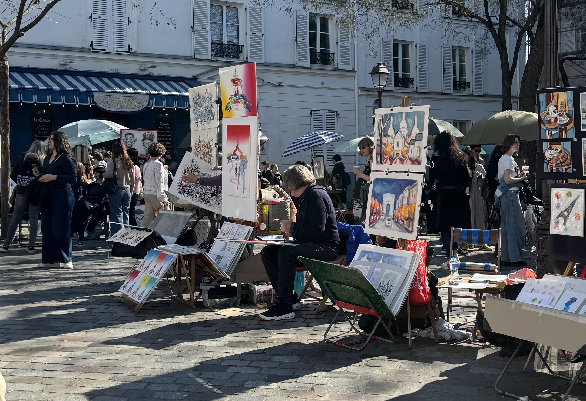

Montmartre is one of my favourite neighbourhoods of the city. This place holds a special place in my heart because I used to live not far from here in a tiny studio apartment (6th floor, no lift, the true Paris experience). When the weather was good, I would sit by the sacre coeur with friends, drinking beer or playing card games and watch the sun go down. There's almost always some street performer and it warms my soul. And, just around the corner you will find Place du Tertre, also known as the artist's square.

This square holds so much more than what we see when we first look at it. Artists have been working and living in this area since the end of the 1800s and the artists of the square help keep the spirit alive. Some of the more known artists who found inspiration in this area are Pablo Picasso, Vincent van Gogh, and Henri Toulouse-Lautrec but you also have other artists such as Suzanne Valadon - her house is now the Musée de Montmartre!

<a class="cta" href="/book/montmartre/">Book a tour of Montmartre</a>

### The artists at Place du Tertre

Tourist trap or tourist attraction? Personally, I think this is a tourist _attraction_, this is not where locals are coming to buy art (most of the art is Paris themed). If the weather is good, you'll see lots of artists but if it rains you won't find many (and there are also fewer tourists).

There are 124 official spaces that artists can rent - on the ground you can find small little studs that have numbers on them which mark the plots. In 2026, the cost of this is 334,28 € for the year. Part of the requirements are you need to be working on your art while there and have at least one project in progress.

At the time of writing this, the city have their [applications](https://www.paris.fr/pages/appel-a-propositions-20-places-vacantes-sur-le-carre-aux-artistes-place-du-tertre-18e-33952) open to become one of the artists on the square (applications are open until the 12th April 2026). They have positions open for painters, portrait painters and a silhouette artist. How exciting!

### The restaurants

There are a lot of restaurants on this square that allow you to watch the city pass. While I have personally never had food at any of the restaurants on the square, I would not recommend them because they scream _tourist trap_. Paris has so many great restaurants in the city and it can be hard to know how to find a good one. Here are two of the big warning signs:

- If they have someone standing outside, holding menus and saying _hello_ (which basically every restaurant on this square does)
- The menu has been translated in English, Spanish, Italian, you name it _and_ they're loud about it. It means they're counting on people who are not comfortable with the French language

With that being said, I don't think there is anything wrong with grabbing a glass of wine or a coffee here. There is something fun about the atmosphere, but expect to pay a little extra compared to other parts of the city _and_ it wouldn't surprise me if they ask for a tip. I've also heard that restaurants on this square will often give bottled water instead of tap water. This is fine if you _want_ bottled water, but the tap water is perfectly safe to drink and is free.

### Birth of the French automobile industry

On the corner of the square just off _rue Norvins_, you can come see a small plaques that is often overlooked. In French it reads as "pour la premiere fois le 24 decembre 1898, une voiture a petrole pilotée par louis renault son constructeur atteignit la place du tertre marquant ainsi le depart de l'industrie automobile francaise"

With the English translation being:

> For the first time on December 24 1898, a petrol-powered car driven by its manufacturer, Louis Renault, reached the Place du Tertre, thus marking the beginning of the French automobile industry.

If you have walked up, either via the stairs or the longer stair-free route, you'll see how impressive this is. The birth of the French automobile industry! And, Renault are still a known car brand today!

