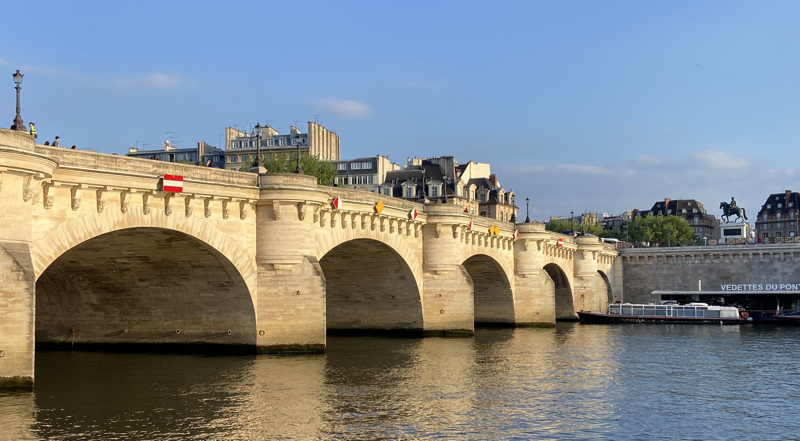

Pont Neuf, despite the name _new bridge_ is the oldest bridge in Paris. It's one of the 37 bridges in Paris.

### History

This bridge is an important bridge for a few reasons. It's the oldest bridge of Paris! It was a new design for the time, with it being the first stone bridge in the city - prior to this bridges were made with wood. The bridge is made up of smaller arch bridges, made in the same was as the Romans made their bridges. On the south side there are five arches connecting the bridge to left bank, and on the north there are seven arches connect the bridge to the right bank. The bridge is 232 metres long and 22 metres wide.

It was the first bridge in Paris that didn't have houses built on it. Henri IV said that he didn't want the houses to obstruct the view of the Louvre.

The bridge was designed with pedestrians in mind - which wasn't always the case. The pavements allowed allowed pedestrians to avoid the traffic and the mud. The

It took many years to build, the first stone was placed in 1578 by Henri III but was only inaugurated by Henri IV in 1607. In France during this period there was the Wars of Religion (1562 - 1598) which put a pause to construction.

It has been listed as a _monument historique_ since 1889 (which is the same year that the Eiffel Tower _and_ the Moulin Rouge opened). A major restoration of the Pont Neuf was begun in 1994 and was completed in 2007, the year of its 400th anniversary.

### Statue of Henri IV

At the point where the bridge crosses _Île de la Cité_ there is a bronze equestrian statue of King Henri IV. This isn't the original statue, as this was melted down during the French Revolution but was replaced in 1818.

Henri IV, sometimes called _le Bon Roi Henri_ (the Good King Henri) or _Henri le Grand_ (Henri the Great) was the king of France between 1589 and 1610, until he was assassinated by a Catholic zealot. He was baptised a Catholic but raised as a Huguenot in the Protestant faith. This made him unpopular because until now, all kings were Catholic. He converted to Catholicism, reportedly saying that "Paris is well worth a Mass".

While king, he signed the _édit de Nantes_ which guaranteed the religious liberties to Protestants which put an end to the French Wars of Religion.

### View from the bridge

While facing north, you can see _La Samaritaine_, a large department store that was recently renovated. It gets it's name from a water pump from the 17th century that used to be on pont neuf. At the time the pump provided up to 700,000 litres of water per day. It supplied running water to the Louvre district and more specifically the Louvre and Tuileries palaces. The pump got its name from the _Samaritan woman at the well_ from the Gospel of John.

While facing north west, you can see the Louvre, the size of the Louvre always surprises me.

### Stone faces

The stone faces, or _mascarons_ line the bridge - this is something that's easy to miss when walking over the bridge! Mascarons were originally designed to frighten evil spirits from entering. The ones on the bridge are all replicas, but some of the original faces can be found in Musée Carnavalet (one of my favourite museums in Paris!). Eight other originals were first placed in the Musée de Cluny – Musée national du Moyen Âge, but are now in the French National Museum of the Renaissance in the Château d'Écouen (a great [day trip](/articles/alphabet-ile-de-france/e-ecouen/) from Paris!).

### Book a tour

Want to explore Île de la Cité with me? You can book a private tour [here](/book/)!
