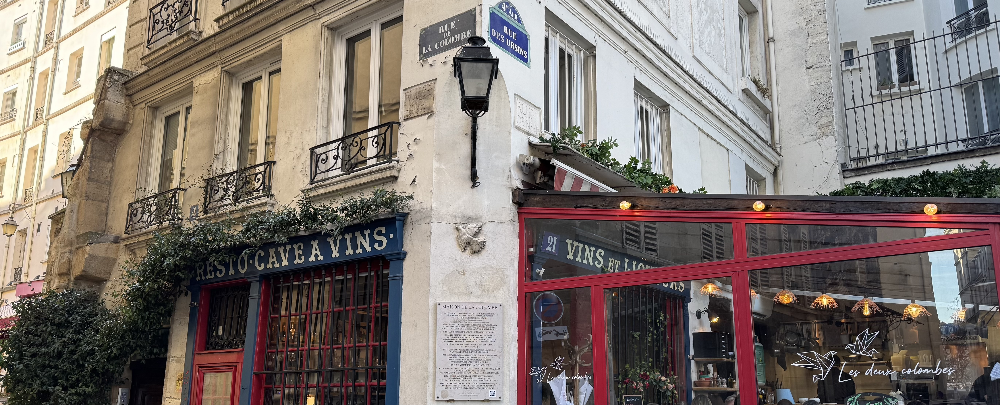

One of the things I love about Paris is the myths and legends that are hidden in plain sight. There are so many stories behind the buildings that are directly in front of us. Sometimes there's a trace, like a plaque on the wall or an engraving like there is here, but other times there's nothing visual to give it away.

On rue de la Colombe (dove street), there's some doves on the building and a restaurant named _Les Deux Colombes_ (the two doves), but why?

There is a legend dating back the 13th century that involves two doves. As the story goes, there was a sculptor who lived at 4 Rue de la Colombe with a couple of tamed doves. One day, while he was out working, the building collapsed trapping both doves inside. The male dove is able to escape, but the female dove unfortunately remains trapped.

Each day, the locals see that the male dove is returning to the collapsed building bring the female dove food and water. The locals witnessing this act of love help the female dove escape by removing the stones that are trapping her.

While this is a myth, and there are various versions of the story that alter in details, I like it. Stories like this add to the feeling of Paris being the city of love.

### Another piece of history in plain sight

A little bit further down this street, at 6 rue de la Colombe, there is a plaque which draws the attention to the Gallo-Roman wall. The difference in stone on the ground indicate the location of the remains of the wall which were discovered in 1898.

### Where to next? 

There's always something else to discover in Paris. Don't forget to look up, and pay attention to the details otherwise stories like this will pass you by.

Let me know if you've seen this before, or if it's now on your list of places to visit! You can reach me via Instagram at **[@abiguides](https://www.instagram.com/abiguides/)** where I share all things related to Paris and France.

If you would like to hear more stories about things in plain sight, you can book a tour using the button below or by clicking **[here](/book/)**!