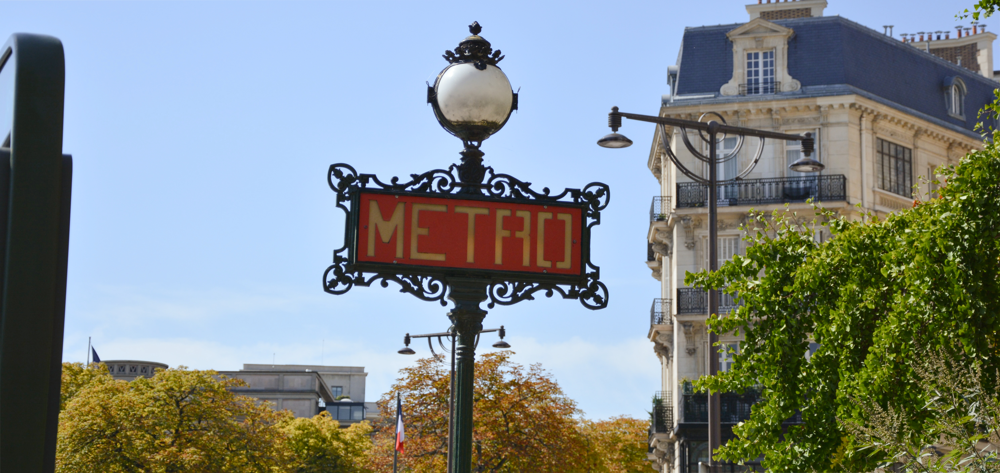

As someone who lives in Paris and works as a tour guide, I spend a lot of time on public transport. I love the metro system, I love being able to get from one side of the city to another, I love not needing to drive and I love the convenience of it. I rarely need to wait more than 5 minutes for a metro which is really really cool.

Just think about it, underground tunnels that allow thousands of people to be transported - magic!

### How and where can I buy a ticket?

To take public transport, you're going to need to buy a ticket. There are a few different ways of buying tickets but _never_ but tickets from someone outside of a metro station. The easiest way to buy a ticket is directly on your phone using the _bonjour RATP_ app. You can buy tickets most metro station from a ticket machine or on the bus directly from the driver (you need to pay in cash, ideally with the exact amount).

As of January 2025 pricing has been simplified!

The short version is:

- metro-RER tickets cost 2,5€
- bus-tram tickets cost 2€ (or 2,5€ if you're buying it from the bus driver)
- airport tickets cost 13€ (do not risk trying to get there on a normal ticket, there are often ticket controls at airport stations)
- day tickets cost 12€ for the entire Île-de-France region but exclude airports

It's a little more complicated if you're wanting to a physical ticket (rather than buying on your phone) and use both metros/RERs and buses/trams because you'll need to buy two cards. You cannot mix and match.

If you're planning on taking a lot of public transport, a weekly or monthly navigo (travel card) might be better - you can find more details [here](/articles/navigo/)!

### Is the public transport accessible?

The metro is not for everyone, most metro stations are not accessible (all newly built stations are) so if you're using a wheelchair or have mobility issues then you're going to have a hard time. It's also going to be harder if you have a pushchair or lot of luggage. There will often be someone who offers to help you carry things up and down stairs, but this isn't guaranteed.

Buses are a lot more accessible because you don't have all of the stairs.

### Navigating

Once you have validated your ticket, you're going to need to get to your metro.

Unfortunately the Paris metro doesn't make the navigating as easy as it could be - often you'll know if you're needing to go north or south on a line, but in the stations only the end station is displayed. When looking up the directions, it's good to remember the end stop of the direction you're going in.

It's important that you follow the rules of standing on the right of escalators. Parisians get frustrated (and will tell you so) when tourists block the left, because the left side is used for people who want to walk up.

If you want to stop to check directions, it's important to stand at the side to not block the people who are trying to pass. This is especially true during rush hours.

As with all busy places, you should watch out for pickpockets, both in the station and on the metros.

### The metro

When the metro arrives, make sure you stand to the side of the doors to allow people to get off before trying to get on. If you're in a large group, it's often better to split out between the doors. There will be time for yous to get on. If the first metro that arrives is really busy, and the next metro is on one or two minutes, I will often wait for the next one - often it's significantly quieter.

If the metro is busy, then the folding out chairs should not be used because less people will fit.

If you're needing to change metros, there's often a lot of walking (and stairs) between the two lines, so keep this in mind if you're needing to be somewhere at a specific time.

There are three fully automated lines, the line 1, 4 and 14 - because there's no driver you can actually see out of the windows at the front and back which I think it pretty cool.

### Favourite lines

I can say something positive about pretty much every line, and I have been on every line.

Line 6 is a fun line to take, because it's mostly overground. Between Bir Hakeim and \*\* you get a cool view of the Eiffel Tower. Line 6 is also known because of all of the cool street art that you can see (mostly on the east part of the line)

### Get in contact

Do you have any questions about the Paris metro system? Feel free to get in contact via Instagram at **[@abiguides](https://www.instagram.com/abiguides/)**!

I love talking about the metro, and public transport in general because of the positive impact on the environment and the convenience of it. I love the buzz of passing through busy stations while everyone is doing their own thing, living their own life.

There's a fun [online game](https://memory.pour.paris) where you can see how many metro stations you can name!
