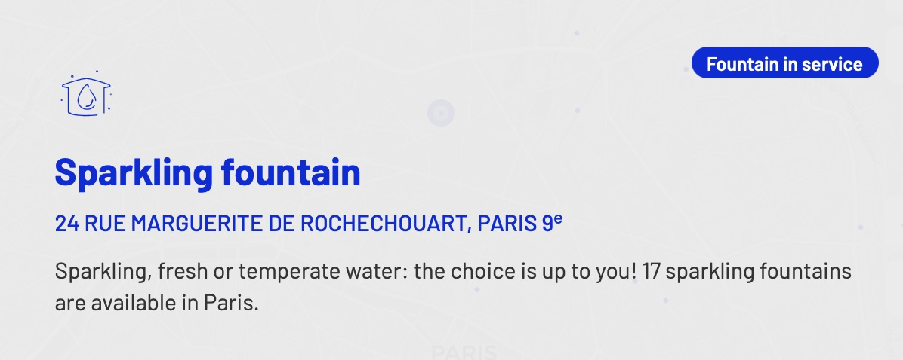

Yes! It is totally safe to drink tap water in Paris.

I spend a lot of time walking through the city, and a major part of my job is talking. Yet, I only have a 500ml bottle that comes almost _everywhere_ with me. Even on the days where it's 35°c, a 500ml bottle is sufficient in size, because I know that I'm never far from a place to fill up my bottle.

Here are some of my tips on staying hydrated in the city!

### Public water fountains

The city had a [website](https://www.eaudeparis.fr/ou-trouver-de-leau-paris) called _eau de Paris_ where you can find a list of all of the different places around the city to fill up your bottle.

Translated from the _eau de Paris_ website:

> In Paris, drinking water is accessible to everyone, so they can stay hydrated throughout the day. Eau de Paris supplies and maintains the 1,300 public fountains located in the city's streets and gardens: free, safe, and of optimal quality water.

This website is WONDERFUL because not only does it tell you where they are, it tells you if the water fountain is in service, the _type_ of fountain, but probably my favourite feature is knowing where the _sparkling water_ fountains are. Yes, Paris has 17 totally free fountains to fill up your bottle with sparking water!

There are many different types of fountains, but my personal favourites are the Wallace fountains. They're incredibly beautiful, and on first glace you'd never expect them to be a fountain. You can _sometimes_ find them in other cities, I came across one in Barcelona!

There are also shops and restaurants that take part in the _I choose Paris Water_ which is a network of places that will fill up your bottle for free with no obligation to buy anything. These places are also listed on _eau de Paris_. This is one of the many things the city is doing to reduce plastic waste.

### Restaurants

Unlike in some countries, tap water is given _almost_ by default. Certain restaurants, especially in the more touristy areas sometimes try to give you a bottle of water. When ordering you can politely ask for tap water, _une carafe d'eau_. Of course, there is nothing wrong with drinking bottled water if that's what you'd prefer, but personally I'd rather use than money on something else.
