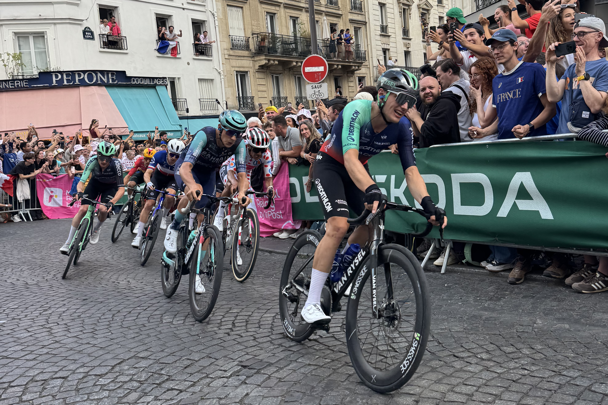
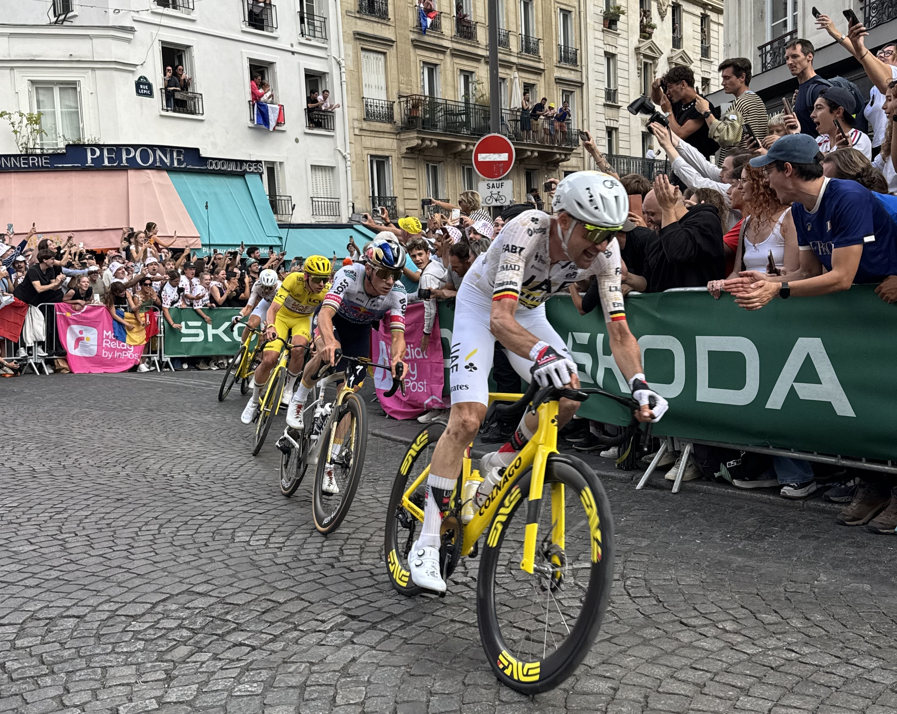

Throughout the year, there are many cool events (often free!), that happen in Paris. And watching the final of the Tour de France in Paris is something that I look forward to each year. I make sure to take the day off work (as a tour guide, my work schedule changes week to week, so I'm often working weekends).

2026 is my fourth time watching the final Tour de France Hommes in Paris and my second year watching it from Montmartre. The first two times I watched it, I watched from the Champs Elysées - they do multiple laps. Last year was the first time the passed Montmartre (following the route of the 2024 olympics!). Every single time I see professional cycling I am blown away with how FAST they can ride. Blink and they're gone. During the [2024 olympics](/articles/olympics/#womens-road-race), I watched both the men's and women's road race from Montmartre.

### Arrival time

We arrived early, just before 12 to secure a spot in Montmartre even though the race didn't start until 5:50pm. They reached Montmartre at 7pm (first lap of three). This year, they announced a modification to the route the day before so it started in Paris. This is because the police who were needed to help close of roads, were needed in other parts of France - there were (and still are at the time of writing) some really big fires in the south of France.

We probably didn’t need to arrive so early, but we wanted a good view. My partner is a big cycling fan, and watch the stage 10 from the col de pertus. I opted out of this adventure because cycling up mountains is not my idea of fun (and it was also hot). We knew Montmartre would be busy, and because I'm quite short, I wanted to be close to the front. There are so many places in Paris to watch from, so you can definitely avoid the big crowds. We had lots of snacks to get us through the day (including some great cherries), and we were joined by a father and son who we’d met the weekend before (the father has had some work displayed in the Centre Pompidou!!). This man had so many stories to share! It got me thinking about what stories I'll be sharing about my life.

In Paris, there is no _caravan_ - the vehicles that give out the promotional items (t-shirts, hats, snacks etc). But there are a few stalls where you can get some of items. I have mixed feelings about the items given out because while they're fun, they produce so much waste. (We cannot ignore the climate crisis.)

### The atmosphere

It’s such a good atmosphere, lot of people had signs and I saw some really cool outfits. It got me thinking that maybe I need to sew my own outfit for next year - do I do a mix of the four jerseys (yellow, green, white and polka dot). Special shout out to the people on the corner of rue Lepic who were playing music from their apartment window. Certain songs really got the crowd going. I really need to work on the lyrics of some of the classic French party songs.

After the race, I saw a lot of photos from further up rue Lepic which looked wild and was probably the more interesting place to watch from. We probably could have got a ‘better’ spot when we arrived, but honestly sometimes crowds get a little bit too wild for me. I don't regret our spot. If you don't want to join a big crowd, then I'd advise against Montmartre and the Champs Elysées. There are a lot of roads between that are a lot less busy.

The speed at which they go by is truly insane. You blink and they’re gone. Even going uphill on cobblestones, they’re incredibly fast. The first lap, the group was still mostly together, but by lap two and three there were gaps in the groups. The crowd went wild for every single person. I love that. Yes, sometimes people are rooting for a specific person but everyone deserves to be there and should be celebrated.

Despite the large number of people, getting home was a breeze. So grateful to live in a city that has a wonderful public transport network.

### Things I'd do different

- bring a chair or something to sit on. After standing while waiting for over 6 hours, you can really feel it. When the cyclists start coming through, you forget all about it. The long wait was worth it.

- bring a book (weather dependant): I love reading, but I didn't bring one this year because I thought it might rain and in 2025 I destroyed a book because of the rain.

- bring some card games. It would have been nice to play something while waiting

There’s something magical about being in a crowd. Sports, music, protests. I love the energy. (I also feel like this when commuting through a big train station, but I accept that I'm one of the weird ones on this.) I'm feeling inspired to find some more local sports events to attend. There are lots of known sports event - Tour de France, The Six Nations, the World Cup and the Olympics, but I think I'd prefer to find something smaller. I'll need to do some research into finding this.

### Tour de France Femmmes

Next weekend, the women's Tour de France starts. I’d love for the women’s edition to come through Paris in the future so that I can cheer them along too. We need more women in professional sports. Unfortunately, this year travelling to another part of France to watch is not on the cards.
