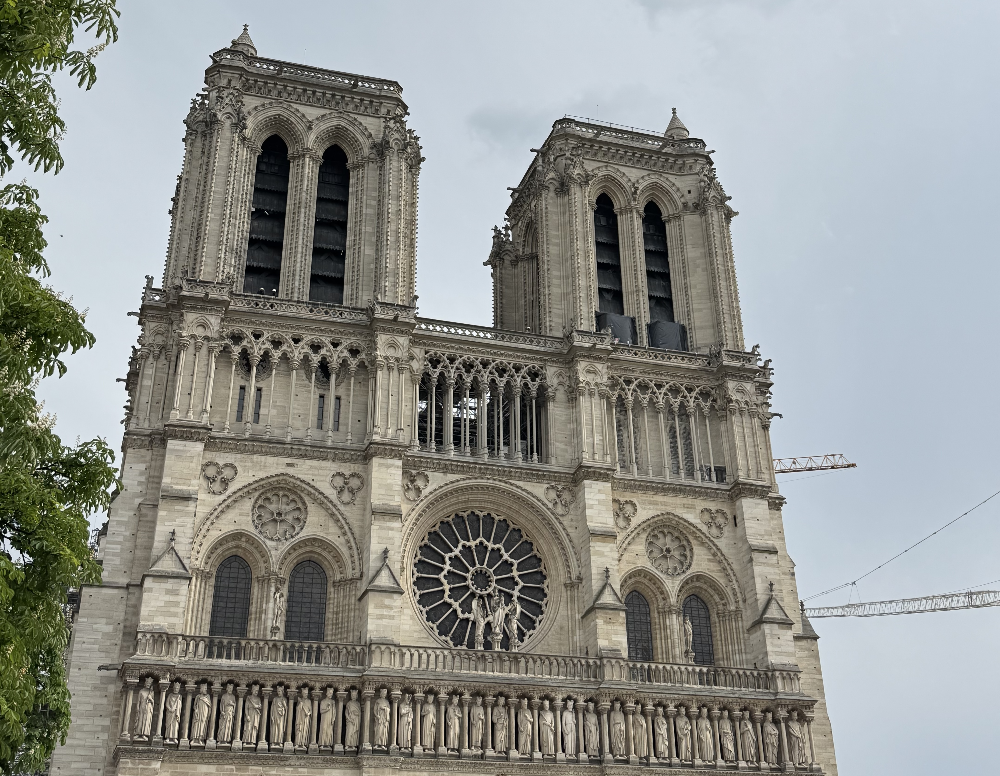

Visiting the Notre Dame is high up on the list of must-dos for a lot of people who are visiting Paris. People want to visit for a bunch of different reasons, sometimes they are wanting to visit for a service, sometimes it's to appreciate the building from a religious or spiritual point of view, and other times it's just to admire the beauty and history.

I get to spend a lot of time on Île de la Cité, which includes a lot of time admiring the Notre Dame!

<a class="cta" href="/book/visit-notre-dame/">Book a tour</a>

Before you visit, here are some things to keep in mind.

### Reservation slots for Notre Dame

Do you really need to reserve a ticket in advance? The short answer is no, you don't need to do a reservation in advance. You can show up during opening hours and join the queue. It it free to enter the cathedral. If you're wanting to visit the crypt there is a charge for this, along with the bell towers when they open (expected in September 2025, but this has not been confirmed yet).

If you're unable to get tickets, I'd recommend going early in the morning. If you're there before 9:30am there's essentially no queue. Even if you're not there early, and you're not able to get reservations, all hope is not lost! The queue does move fast even if it does look super intimidating.

Some companies provide a guided tour of the Île de la Cité with skip the line entry to Notre Dame (note, most do not give a tour inside Notre Dame). So if you're not wanting to join the long queue, this is also an option.

### Notre Dame dress code

The Notre Dame has a strict dress code like a lot of churches do. Since the end of June 2025 they've became much stricter when it comes to enforcing the dress code. Shoulders must be covered, and short shorts/shirts/dresses are not allowed. All hats have to be removed when entering the church.

If you find yourself in this situation, there are plenty of tourist stores (the ones that sell postcards, magnets and other Paris themed items) nearby where you're able to buy a scarf to cover your shoulders or wear as a skirt. You're going to other people in the same situation, so no stress! The Notre Dame _sometimes_ has scarfs you can borrow, but unfortunately people forget to return them so they're not always available.

### Renovations

After the 2019 fire, they have been working to restore the Notre Dame to her full glory. While the cathedral has been open to visit since December 2024, they haven't finished all of the renovations. There's still some scaffolding around the Notre Dame which isn't super visible from the front but can be seen from the back. The bell towers are not yet open, but hopefully we'll get some news on that soon!

### Got any question?

Got any questions about the Notre Dame, or would like to book a tour of Île de la Cité, you can get in contract via instagram at **[@abiguides](https://www.instagram.com/abiguides/)**
