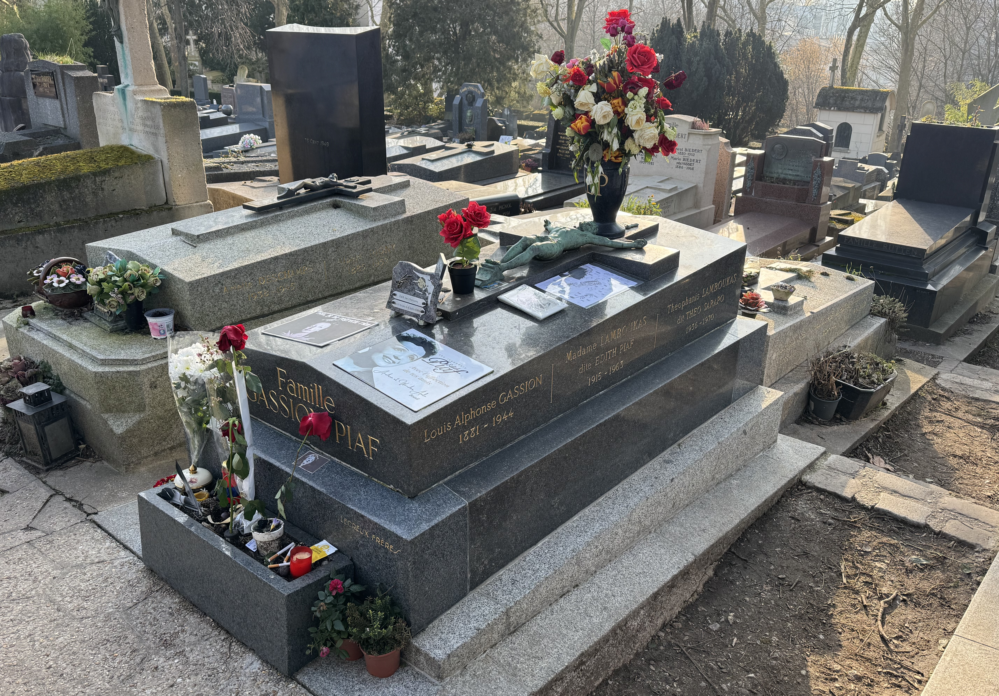

Père Lachaise cemetery is the largest cemetery in Paris with over 70,000 tombs. It's a beautiful and peaceful place to stroll through with so much history in front of your eyes.

I love digging into the lives of women throughout history. They played important roles and are often forgotten about.

If you would like to learn more about this cemetery and of the people who are buried here, you can book a private tour.

<a class="cta" href="/book/pere-lachaise/">Book a tour</a>

### Edith Piaf (1915 - 1963)

Edith Piaf is one of the most visited graves in Père Lachaise. She is buried here along with her dad, daughter and husband. She was an icon of the area, who started performing at the age of 14.

Her life wasn't always easy, from being raised in a brothel by her grandmother, being blind from the age of three to seven, to losing loved ones in her life. Her music is often autobiographical with themes of love, loss and sorrow.

She died in the south of France at the age of 47, but her second husband Théo Sarapo drove her back to Paris so that fans would think she had died in her home town.

Even if you don't listen to much French music, you're still likely to have two of her songs "la vie on rose" and "non, je ne regrette rien". At the opening ceremony of the Paris 2024 Olympics, Céline Dion performed "Hymne à l'amour", a song written by Edith Piaf. The performance was _beautiful_.

To the east of Père Lachaise there is _Place Edith Piaf_ which has a statue of her.

### Sarah Bernhardt (1844 - 1923)

Sarah Bernhardt was born in the Latin Quarter in Paris. She was a French stage actress who starred in some of the most popular French plays of the late 19th and early 20th centuries including works by Victor Hugo.

Her first performances were not successful and she had to really fight for her success. It wasn't always easy, there was pushback from people within the industry and she was involved in a few scandals throughout her career.

She performed both in France, and internationally and is known as one of the first international stars.

The _Théâtre de la Ville_ was previously named _Théâtre Sarah-Bernhardt_.

### Colette (1873 - 1954)

Born _Sidonie-Gabrielle Colette_, Colette was a French author and woman of letters. She was also a mime, actress, and journalist. Colette is best known internationally for her 1944 novella Gigi.

Her first four novels appeared under the name of her husband, so she has no access to the money earned from these books. Her work often has themes of being a woman in a male society.

Upon her death, on 3 August 1954, she was refused a religious funeral by the Catholic Church on account of her divorces, but given a state funeral, the first French woman of letters to be granted the honour.

In Paris, Place Colette is named after her. It is close to Palais Royal, where she used to live.

### Jane Avril (1868 - 1943)

Jane Avril, born _Jeanne Louise Beaudon_ was a French can-can dancer born in Belleville made famous by Henri de Toulouse-Lautrec through his paintings. She was sometimes called _Jeanne La Folle_ (crazy Jane) or _Mélinite_ (an explosion)

After a difficult youth, she discovers her love of dancing which ultimately saves her. It is thanks to her, the French cancan was exported. She is mentioned on the Moulin Rouge's [website](https://www.moulinrouge.fr/en/the-moulin-rouge/history/the-legends/jane-avril-2/) as one of the 13 legends of the cabaret.
