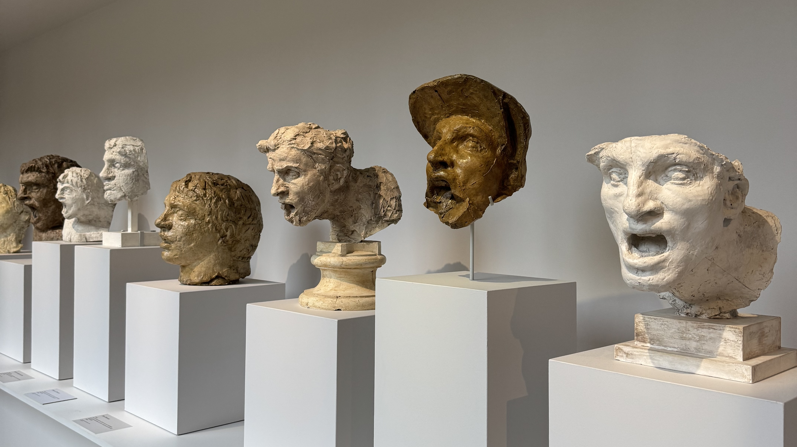
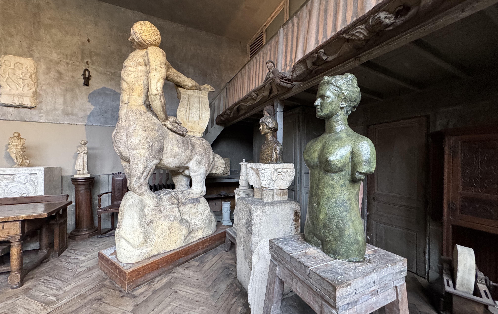

I recently went to see the exhibition _Rodin / Bourdelle. Corps à corps_ at the Bourdelle museum. This is my first time visiting this museum in the 8 years that I've lived here (I'm sure I'll never run out of things to do in the city). It's a museum that I've never seen on a top 1O list, but it's still worth seeing especially if you like sculptures. The museum is located in the studio of Bourdelle.

Since it was my first time here, I also took the time to see the permanent collection. In total I spent ~1h45h. Entrance to the permanent collection is free, and the exhibition costs 10€ (I have the annual [subscription](/articles/subscriptions/) to Musée Paris, so it was free for me).

### The exhibition

I didn't have many expectations going into the exhibition, I knew of Rodin (I have been to the Rodin museum a few times before and liked it _especially_ when the sun is shining) but I didn't know anything about Bourdelle.

The exhibition shows many works by both Rodin and one of his students, Bourdelle. Many of these pieces are on loan from other museums, including the musée Rodin, musée d’Orsay and Maison de Balzac. Their relationship started as Master and student, but it evolved over time where the exchanged letters, works and ideas.

The exhibition is broken down into multiple sections: soul of the material, elective affinities, aesthetics of the fragment, monument(al) and legacy and posterity.

I love getting to read more about the pieces on display, it’s always super interesting to think about the motivation of focusing on a specific element (there was one room that focused on hands and on torsos) or the choice on how it’s displayed.

While it was mainly sculptures, there were some drawings and paintings on display towards the end.

Almost everything in the temporary exhibit had English translation.

### The permanent collection

There's a few different parts to the permanent collection, so be sure to see it all - there are different rooms that are not all connected to each other. The workspace of Bourdelle and the painting studio are in different parts of the building.

I didn't know any of the works done by Bourdelle, so I was surprised to see some works that I recognised. He made the bas-reliefs that were used on the Theatre de Champs-Elysées (one of the first art deco building in Paris). They were really cool to see, and they're so much bigger when they're not metres up on a building.

There’s a small garden area which has some sculptures, many of them impressive by their size alone. It’s not often you’re at eye level with pieces on this scale.

One room is temporarily closed for renovations, which is due to reopen early 2025.

### Overview

It was nice to visit a museum a little different to normal, since I don't often visit sculpture museums.

After I got home, I did a little bit of extra research about Bourdelle. It turns out, that the bust of Gustave Eiffel at the Eiffel Tower, was made by Bourdelle. I've seen this bust many times because I give tours at the Eiffel Tower. I love it when information slots together like this, something I have seen linking in with something else that I have learnt.

One of my favourite things about being a tour guide, is that there is always something else to learn, something else to expand on.

If you've been, or plan on going, I'd love to [hear your thoughts](https://www.instagram.com/reel/DDr8M5AtvZe/)!

