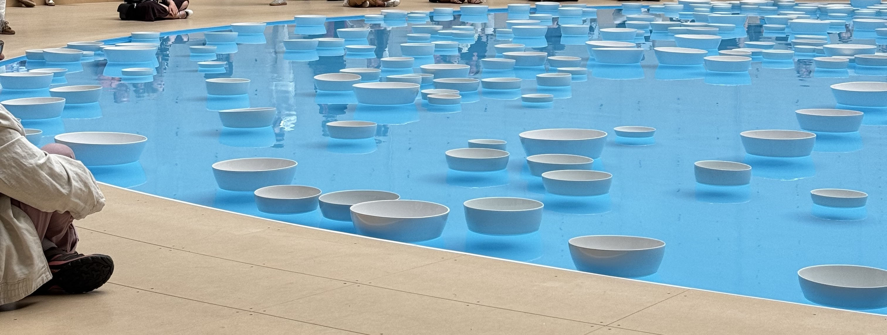

You've probably seen photos and videos of this exhibition online, because it's _beautiful_ and it did not disappoint. I only had a short period of time to visit in between tours, but I could have spent much longer there (I have an annual pass for the Bourse de Commerce so I'll be back!). I've loved every exhibition I've been to here at Bourse de Commerce, most of them involve something immersive and this is no exception.

### The exhibition

> on until 21st September 2025

The exhibition transforms the Rotunda into a place to sit, reflect and dream. In the centre of the room, there is a water with lots of white ceramic bowls floating on it. The current of the water pushes the bowls around, and on contact with each other produce acoustic vibrations. It's a unique experience because you never know what sounds will play next. Around the water, there is places to sit both on the ground and on seats.

### Reflection

While this exhibition is simple, there is a lot of beauty to it.

While here, I took out my journal because I LOVE sitting down with my thoughts. I loved watching, listening and reflecting on the installation in front of me. There's so many ways you can enjoy this exhibition! Do you want to follow one bowl and watch it move? Do you want to observe how many bowls pass at a specific point? Do you want to find the fastest bowl? There is not right or wrong way to enjoy this.

While there I changed positions a few times because looking at the installation from different angles changes how I perceived it. I sat on the floor, I sat on the seats at the edge of the room. You can see different reflections in the water from the people sat next to it, but also from the ceiling depending on where you sit.

I wrote an entire page of questions in my journal just for fun. Questions that I don't have the answer to, questions that have different answers from person to person, questions that are not at all important. Here are some of the questions I wrote:

> How do you define art? Can there be art in everything? Does art need to be understood? What are the benefits of art? Should you sit and watch? Should you close your eyes? Why was white chosen? What is the average age of the people in this room? What was the starting point of this idea?

I also did a mental spin off of what the exhibition could look like if there were some small changes. Say, if the bowls were not white but instead a mix of colours, or if each bowl was dyed a different colour and when it collided with another bowl they colours would mix, or if they had bowls in more sizes. Would this change how I felt about it?

I can't wait to go back and just sit there. Don't forget to look around the room, because the ceiling is beautiful too!

### Share your thoughts

I fully intend on going back to listen to the music, to dream and to imagine. Let me know what you think on [Instagram](https://www.instagram.com/reel/DM8eTWtinWD/)!
