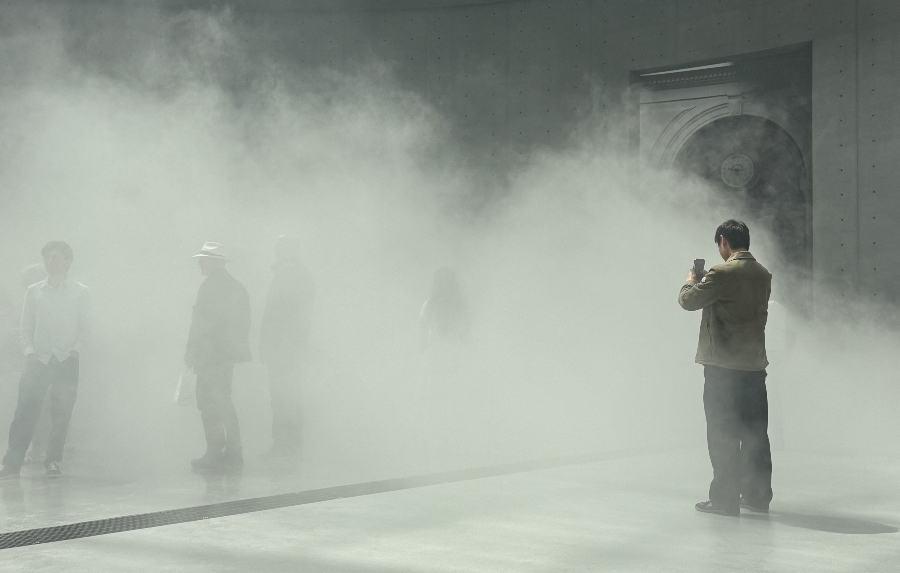
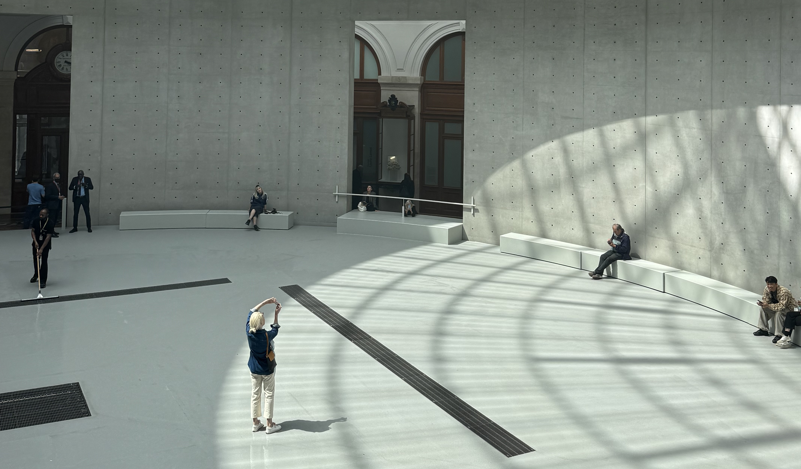

You've probably seen photos and videos of this exhibition online, which is not uncommon for the Bourse de Commerce - their exhibitions often look great on photos like with [Céleste Boursier-Mougenot](/articles/museums/bourse-de-commerce-celeste-boursier-mougenot/). And I almost always love what they have on, especially in the Rotunda. This is no exception. It's a unique experience, that is fun for all ages.

But I did leave with a lot of questions about art, how we engage with art and the role of social media. I'm going to prefix this article by saying there is no right or wrong way to enjoy art. Art is subjective. What I take away from this experience, could be very different to what you take away from it. Art is for everyone and is everywhere in our day to day lives and I’m trying to be more mindful with how I engage with it. Music, poetry, books, museums it all counts.

### The exhibition

> on until September 14th 2026

In the centre of the Rotunda, there are five grids that contains pumps that release tiny water droplets that are identical to the ones that make up a fog. When the pumps are activated, it really is like being in deep, deep fog. Almost like being in a cloud. I have never experienced anything like this inside a museum. (I did wonder how they are managing the humidify levels inside the museum, considering there is a lot of other art.) As the intensity of the fog changes, so does our vision and perception.

I went on a Wednesday afternoon so there were a lot of kids there (in France, kids don’t go to school on a Wednesday afternoon). I LOVE seeing kids in museums. It's so nice to see kids really enjoying an exhibition (despite being told continuously to stop running). A lot of museums can be quite boring for kids - don’t run, don’t talk to loud, don’t touch. There's a lot of rules to follow. This was great because you really got to experience it.

And it wasn’t just the kids having a good time, I loved it. Most people there seemed to be having fun. From sitting at the sides, to standing in the fog, to watching it from the balcony. It was great. You’re standing in a room, you can see everything clearly - the painting on the ceiling, all of the other people standing in the room. The fog starts and what you see changes. There is something weird about the feeling of seeing nothing in front of you, knowing that there is almost definitely someone in front of you.

You can also walk to the upper floor and observe the fog sculpture from there. It's interesting to see how different it looks from every angle.

While the fog sculpture is the main event, I highly recommend stopping, and observing the room when the fog is not on. I love this room. I love the way the light falls, the shadows that are cast from the roof, and the quite space for reflection.

### Reflection

I really enjoyed this experience, but I left with lots of questions about how I engage with art, and how social media has influenced how we view art. This exhibition is very instagramable, it looks great on photos and it’s a cool experience. I saw photos online, and thought it looked cool. Are exhibitions prioritised because they look good on social media? At the end of the day, the museum wants people to come see their exhibitions, it’s a part of how they make money.

Does posing for photos take away from the experience? How important is it to stop, pause and reflect on the art? How does it make you feel? What do you notice? Does it remind you of anything? Can you do that while optimising for the best photos? I know I can't. If I'm taking a photo, that is what I'm doing, that is where my focus is. I find it very hard to be on my phone and fully present in the moment. Fujiko Nakaya’s first fog sculptures date back to 1970 so she’s been doing this for a long time. The way we engage with art has shifted massively since then, especially with the rise of smart phones. We more or less all carry cameras around in our pockets. How does the artist feel about this change? Has anyone asked her about how she feels?

Can we engage with art without taking any photos? Should we? I like to take photos of art that inspire me, things that catch my eye, the experiences that I have. I definitely took some photos of the fog sculptures - this isn’t me trying to be “better” than anyone, but more about questioning how I choose to engage with art. I’ve also seen artists such as Nan Goldin ask for people to not take photos of their work at exhibitions in Paris. To be there, to be present. To not share it on social media. Most of the time, people try to respect the wishes of the artist.

Like I said, there are no right or wrong ways to enjoy art. We should all be doing it more - because it does have an impact on our heath. (If you haven’t read the book Art Cure by Daisy Francourt you should.)

### let me know what you think!

I’d love to know what you think about exhibitions like this, and how we choose to engage with art. You can reach me via instagram at **[@abi.in.france](https://www.instagram.com/abi.in.france/)**
