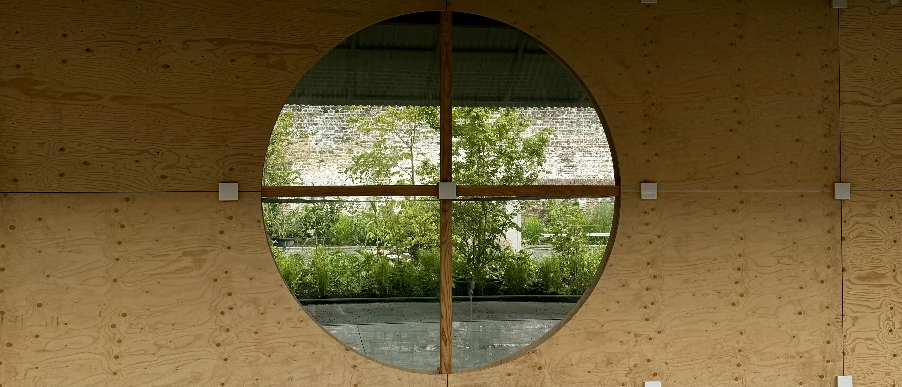
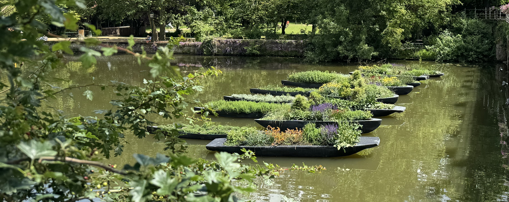

### Bruges Triennial

Every three years the Bruges Triennial brings contemporary art and architecture to the historic city centre of Bruges. I’ve known about this for a few years but my trips to Bruges never aligned with the event. In each edition, artists and architects submit new temporary installations for various locations across the city.

This year, the Bruges Triennial runs from 13 April 2024 through 1 September 2024.

I downloaded the _Visit Bruges_ app so that I could find out where all of the installations are located, I knew I would be doing it over multiple days so I didn't need to do them in order. The Visit Bruges app says the route it 7km long and can be done in four hours.

In total there are 12 different installations, 11 of them are in the centre of Bruges, and one is on the coast.

### The Theme

The theme of this years event is "Spaces of Possibility".

> "For this fourth edition, the Bruges Triennial will explore the city's hidden possibilities with the theme of 'Spaces of Possibility'. How can a UNESCO-protected historic city, where non-building is central, cope with change? And how can contemporary art and architecture be a catalyst for this sustainable change?"

I like the theme, I like thinking about spaces within a city and how the space can be used to benefit the people that live there. In a lot of cities all space is already accounted for, from things like parking and car infrastructure to shopping and places to eat - there's not always many places to just spend a few hours without spending money.

The number in brackets refers to the number on the route proposed on the Visit Bruges app.

### Day One: 11th June

Thankfully the weather was good, rain was forecast for the afternoon but I didn't actually rain. This is my first time at the Triennial so I wasn't sure what to expect with the different installations.

#### Traumnovelle – The Joyful Apocalypse (11)

> “A new story for the City Halls courtyard.”

This installation is a nine meter high scaffolding structure that you can climb up in three levels inside of the City Halls.

I didn't see anyone else climbing on the scaffolding, so it felt odd to start climbing. There was a small sign with an arrow that says it's free to enter but it still felt like I shouldn't be on it even thought I knew it was designed for this. Most of the people I saws inside the City Halls were on a walking tour, or were there to admire the Belfry not specifically to see this installation.

I'm pleased I walked up the scaffolding, despite the fact I didn't really enjoy it because I don't like heights or the sound of it moving especially when it was still wet from the morning rain. It was however cool to see the Belfry from an angle that I normally wouldn't.

But I'm going to be honest, I didn't really understand what this piece was trying to show.

#### Norell/Rodhe – Raamland (6)

> “Unknown town square gets temporary makeover.”

The installation turns an anonymous square into a meeting space. You can observe the square from the road by looking through a circle window, but you can also go inside. Almost all of the materials are reused from other places, and I like that there's native herbs and shrubs in the middle.

It feels like community is at the centre of this, a place to relax and to pass time with others - a space designed to be used.

#### Shingo Masuda + Katsuhisa Otsubo Architects - empty drop (7)

> “St John's Hospital Park gets new eye-catcher.”

The idea behind this piece is to celebrate the empty spaces within a built up area - they wanted to create a new, open meeting place. They chose bricks to reflect the building style of Bruges so it really blends in to the surroundings while also standing out.

Inside one of the drops there's a tree growing. This is also a reference to the past because a former orchard once flourished here.

You were invited to enter into it if you wanted to.

#### Adrien Tirtiaux – Under the Carpet (10)

> “Forgotten connecting road brought back to life.”

This one is in two parts. The idea behind this installation is using the old route that connected two hospital in the 1930s when Saint John's Hospital was struggling with a lack of space. At both ends there's a moss carpet.

Seeing only one part on it's own doesn't make much sense, but together it works. The walk between the two parts is nice but definitely doesn't feel like it's part of the installation, but maybe that's the point?

> "For example, you'll walk past a series of garage boxes and an overgrown narrow canal. Through this forgotten piece of residual space, Adrien Tirtiaux asks you the question: what do we consider heritage and what don't we?"

I liked the idea behind this, showing that the city was previously used in another way and that it's easy to forget about the past.

#### Sumayya Vally – Grains of Paradise (12)

> “A new page in history.”

This installation looks back on the history of Bruges based on the 14th and 15th-century trading relations between Bruges and the African continent. It's a series of blackened pirogues on the _Lake of Love_ which are filled with plants and spices, including the malagueta pepper. The malagueta pepper originated in the Gulf of Guinea and was very popular with the mediaeval people of Bruges.

I don't know much about the history of Bruges, other than it was a place known for their trade. I liked how this is in reference to the history.

### Day two

I was again lucky with the weather. Day two had some of my favourite installations.

#### Mona Hatoum – Full Swing (4)

> “Underground swing invites reflection.”

The installation is a space underground that you walk down into using stairs that are uneven. At the centre there is a swing that you can use. The idea behind this space is "evoke feelings of instability, displacement and even fear".

The artist is intrigued by prisons and other penitentiary buildings because their architecture focuses primarily on control and discipline. She wonders what type of impact this building style has on the people and whether they can thrive in such an oppressive system.

I liked this piece a lot, the swing adds an element of joy and childlike behaviour to the more serious theme. When I was there, it was quiet so I could really take the time to think about this installation. It's located in the garden of the Onzelievevrouw psychiatric hospital, which is very fitting for this theme.

#### Bangkok Project Studio - The tower of balance (2)

> “A fourth beacon for the Bruges skyline.”

This installation is inspired by the Belfry of Bruges. You can climb the three different levels on this structure which allows you to get a view across the city. There is a bell at the top that you can ring which captures the typical sound of Bruges.

There's also a small opening where you can see into the St Godelina's Abbey. They're currently working on the Abbey so that it can be opened to the public in the future.

While I enjoyed climbing the tower and seeing Bruges from another view point it feels a little _bland_ in comparison to some of the others.

#### SO-IL – Common Thread (8)

> “Meander a path through the garden of the Capuchin Monastery.”

This installation is inspired by Bruges history with lace - Bruges was a centre of the lace industry from the 16th century.

From one of the entrances it's like you're entering from a private garage but the garage opens up into the garden of the Capuchin Monastery. You walk through all of these different tunnels formed from recycled PET bottles. Not all of the tunnels are directly connected to each other so when trying to find the way to the exit it's possible to take the "wrong" one.

I really enjoyed walking around the gardens. I like the reference to the history of Bruges along with use of recycled materials.

#### Iván Argote - Who? (1)

> “A monument in doubt.”

This installation is a pair of weathered boots on the Speelmansrei. You don't have any information on who they belong to and as the person viewing the art you get to reflect on that.

I like the idea behind this piece, but I couldn't stop thinking about how _big_ the statue would need to be if it was full sized - it would be higher than the surrounding buildings. Maybe that's just a me thing.

#### Mariana Castillo Deball – Firesong for the bees, a tree of clay (3)

> “New residents for the Sebrechts Park.”

This installation contains unique ceramic beehives which refers to the historical bee-keeping in Europe. Hives were built from straw, clay and fired ceramics and were all unique. We are now used to the standard beehive that was introduced in the 19th century. Atop the installation there are three typical simplex hives which actually house bees. The bees are cared for by local beekeepers.

This is probably my favourite one. I loved seeing all of the bees around the beehives. Bees are so important to the environment.

#### Studio Ossidiana – Earthsea Pavilion (9)

> “Searching for shells at Bladelin Court.”

This installation is inspired by the different layers of history which tells stories about the local environment. Each layer contains plants, flower seeds, fungi, minerals and bacteria which are all impacted by the local weather conditions.

I like how with time this piece will change, each time you visit you'll be able to see something different. It's interesting to think about the ground that's underneath us hold stories of the past.

### Final thoughts

I like the Visit Bruges app, I like that it had a map which has a route that you could follow and that it had a summary of what each piece is representing.

I've been to Bruges a few times now, and I really like that I got to see more of the city than I normally would. I really enjoy it when cities host events that are outdoors and free to explore because it makes culture more accessible. At every location there was someone there where you could ask questions to and to pick up a leaflet with explanations around each piece. I appreciate how carefully each location was selected.

All quotes come from the Visit Bruges Triennial [website](https://www.visitbruges.be/en/triennial).
