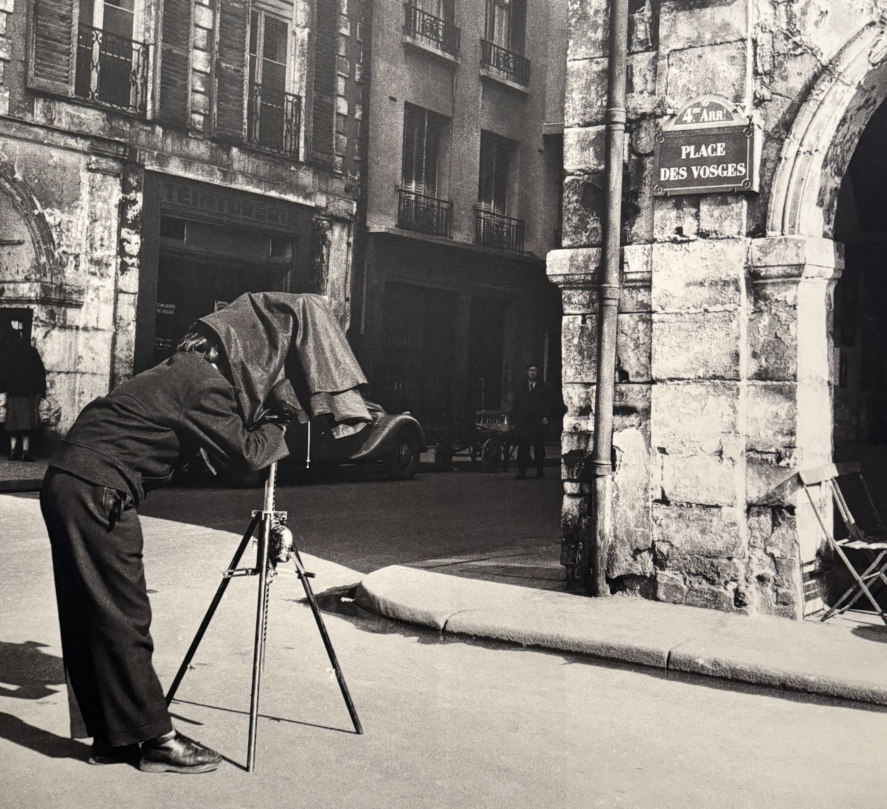
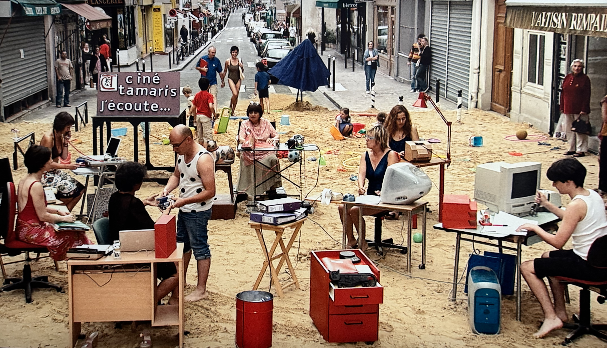

I remember seeing posters for this exhibition when it first came out, yet I still only took the time in the closing week to go and see it (when will I ever learn?!). I'm so happy I got to see this exhibition.

### The exhibition

The exhibition costs 15€ - while the permanent collection of the museum is free. Almost everything has English translations.

Agnès Varda (1928 - 2019) was a photographer, film maker and visual artist. She lived in Paris from 1943 to 2019. It covers different stages of her life from settling in to Paris, her exhibition in her own home and working as a film maker. She had so much personality and it was reflected in her work. I didn't know anything about her or her work prior to this exhibition (which is the case for a lot of exhibitions I go and see).

There were a few things that stood out for me, the changes in technology over her lifetime, the everyday backdrop of Paris in her photos, her sense of community and the dating of her work.

> Les plages d'Agnès, août 2007

This is one of my favourite photos in the exhibition and I wish I could have experienced this. Paris never fails to surprise me, and I love it when I come across film sets in the city.

While I really enjoyed this exhibition, part of that is because Paris is the backdrop of a lot of her work and I love learning more about women from history. I definitely feel like I took more away because I live here, and it's so interesting to see how Paris has changed over the years. This wouldn't be top of the list of exhibitions to see if I was just visiting Paris.

### Closing thoughts

I was telling a friend about this exhibition while we were taking about museums and I told her that I really enjoyed this exhibition. In general I love seeing exhibitions that focus on women and she asked why. It's partially because woman are often forgotten about in history. If I asked you to name a female artist, would you be able to? Men tend to be the first people we think of, and then we struggle to name more than a handful of women. Agnès was a woman working in a male dominated industry but still showed up and was successful.

It also got me thinking a lot about photography and how technology has changed over the years. This is something that's been on my mind since I visited the [Wolfgang Tillmans exhibition](/articles/museums/centre-pompidou-wolfgang-tillsman/) at Centre Pompidou. I recently bought myself a new (second hand) camera because I want to learn how to take photos - and taking photos on a phone doesn't _feel_ serious enough. It doesn't motivate me to learn the skills behind it, to take my time rather than taking a photo while walking and I already spend a lot of time on my phone.

I'm excited to learn the skills that go into photography, and in many ways it's so much easier now with modern technology.
