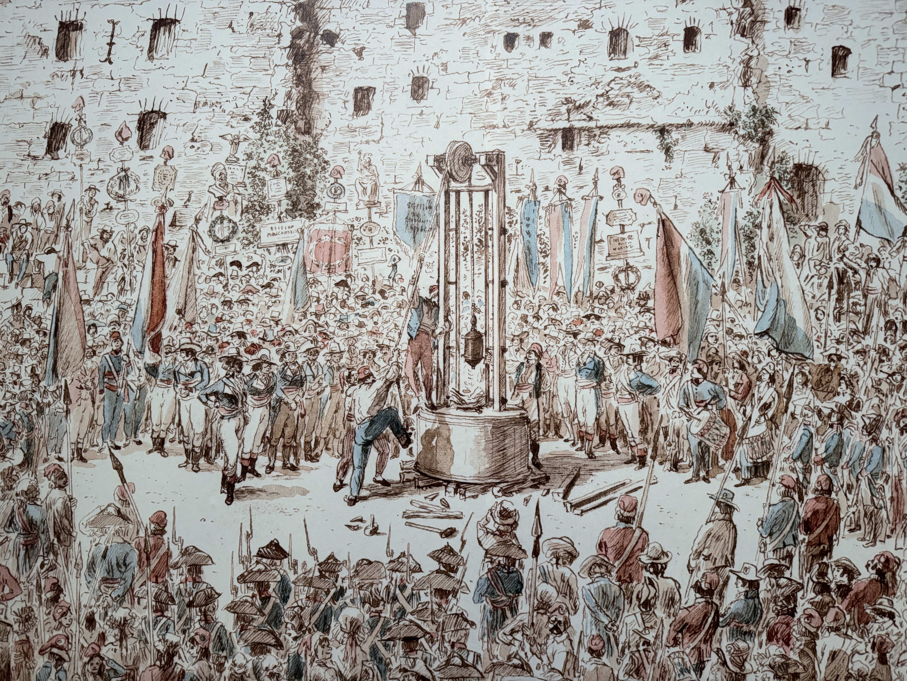
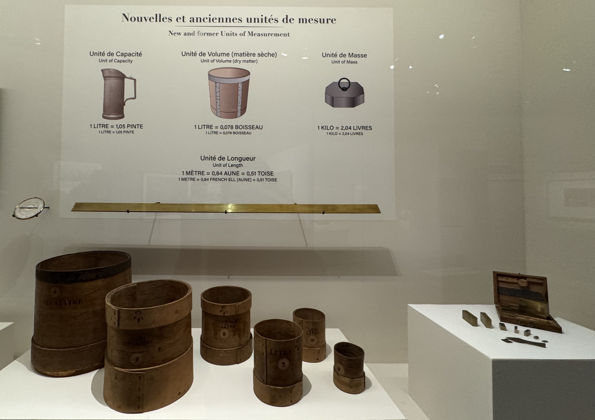
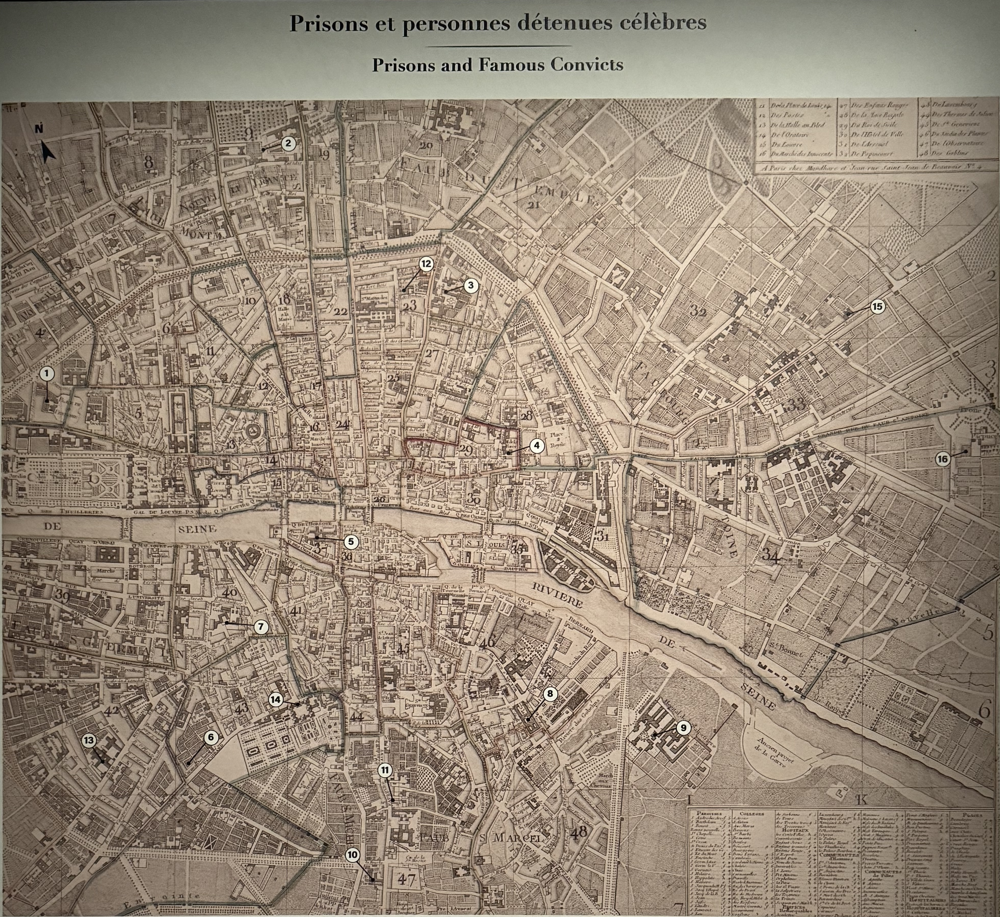

I recently went to see the exhibition _Paris 1793-1794: Une année révolutionnaire_ at musée Carnavalet which focused on Paris in 1793-1794. This is one of my favourite museums in Paris and I always enjoy the exhibitions here. The permanent collection had loads of interesting things related to the history of Paris and it's free to enter!

I spent an hour and a half going through this exhibition. There's a lot of information about this period with all of the text translated into English (which isn't always the case for museums in Paris). Full price tickets cost 13€, but I have a subscription to the Paris museums so it was free for me.

### The exhibition

The exhibition focuses on the period of the French revolution between spring 1793 to summer 1794, also known as the _Reign of Terror_. This French revolution (which is definitely not the only one) started in May 1789 and only ended in November 1799 and is an important part of French history. The national holiday of France, the 14th July, commemorates the storming of Bastille in 1789 which is often associated with the start of the revolution.

The exhibition goes into depth about political events and why they were important. Daily life during the revolution was not easy for the Parisians. While there was hope, there was also fear and disruption. There were food shortages, police surveillance, repression and social conflicts.

On September 21st 1792, the royalty was abolished in France, paving way for the First Republic. It was decided that the 22nd September 1792 would be the start of the Republican calendar. This calendar is fascinating for me. It consisted of twelve 30-day months, each divided into three ten day cycles similar to weeks, plus five or six days at the end to fill out the balance of a solar year.

This change was part of a larger attempt at de-christianization and decimalisation in France. With the new Republic calendar, the tenth day replaced what we know as sunday which were used for rest and festivity. Because there were less sundays, people were praying less.

This wasn't the only thing that changed. While the calendar only had a short life (it was abolished in 1806 by Napoleon), there are some things that are still in use today.

During the Revolution, they standardised certain measurements, including the metre, litre and kilo - these are all things that are very much used day to day! And wow am I pleased that they have been standardised because it makes things so much easier to count with - I'd very much like to drop miles and replace them with kilometres!

Throughout the exhibit, they had different maps with different elements highlighted. One of the maps that stood out to me, is the map of prisons and famous convicts. The most known prison is definitely _la Conciergerie_ with Marie Antoinette. It's always interesting to me to think about the history of the city I've spent many hours walking through.

One of the most fascinating items on display is a guillotine blade. I've seen so many drawings and paintings of guillotines, but I've never really thought about the blade. It was much thicker and looked heavier than I imagined. The design of the guillotine was intended to make the death penalty more reliable and less painful. It was also used by everyone, regardless of social status or class.

During the Reign of Terror, around 17,000 people were guillotined including former King Louis XVI and Marie Antoinette along with revolutionary leaders such as Maximilien Robespierre.

### Closing thoughts

I really enjoyed this exhibition and I like the mix of paintings, posters, videos and maps used. There were definitely parts I already knew but I did leave with some notes that I'd like to research further. It's interesting for me to understand how the events fit around other events at the same time, and their lasting impacts.

I like to spend time thinking about Paris over the different eras, and the changes that have happened. There's so much history in this city, and I love that there's a museum dedicated to it.
