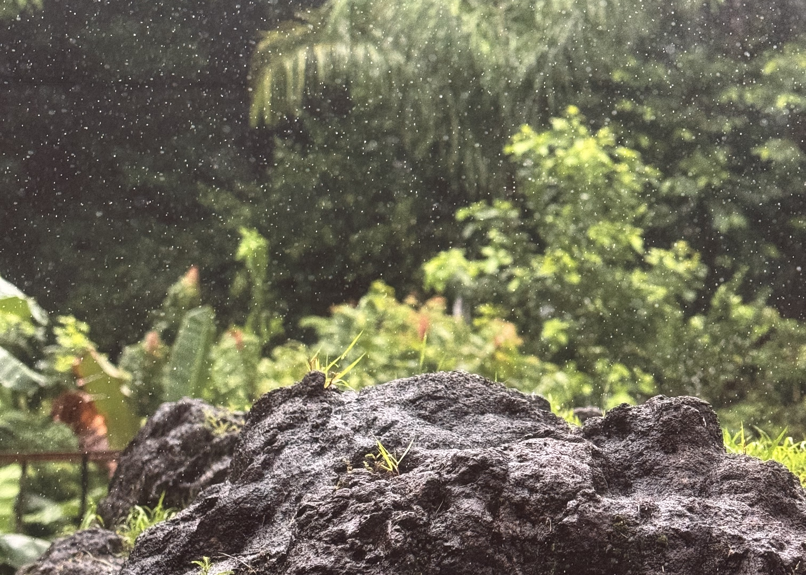
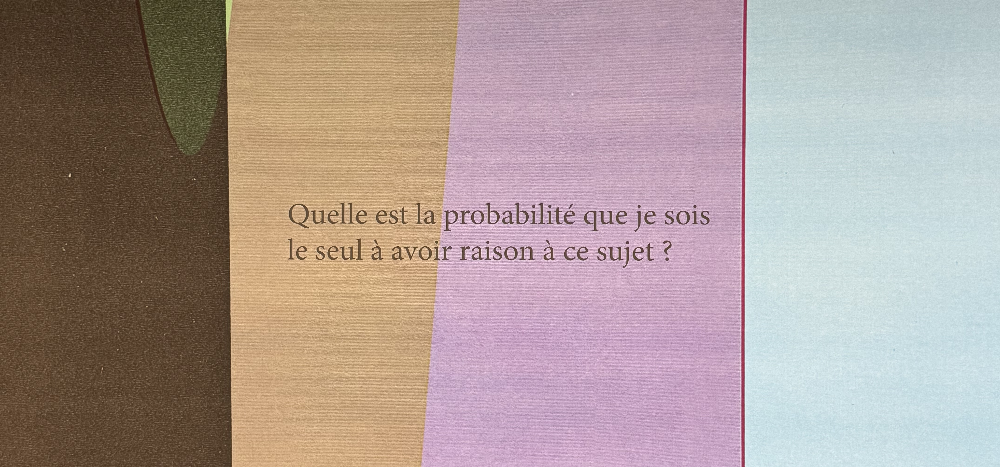

I went to see the final exhibition, “Nothing could have prepared us, everything could have prepared us” at Centre Pompidou before it closes for 5 years. Walking into the building was a very emotional experience - which I didn't expect. They've already closed the escalators at the front of the building, so you can no longer go to the top to get a nice view. It makes sense, but I thought it would remain open while the final exhibition is on.

Centre Pompidou is one of the first museums that I visited when I moved to Paris back in 2016. Growing up, I didn't go to museums often (because I'm from a small town), so when I first moved here, I spent a lot of time discovering what Paris has to offer - museums were a free activity (because I was under 26), it worked well with my working hours and I could experience art in a way I didn't growing up.

But not only was it one of the first museums I visited, I've spent countless hours working here, both when I was learning to code and researching for my job as a tour guide. There's something so motivating about working while surrounded by other people. The exhibition takes place in the library - almost all of the furniture has been removed so it's a very different space, but I was still reminded about the hours I spent here.

### The exhibition

Ticket price: 17€

The exhibition covers nearly 40 years of Wolfgang Tillmans' work across various domains - photos, videos, and sound.

In total, I spent two hours(!) here, and I could have spent longer if I didn't have work in the afternoon. I didn’t have any expectations for the exhibition, but it was so much more than I thought it would be. They have a little book leaflet with the layout and some information on the pieces.

I like the mix of styles of photos, the stories that goes behind each piece, the way that politics is layered through the art. There's photos, magazine covers, videos, and audio all throughout the exhibition. I like that there are so many unassuming photos that ended up here. It left me thinking a lot about the photos I have taken over the years, and the things that I choose to pay attention to. (It also got me thinking about how many photos I've appeared in)

It got my thinking about writing, text that has been printed and how it can be used for many years to come. If you stop and look at some of the photos, you're able to see that even if the words are not the core of the image, they still mean something - someone still chose to write them. There's text in English, French and German.

> translation: What is the probability that I am the only one right about this?

One of the most memorable pieces was audio - a 9 minute recording called "I want to make a film" from 2018. They had a room playing this audio, but it was also available in the 'self-education' space - an area that has computers with the films he has created over his career.

I felt so inspired by the exhibition, that I took out my journal to write. Phone notes were not scratching the itch. So I sat down, and wrote while listening to Tillsman talk.

### Closing thoughts

I would highly recommend this exhibition! You could spend hours here, especially if you wanted to look through all of the videos in the self education section. There are plenty of places to sit down and enjoy the work.

I have an annual pass to Centre Pompidou, so I'm hoping to experience the exhibition again. You can hear Wolfgang Tillmans talk about his exhibition on the Centre Pompidou [YouTube channel](https://www.youtube.com/watch?v=FBOCcvkEC9w), where he explains some of his favourite pieces.

Have you been to this exhibition? What did you think? I'd love to hear your thoughts! You can leave a comment on instagram at **[@abi.in.france](https://www.instagram.com/reel/DMvKQkVNuC_)**

---
