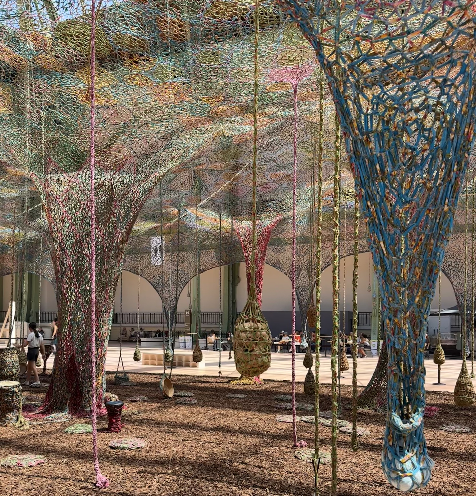
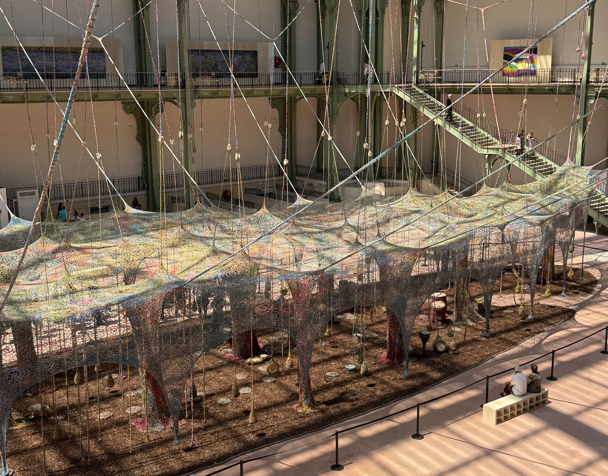

This exhibition has been on my to-visit list since I first saw an ad for it in the metro, so I took myself on a solo date. I've been to Le Grand Palais a few times since it reopened, once to see the [wheelchair fencing](/articles/paralympics/#wheelchair-fencing) at the Paralympics, and once to go [ice skating](/articles/guide/ice-skating-grand-palais/). I love love love this building. The architecture is just so impressive.

This exhibition explore the connection between nature, culture and spirituality, inspired by gravity and rhythms.

### The exhibition

I've been wanting to go to this exhibition since it opened, but with my work schedule I don't always have the time to squeeze it in between tours. On the days that I had free time, I checked online before going and noticed that the interactive part was actually closed for maintenance. I knew that I wanted to be able to experience the exhibition, so I decided to hold off, until today!

I had a catacombs tour scheduled today for 12:3O but it was cancelled because the catacombs workers are on strike (we're in week three of the strike). I still had to go there in case anyone on my tour didn't get the notification that it was cancelled, but it did mean that I finished work earlier than expected. Today was a hot day for Paris, reaching 31°c (88°f) which is hot for this time of year, so I wanted to be inside. (side note, being inside a building with a glass roof is _hot_ on a day like today).

I arrived after lunch at around 1:3Opm (on a Thursday) and there was no queue to get inside Le Grand Palais. Once inside, you turn right and you'll be inside the exhibition hall. Since this is a free exhibition there are no tickets and no reservations. In the centre of the room, there is a giant piece of art handing from the ceiling. There was a short queue to get to the interactive part which I joined. Every ~10 minutes the queue moves, with the people on (in?) the exhibition asked to leave, and new people let on. They allow 20 people at a time.

The main two rules they have are no shoes and you're not allowed to pull on the fabric (which is why I imagine they had to close part for maintenance). The exhibition focuses on multiple senses. This is not something to just look at, it's something to interact with, something to experience. There are things to touch, things to smell and things to listen to.

Throughout the area, there are various instruments that are open to everyone. At the start I was a little nervous because I have no sense of rhythm, but in the end I didn't care. I had fun! There are various forms of drums and bells. Some are on the ground, others are handing from the fabric that is attached to the ceiling.

There really was a variety of different people there and I loved catching snippets of conversations. Some kids were playing _the floor is lava_ as they were jumping around.

I will say, the exhibition itself is quite small, but it's impressive to see! Based on the photos I had seen online, I expected something bigger. On the balcony, you have a small exhibition featuring four other Brazilian artists. I liked the different textures that were used in the paintings.

### advice

Since the exhibition is interactive, it may be closed for maintenance. If that's the case, the website should be updated. You're still able to see it from the balcony, but a lot of the fun of the exhibition is getting to interact with it. If you have the choice, I'd recommend coming on a day where it's open, but it's still worth seeing from the outside!

There are no reservations to this exhibition, but once there, you can estimate how long it will be until you're allowed on (every ~10 minutes the queue moves by 20 people). If you're going in a group, you _all_ need to wait in the line otherwise you might not be allowed on at the same time. Someone just in front of me in the queue asked if she could get her friend who was reading the information, but he said that she needed to queue herself. This will depend on the person managing the queue.

No shoes are allowed into the exhibition. You'll be asked to take them off before you enter. I saw quite a few people wearing no socks (did I mention it was hot?!), but I'm happy I was wearing socks. The bark on the ground can be quite sharp.

I also highly encourage to pause and listen to the music. Everyone there had difference musical talents, ranging from people with no sense of rhythm (me) to people who can clearly play instruments. The sound is always changing, always moving. There are benches around the exhibition both on the level of the exhibition and the balcony level.

### Now it's your turn

Have you been to this exhibition? What did you think? I'd love to hear your thoughts! You can reach me via instagram at **[@abi.in.france](https://www.instagram.com/abi.in.france/)**
