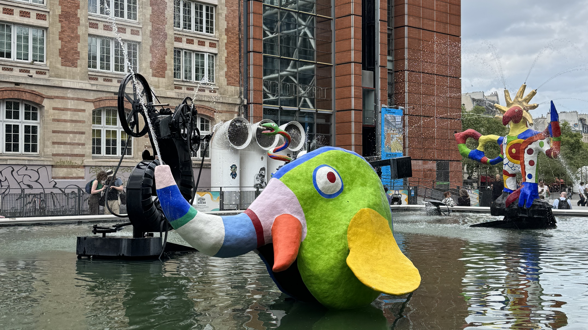
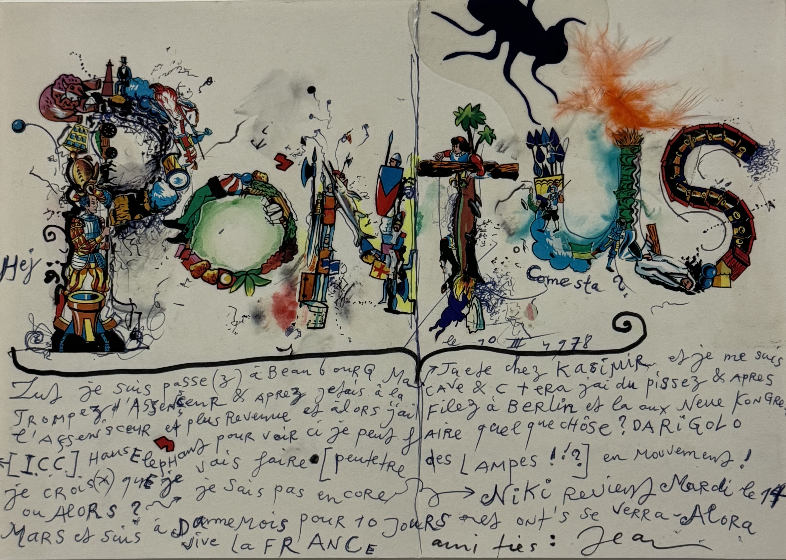
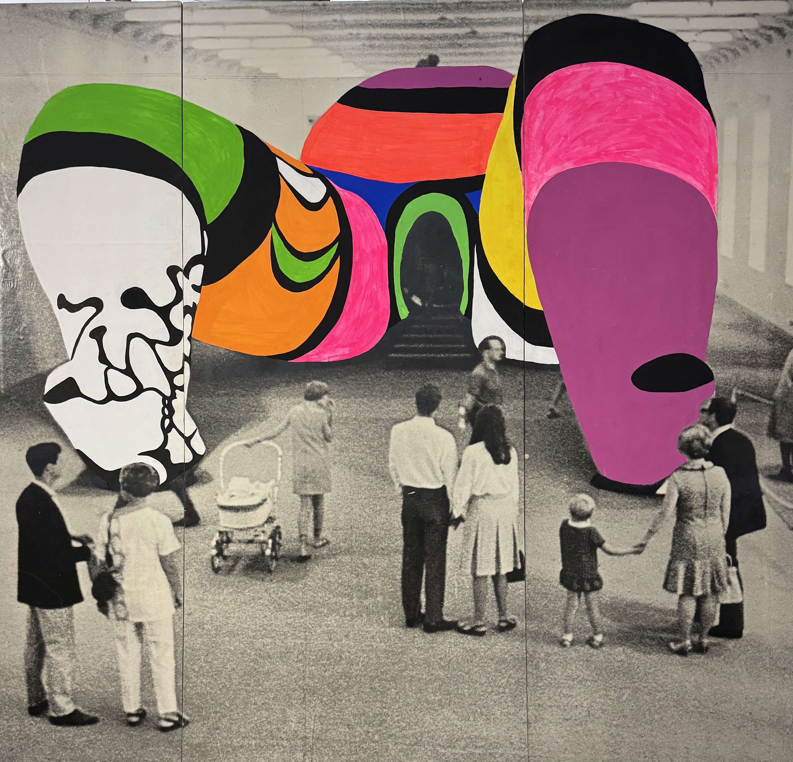

I knew this was an exhibition I wanted to check out as soon as I saw the posters for it. I did take me a few months to make it here - but I'm so happy I did. This is not a part of Paris I find myself in often, so it's a museum that I have to make the time for rather than dropping by between tours. I had already seen some of Niki de Saint Phalle and Jean Tinguely's work - notably outside the Centre Pompidou with the Stravinsky fountain and Le Cyclop (highly recommend as a day trip from Paris in the summer!). I was so excited when I saw these pieces featured in the exhibition.

The exhibition shows work by Niki de Saint Phalle and Jean Tinguely through the visionary lens of Pontus Hulten. Pontus Hulten was the first director at the Centre Pompidou. This exhibition is in collaboration with the Centre Pompidou which is closed for the next 5 years (until at least 2030) for some renovations.

### The exhibition

The exhibition costs 17€ for the full price ticket and 5€ for the audio guide. Because it's in collaboration with the Centre Pompidou, I didn't have to pay for my ticket because I have their annual membership (which was only 25€ for the year because I'm under 30!). I did opt for the audio guide which I'm so happy I did.

As you walk into the room, you instantly get a feeling for what the exhibition is going to include - a machine in the centre of the room and some clock icons next to some descriptions. In order to preserve the works, they are not on constantly but instead go on at specific intervals - this is probably nice for the people working there since some are quite loud.

I really enjoyed this way of exploring an exhibition, I found myself staying in rooms for longer than I otherwise would have. I spent this time re-listening to the audio guide or reflecting on the art. You knew that the movement would only last for a matter of seconds, sometimes minutes (as indicated by the description), and that it was going to be _useless_ but it brought me so much joy waiting for it.

Along the first wall on the right, there are some photos of the machines in use. And honestly, I wish I could have experienced these machines as they moved around the city. They have some videos of them in the streets and I loved watching them - the looks of surprise and fascination is incredible. These machines are not meant to be useful - in fact, they're the opposite. Machines that are useless, that are made with items that you'd not usually see on a piece of art.

There's something so fun about this exhibition. You can feel their spirit in what they're creating and I love it. Machines that have no use other than art? Yes please.

I love writing postcards while travelling, and I think I want to make them this extra.

One of the reoccurring themes to the exhibition was destruction. There were machines that were created so that they _would_ self-destruct. And this piece here, the giant woman lying on her back was destroyed after the original exhibition. Only a few parts of it remain. I would have loved to attend this exhibition - inside the woman, they had a bar, cinema and other art to look at.

### Overall thoughts

10/10 exhibition. I'd love to visit again before it closes (in one month!). If you have been to the exhibition or plan on going, I'd love to know your thoughts over on Instagram at **[@abi.in.france](https://www.instagram.com/abi.in.france/)**
