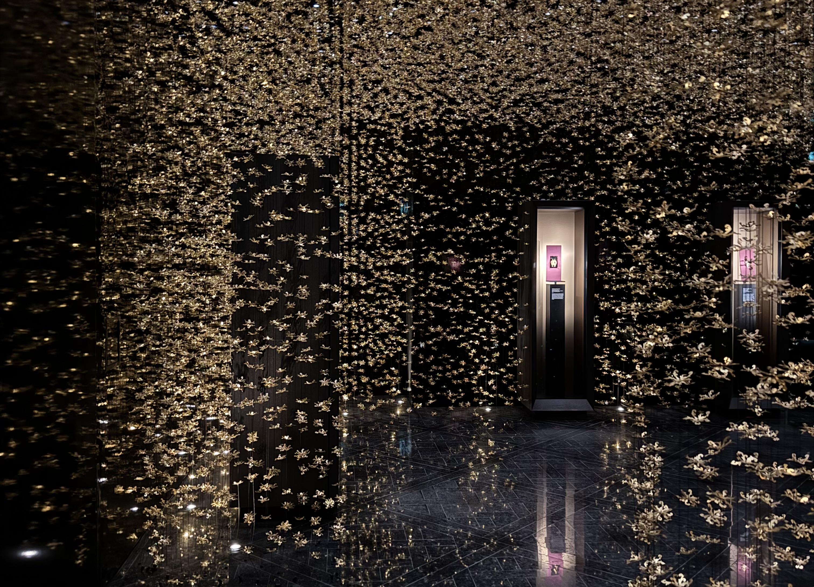
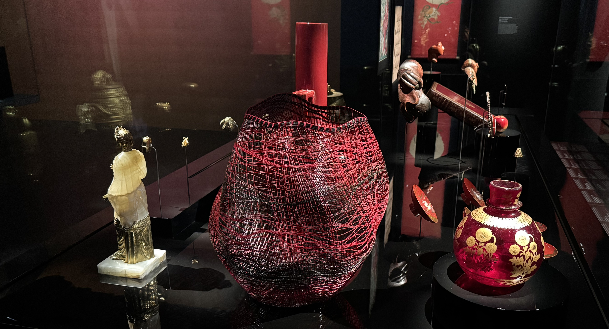

I've been living in Paris for eight years, and this is my first time visiting Hôtel de la Marine. I had no expectations going into the museum or exhibition, but I _loved_ it. It exceeded the expectations that I didn't have.

With a friend and fellow tour guide, we had planned to meet up and do some sketching together. It's still too cold to be sitting outside, so my friend suggested this museum (we did not end up sketching because we were enjoying the museum so much). Neither of us has been before, and I entry was free because I have the duo national monument card (which I love very much!). We visited the permanent and temporary exhibition, which took us a little over two hours.

The full price combined ticket costs 23€ when purchasing online, this includes an audio guide.

Here are my thoughts on the exhibition _La couleur parle toutes les langues_, (Colour speaks all Languages).

### The exhibition

The exhibition focuses of the theme of colour and the significance of each colour through history and across different cultures. The objects on display represent cultures across five continents, spanning from the 3rd millennium BC to the 21st century.

I had no idea what to expect, I had not looked up what the museum was or what exhibition was on. As we walked towards the exhibition, the sliding door opened. The wall was a grey black colour with _AT | Collection Al Thani_ on it. There's two panels to the right that had text on, which I didn't read because two other people were already there _and_ I got distracted by the room. The room was dancing.

The room was _beautiful_. There were a few different displays which all had incredible pieces of jewellery in. So much details! The colours! The audio guide was explaining each piece, but I was so distracted by my own thoughts I didn't listen (oops).

### Colour speaks all Languages

The second room of the exhibition followed the theme _colour speaks all languages_. There are six different display cases, focusing on each of the colours, black, white, red, yellow, blue and green.

One of the first things I noticed is the panel that explains the exhibition had a title that changes colour! I liked the touch that it gave to the exhibition.

Each display, had a variety of pieces of art, different styles, different shades.

It was interesting to reflect on how colours are perceived differently across cultures. So much of how I feel is based on things I have experienced, which includes the culture of where I have lived.

I don't often think about the significant of colour, but I do know that colour is an important part of my life. I'm almost always wearing something colourful, my office at home has a yellow wall, my sofa is blue, my notebooks vary in colour. I gravitate towards colour, it brings me joy.

There is text on each colour, but it's only displayed in French.

<!-- the last section includes.... -->

### The audio guide

The audio guide for the entire museum was great (available in multiple languages), and I don't think I've never had an experience quite like this. The audio headset hovers of your ears so it's a really immersive experience. Sometimes it would throw me off because it would sound like someone approaching from my left (I'm blind in my left eye, so I don't have great spatial awareness).

As you walked into the room, the audio started playing. Once you had your headset on, you had to do nothing. If you changed room before you had finished listening to that section, it would skip the remaining part and continue in the next room.

While this is a cool experience, I found that sometimes I wanted to skip ahead to a specific piece which didn't seem to be possible. It means that you do have to talk your time, and go at the speed of the audio guide. This has both pros and cons, but overall I enjoyed the experience.

### Closing thoughts

I'm so happy I ended up her with a friend, and I'm sure I'll be back. I loved the sense of aw that the exhibition left me with. It definitely left me with things to consider especially related to what each colour means to me.

---
