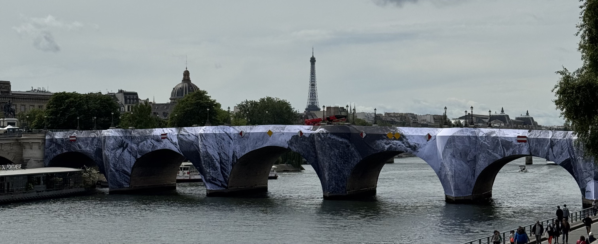
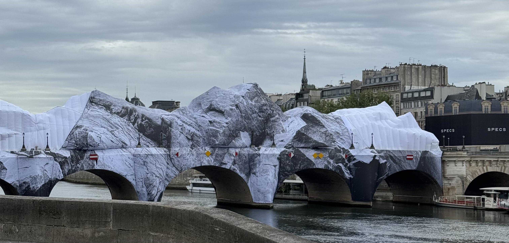
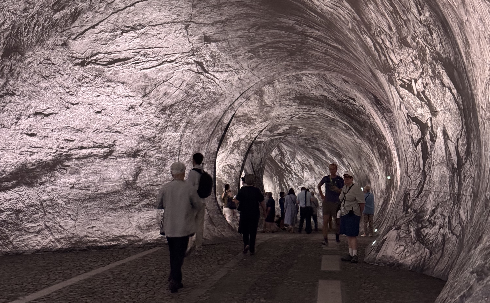

If you've been in Paris in the second half of May or June 2026, you may have came across this art installation over [Pont Neuf](/articles/guide/pont-neuf/). Parisians and tourists alike all have something to say about it - some people like it, others don't. The artist JR has interviewed some people passing by to ask them what they think and has been sharing it on his social media. Art is subjective and not everyone needs to like every piece. La Caverne du Pont-Neuf is inspired by _Pont-Neuf wrapped_ by Christo and Jeanne-Claude in 1985.

Since the start of the construction, I've had people on my tours asking questions about it. I've had quite a few people ask what they're doing, thinking it's just a cover for some construction. Even some people who live in Paris thought that (see the advertisement to the right on the second photo). I mean, you can see why considering some surrounding buildings have giant advertisements up to cover the scaffolding. This is something you see quite often in Paris.

When I first heard about this, I was looking forward to seeing it. I love seeing different art exhibitions pop up throughout the city - bonus when they're free and when they're open the entire day and night.

I enjoyed getting to see the construction both in person and on social media. There were some big changes one day to the next - a lot of the construction was done over night. Initially the exhibition was meant to be open for three weeks - from the 6th June until 28th June. Due to a storm in Paris, part of the installation was damaged, you could see the white under layer, and therefore the opening was delayed. Devastating! When your exhibition is only going to be open for three weeks, you really really need to find solutions fast. And luckily, they were able to get it repaired and opened to the public!

It officially opened on the 15th June at around 6pm. There was no prior announcement to say that it would be opening at that time. I was lucky enough to be one of the first people to walk through the tunnel after it open. I had a private tour that ended up 8pm and we just happened to end on Pont Neuf - this was not something I had planned for. There was no queue, so I was able to walk straight through. This was ideal because this is the bridge I use for getting home usually. I had the chance to pass through again on the morning of the 17th at 9:30am, and again there was no one. Seriously, mornings in Paris are the best!

### So what did I think?

Honestly, it's ok. I was expecting something... better? I'm not sure exactly what I was expecting, but something a little more than what there was. That being said, the second time I did notice things that I didn't notice the first time, like the perfumes vents. Maybe it gets better with each visit? I'm not convinced the heatwave we have in Paris is going to do any favours for this experience. But this is not something I would queue for.

I was also surprised to see the QR codes for the virtual reality - that take you to Snapchat. I did scan the QR code, so cannot say if the virtual reality adds something to the experience.

I find the print to be a little pixelated which takes away from the illusion especially when up close. I actually prefer La Caverne from a distance. It is cool getting to see it take it's form, the bright white really catches your eye and change depending on the angle you look at it from. You get a great view while walking along the banks of the river. And I do like that it's a conversation starter.

For this construction of the installation, they closed part of the bridge - the part that connects Ile de la Cité and the right bank. While the exhibition is open, you can cross the bridge starting on Ile de la Cité. This appears to be different to the reference piece of art - Pont-Neuf wrapped by Christo and Jeanne-Claude in 1985. In photos I have seen from 1985, people are walking in both directions and cars are driving across. Obviously, this is a different piece of art, and having cars drive through is not possible, and having people enter from one side helps with the flow of people.

While I understand _why_ the bridge is closed, I don't know if art should be allowed to impact public infrastructure in such a way. This bridge is a key crossing for a lot of people. For me, I'm able-bodied and can walk the 15 minutes extra to cross the river at either Pont des Arts or Pont au Change but this isn't as easy for a lot of other people. This isn't just an impact for a weekend or even a week, but 9 weeks in total. This is a BIG impact. It would be slightly different if this was done during July and August when the city has less people.

I've seen some older people asking the staff at La Caverne why they cannot cross, or why they have to walk to the other side to access this installation. I've had people who are late for tours, because their taxi drivers told them they can walk through it starting on right bank (I can't tell if the taxi drivers are just unaware, or if they just don't want to drive a little further).

I really wanted to like it, but overall I found it... underwhelming. I think part of the reason I was excited for this was because I had experience the Arc de Triomphe wrapped by Christo and Jeanne-Claude back in 2021. I had a great time here! It was beautifully done, and somewhere at home I still have a patch of the material. This experience, didn't come close to that of the experience in 2021.

### Share your thoughts

I'm sure there are some people who loved La Caverne du Pont-Neuf. I'd love to know what you think over on instagram at **[@abi.in.france](https://www.instagram.com/abi.in.france/)**
