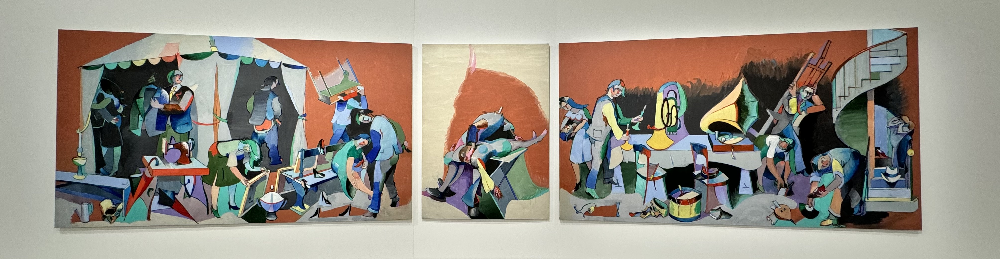
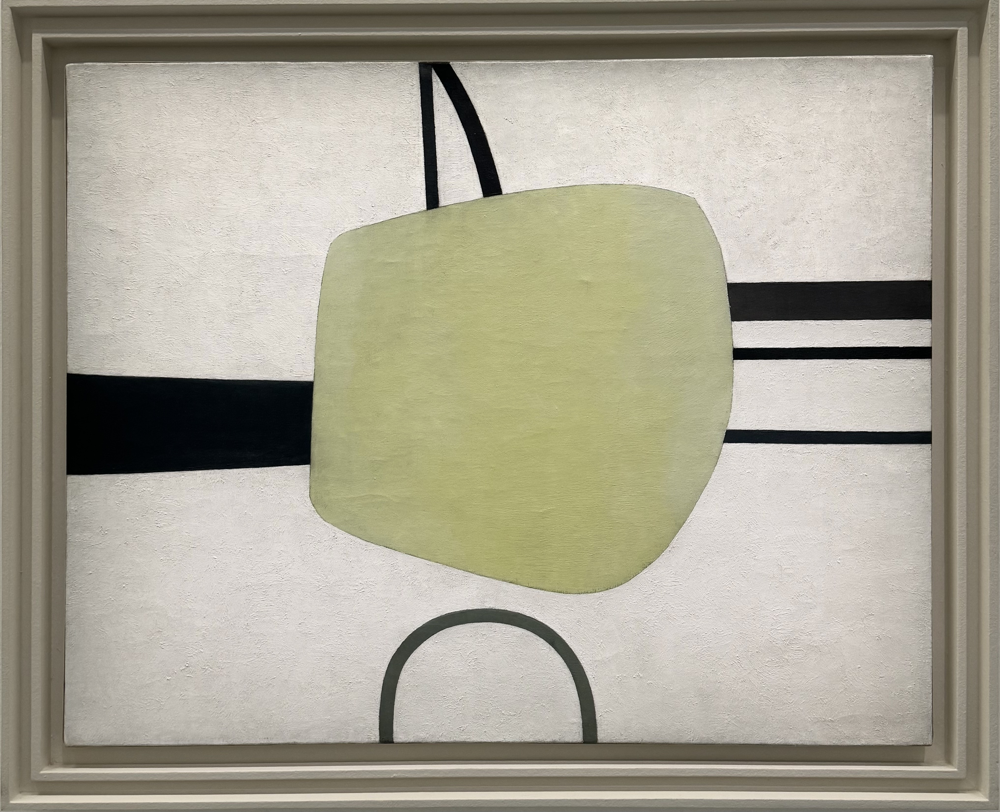

### Jean Hélion at the Musée d’Art Moderne

This exhibition contains almost 150 pieces of art ordered chronologically by Jean Hélion - a french painter and author. Full price tickets to the exhibition costs 15€ but because I have the _Carte Paris Musées_ entry is free. I've been tracking how much I've saved with the card [here](http://abisummers.com/articles/subscriptions/) along with other subscriptions I have.

### The timing

I spent almost an hour in the exhibition and only saw the first half. I booked a ticket for 4:45pm which was the last slot of the day since the museum closes at 6pm. They start informing you at 5:30pm that the exhibition will be in 15 minutes and with how much is left to see - I was around half way through at this point. Before going into the exhibition I knew that I wouldn't be able to see it all so I decided to take my time and come back at a future date.

### The exhibition

Going into the exhibition I didn't know much about Jean Hélion or his work, I just picked this exhibition because I wanted to visit a museum and I was in the area. Initially I was surprised at how varied his art style was - but after thinking about it, it makes sense since he was painting for over 50 years. A lot happens in over 5 decades of life. Some of the evolutions of style are more obvious than others.

Some of the pieces felt more familiar than others either because I've seen the pieces before in centre pompidou or because I've seen other work that's in a similar style. I will mention some pieces, but won't cover everything in the exhibition.

_seated man_ and _trombone_ from 1928 are the first two pieces on display which have a lot more texture to them and are very different to the works that follow next. In a museums I wouldn't have imagined them to be by the same artist given how different they are and how they were painted at a similar time.

The next series of paintings, _orthogonal composition_ (1929-1930), shows Hélion following use horizontal and vertical lines to form blocks with only primary colours. I like looking at these, but I don't really get the meaning behind them.

<!-- _orthogonal composition_ (1929-1930). Paintings are derived from plastic constructs (planes and colours that do not belong to nature). Expressed the vision through the use of horizontal and vertical lines combined with colourful planes. This series of paintings involves straight horizontal and vertical lines with primary colours forming blocks.  -->

in his next series _abstraction creation_ (1932), there are still a lot of horizontal and vertical lines but with irregular shapes and more colours introduced.

<!-- _abstraction creation_ (1932) which brought together trends from the non-figurative movement. -->

The next evolution of style, _equilibriums_ (1932-1935), build on the same ideas but adds curves and colour modulation. Up until now, I can see the how the styles lean into each other, building on previous paintings.

<!-- reveals the full plasticity of space. Be -->

His next series of paintings from 1936 to 1939 moves away from this style with the addition of vertical silhouettes had anthropomorphic shapes. They contain a lot more colour variations too. The _fallen figure_ (1939) was a pivotal painting for Hélion. On the eve of the war Hélion associated this painting with his own disillusionment regarding abstraction which signalled the end of abstraction and moved into figuration. I like looking at this type of painting, trying to see different things and imagining what the painter was thinking about at the time.

> We should, once and for all, rid the modern public of the notion that drawing from life means making copies. Drawing means inventing, on a surface, an image that has the same qualities and conjures up the same energies as the model. Drawing cannot in any way (except erroneously) be conflated with photography. Drawing is a process, where the eyes move and circle around things, knowing their backs when looking at their fronts. Drawing does not mean seeing, but showing. It means revealing. (Journal d'un peintre, 1947)

His work from 1944 looks very different, all of the paintings are a lot more life like. There were a lot reoccurring objects and themes throughout his paintings including hats, umbrellas, lighters, and pumpkins. It was interesting to see some paintings that looks similar like the man with red cheeks next to a man who looked very similar (maybe even the same man, I can't remember the name of the paintings) but with the red in opposite places. From 1947 he also painted quite a lot of nudes.

I had just started watching some short clips of Hélion explaining his work when we were informed that the exhibition would be closing soon so I didn't get to watch them all. The videos were had French audio and had both French and English subtitles. In one of the videos I watched, he spoke about the pelvis and how significant it is because we all have one and how babies pass through the pelvis during childbirth. Honestly, I don't think much about the pelvis in my daily life.

I stopped here, and will be back sometime soon to see the second part.

### end thoughts

Overall I enjoyed the exhibition. It was interesting to see how his style changed over time - a nice reminder to me that life moves on and things change. It's reassuring to know that the things I create now will evolve over time as I experience new things and meet new people. Nothing is static.

I liked the quotes that they shared around the exhibition.

> I believe artworks should rouse viewers, wake them up, stir them, interest them, amuse them, give them pleasure, joy, while always being internal. In this matter as in others, I reject the contradiction between spiritual and material. (Memoire de la chambre jaune, 1999)

As with all art, art speaks to everyone in different ways - not every piece speaks to me. I'm not sure if I will ever fully understand the meaning behind art such as _orthogonal composition_ - it's nice to look at but I don't feel the same level of emotion as I look at it compared to some of his other styles. For me, it misses the level of wonder, curiosity or extension of reality.

I have until the 18th of August to see the rest, and then I will update my article with any additional thoughts.

---

Have you been to this exhibition? If so, I would love to exchange thoughts! You can reach me via instagram at **[@abisummers](https://www.instagram.com/abisummers/)**
